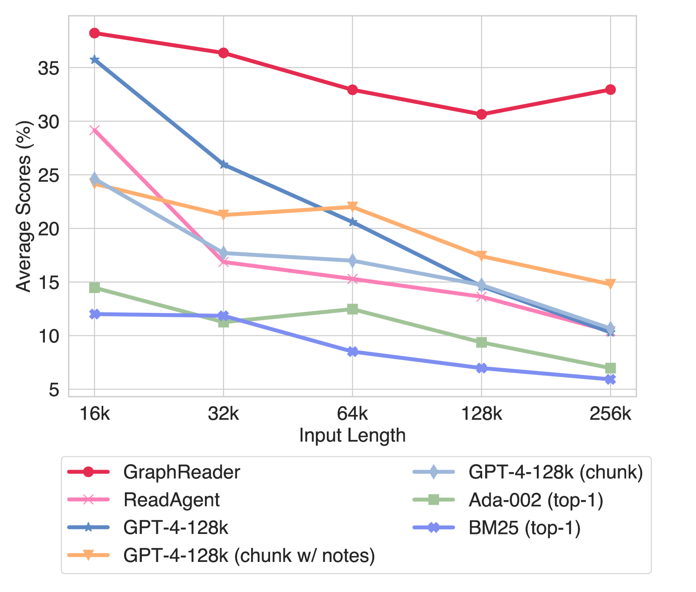
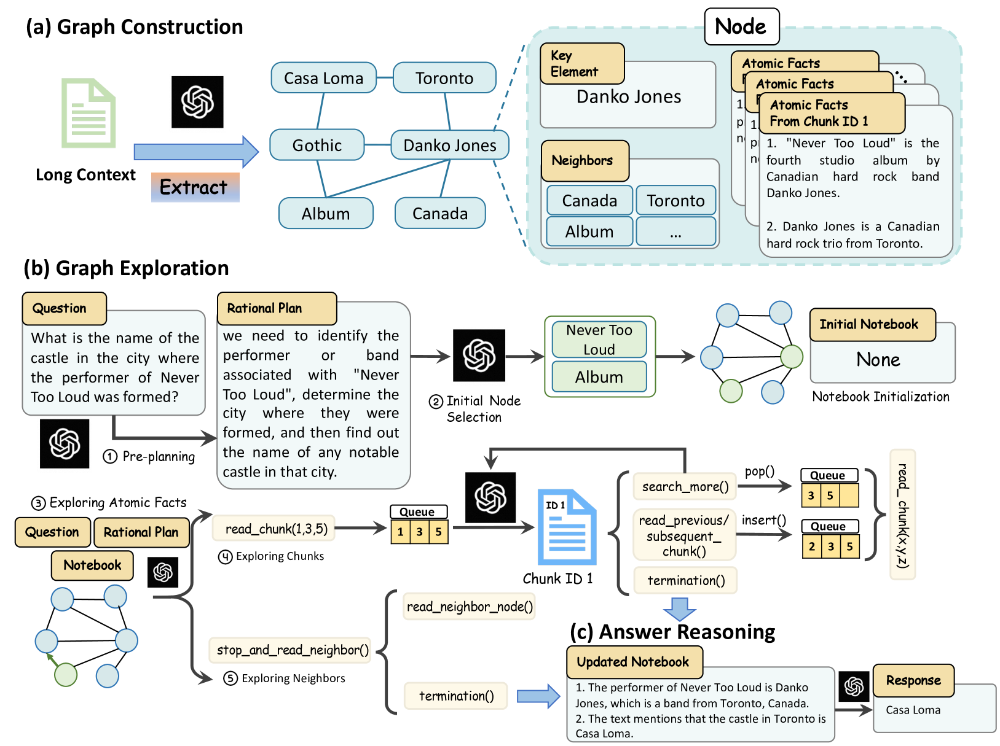
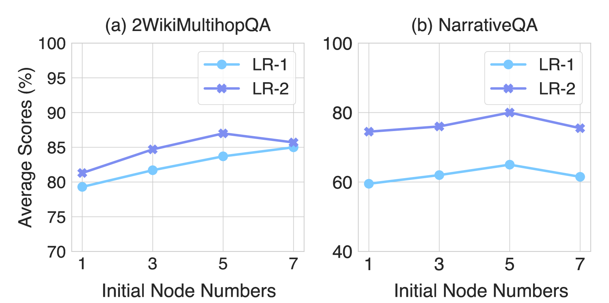
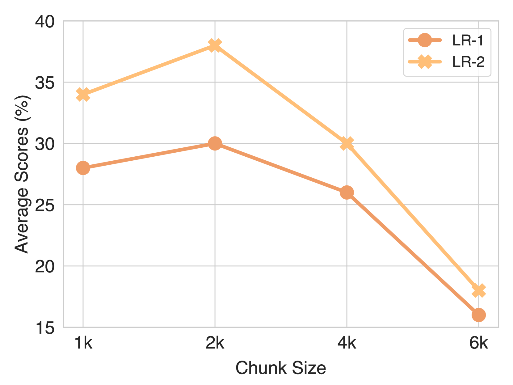
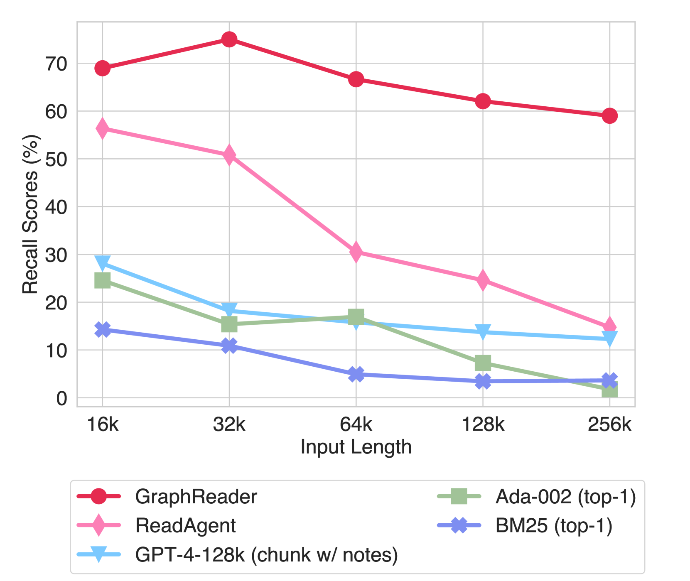
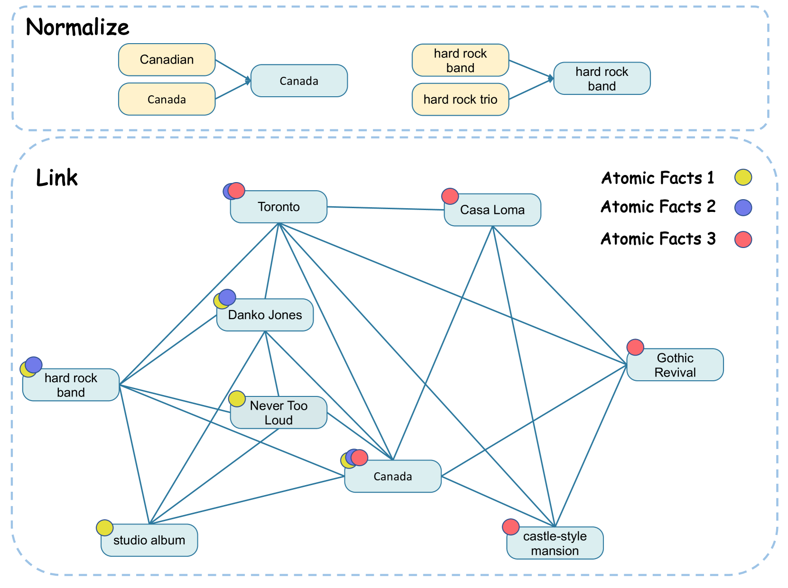
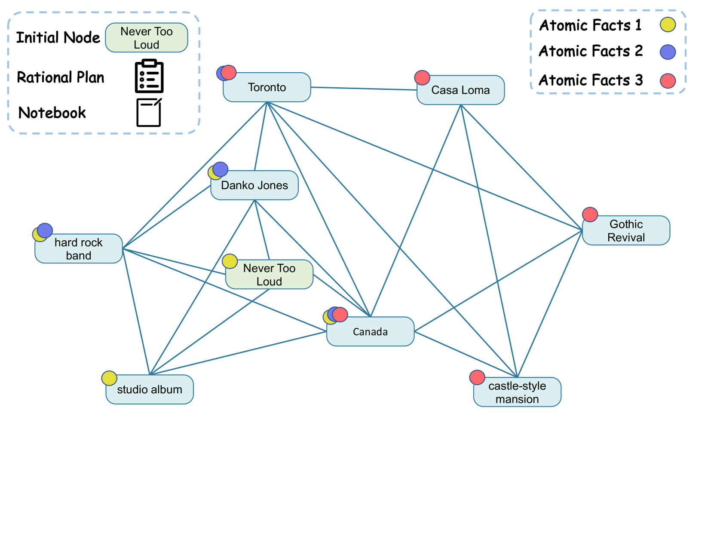
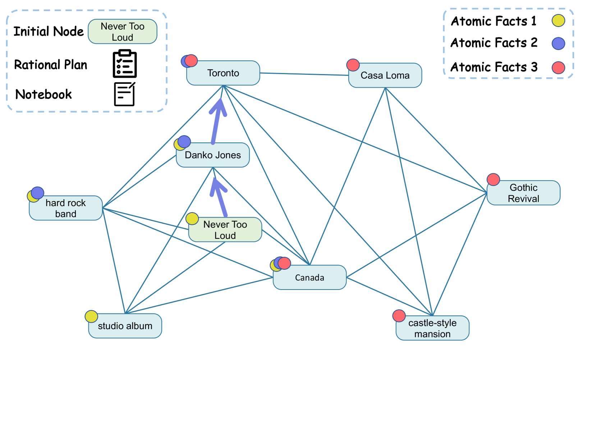

# GraphReader：打造基于图的智能体，提升大型语言模型处理长上下文的能力

发布时间：2024年06月20日

`Agent

这篇论文介绍了一种基于图的代理系统GraphReader，它通过将文本转化为图结构，并利用代理自主探索图来应对长文本挑战。这种方法涉及代理的自主行为和决策过程，因此属于Agent分类。论文中提到的代理系统能够自主分析问题、制定计划并探索图结构，这些都是代理行为的具体体现。同时，该系统在处理长上下文任务上的性能提升，也展示了代理技术在LLM应用中的潜力。` `问答系统`

> GraphReader: Building Graph-based Agent to Enhance Long-Context Abilities of Large Language Models

# 摘要

> 大型语言模型（LLMs）要想应对复杂且长输入的任务，必须具备强大的长上下文处理能力。尽管业界已付出诸多努力优化LLMs以适应长上下文，但稳健地处理长输入依旧是一大挑战。本文中，我们推出了GraphReader，一种基于图的代理系统，它通过将文本转化为图结构，并利用代理自主探索图来应对长文本挑战。当接收到问题时，代理会进行细致分析并制定合理计划，随后调用预设功能，逐层深入地探索图中的节点与邻居。在探索过程中，代理不断汲取新知，并根据当前情况调整策略，直至收集到足够信息以生成答案。实验结果表明，在LV-Eval数据集上，使用4k上下文窗口的GraphReader在16k至256k的上下文长度范围内，均显著超越GPT-4-128k。此外，我们的方法在四个高难度的单跳和多跳基准测试中也展现了卓越性能。

> Long-context capabilities are essential for large language models (LLMs) to tackle complex and long-input tasks. Despite numerous efforts made to optimize LLMs for long contexts, challenges persist in robustly processing long inputs. In this paper, we introduce GraphReader, a graph-based agent system designed to handle long texts by structuring them into a graph and employing an agent to explore this graph autonomously. Upon receiving a question, the agent first undertakes a step-by-step analysis and devises a rational plan. It then invokes a set of predefined functions to read node content and neighbors, facilitating a coarse-to-fine exploration of the graph. Throughout the exploration, the agent continuously records new insights and reflects on current circumstances to optimize the process until it has gathered sufficient information to generate an answer. Experimental results on the LV-Eval dataset reveal that GraphReader, using a 4k context window, consistently outperforms GPT-4-128k across context lengths from 16k to 256k by a large margin. Additionally, our approach demonstrates superior performance on four challenging single-hop and multi-hop benchmarks.

[Arxiv](https://arxiv.org/abs/2406.14550)