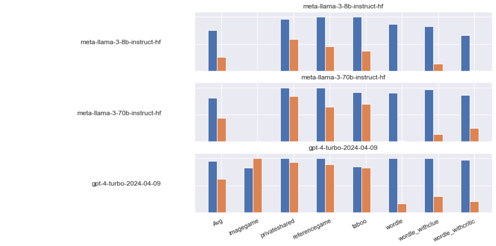

# 改变一盏灯的参数之谜：探究模型特征如何影响对话游戏自玩性能

发布时间：2024年06月20日

`Agent

这篇论文探讨了大型语言模型（LLM）在特定基准测试中的表现，特别是通过对话游戏的自我对弈来评估模型的目标导向和代理性能力。研究关注的是模型特性（如参数数量和训练类型）如何影响性能，以及微调数据的质量和方法等训练参数的作用。此外，论文还提到了模型在不同访问方法间的性能表现的不确定性，以及权重量化对推理过程中性能稳定性的影响。这些内容与Agent的特性紧密相关，因为它们涉及模型如何作为代理在特定任务中表现，以及如何通过调整模型参数和训练方法来优化这种表现。因此，这篇论文应归类为Agent。` `人工智能` `基准测试`

> How Many Parameters Does it Take to Change a Light Bulb? Evaluating Performance in Self-Play of Conversational Games as a Function of Model Characteristics

# 摘要

> 一个优秀的大型语言模型（LLM）应在其相关基准测试中表现卓越，这些测试旨在评估其在实际应用中所需的能力。然而，究竟是什么因素决定了模型的优异表现？我们研究了一种新型的基准测试，它通过对话游戏的自我对弈来考验模型的目标导向和代理性能力，并探讨了模型特性（如参数数量和训练类型）如何影响性能的发展。我们发现，尽管参数数量与性能之间存在明显关联，但在同一规模范围内，性能差异仍然显著，这可能与微调数据的质量和方法等训练参数有关。此外，我们还注意到，由于未公开的采样参数，不同访问方法间的性能表现存在一定的不确定性，但令人欣慰的是，模型在至少中等程度的权重量化下，推理过程中的性能稳定性得到了保持。

> What makes a good Large Language Model (LLM)? That it performs well on the relevant benchmarks -- which hopefully measure, with some validity, the presence of capabilities that are also challenged in real application. But what makes the model perform well? What gives a model its abilities? We take a recently introduced type of benchmark that is meant to challenge capabilities in a goal-directed, agentive context through self-play of conversational games, and analyse how performance develops as a function of model characteristics like number of parameters, or type of training. We find that while there is a clear relationship between number of parameters and performance, there is still a wide spread of performance points within a given size bracket, which is to be accounted for by training parameters such as fine-tuning data quality and method. From a more practical angle, we also find a certain degree of unpredictability about performance across access methods, possible due to unexposed sampling parameters, and a, very welcome, performance stability against at least moderate weight quantisation during inference.

[Arxiv](https://arxiv.org/abs/2406.14051)