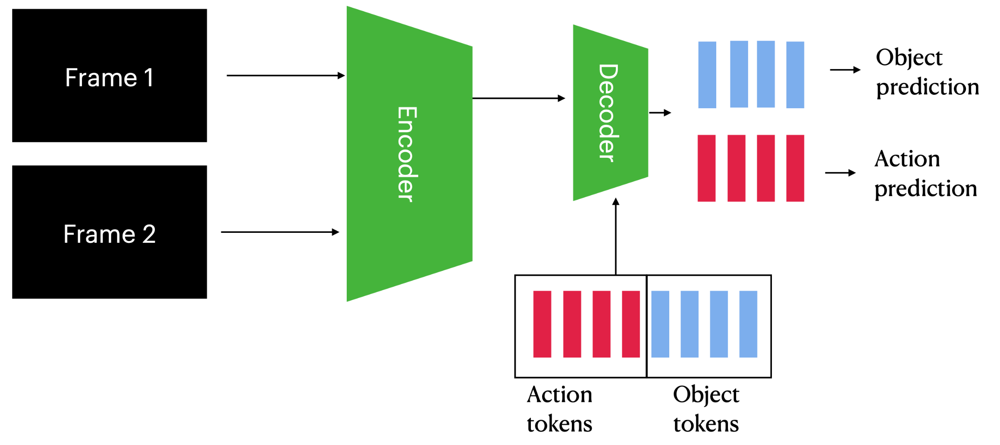

# ICAL：将轨迹转化为行动指南，助力多模态代理持续进化

发布时间：2024年06月20日

`Agent

这篇论文主要探讨了大型生成语言与视觉-语言模型（LLMs 和 VLMs）在少样本情境学习中的应用，特别是在决策和指令遵循方面的能力。论文提出了一种名为情境抽象学习（ICAL）的新方法，该方法通过次优演示和人类反馈来构建多模态经验洞察的记忆，从而提升模型在面对新领域的嘈杂演示时的决策能力。这种方法通过修正无效动作并注释认知抽象，显著提升了检索增强型 LLM 和 VLM 代理的性能。因此，这篇论文更偏向于描述和应用特定的模型（即 LLMs 和 VLMs）作为智能代理来处理和适应新环境，属于Agent分类。` `人工智能`

> ICAL: Continual Learning of Multimodal Agents by Transforming Trajectories into Actionable Insights

# 摘要

> 大型生成语言与视觉-语言模型（LLMs 和 VLMs）在少样本情境学习中表现卓越，尤其在决策和指令遵循方面。但它们依赖于高质量的示例演示。本研究探讨：LLMs 和 VLMs 能否从通用、次优的演示中自我生成提示示例？我们提出了一种名为情境抽象学习（ICAL）的新方法，它通过次优演示和人类反馈，构建了多模态经验洞察的记忆。面对新领域的嘈杂演示，VLMs 通过修正无效动作并注释认知抽象（如任务关系、物体状态变化等）来提炼演示。这些抽象通过人类反馈在类似环境中交互式精炼和适应。这些抽象作为提示示例使用时，显著提升了检索增强型 LLM 和 VLM 代理的决策能力。我们的 ICAL 代理在多个领域超越了现有技术，如在 TEACh 中目标条件成功率提升 12.6%，在 VisualWebArena 中任务成功率从 14.3% 提升至 22.7%，在 Ego4D 动作预测中超越了少样本 GPT-4V。我们的方法减少了对专家示例的依赖，并持续优于缺乏此类洞察的情境学习行动计划。

> Large-scale generative language and vision-language models (LLMs and VLMs) excel in few-shot in-context learning for decision making and instruction following. However, they require high-quality exemplar demonstrations to be included in their context window. In this work, we ask: Can LLMs and VLMs generate their own prompt examples from generic, sub-optimal demonstrations? We propose In-Context Abstraction Learning (ICAL), a method that builds a memory of multimodal experience insights from sub-optimal demonstrations and human feedback. Given a noisy demonstration in a new domain, VLMs abstract the trajectory into a general program by fixing inefficient actions and annotating cognitive abstractions: task relationships, object state changes, temporal subgoals, and task construals. These abstractions are refined and adapted interactively through human feedback while the agent attempts to execute the trajectory in a similar environment. The resulting abstractions, when used as exemplars in the prompt, significantly improve decision-making in retrieval-augmented LLM and VLM agents. Our ICAL agent surpasses the state-of-the-art in dialogue-based instruction following in TEACh, multimodal web agents in VisualWebArena, and action anticipation in Ego4D. In TEACh, we achieve a 12.6% improvement in goal-condition success. In VisualWebArena, our task success rate improves over the SOTA from 14.3% to 22.7%. In Ego4D action forecasting, we improve over few-shot GPT-4V and remain competitive with supervised models. We show finetuning our retrieval-augmented in-context agent yields additional improvements. Our approach significantly reduces reliance on expert-crafted examples and consistently outperforms in-context learning from action plans that lack such insights.

[Arxiv](https://arxiv.org/abs/2406.14596)