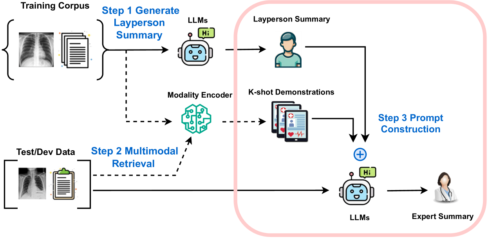
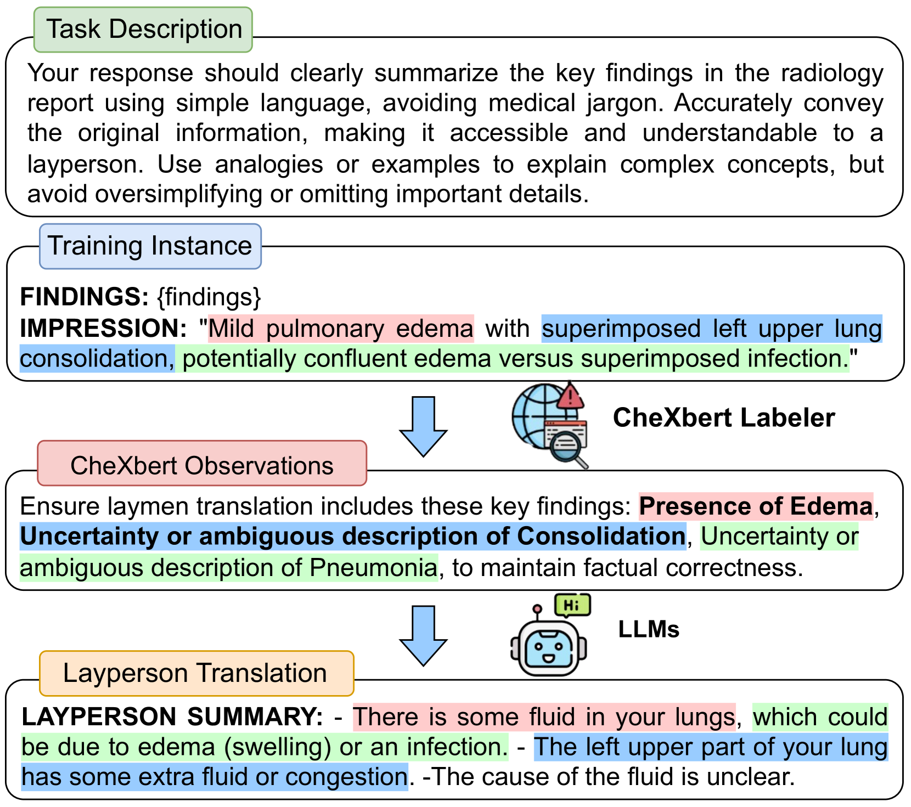
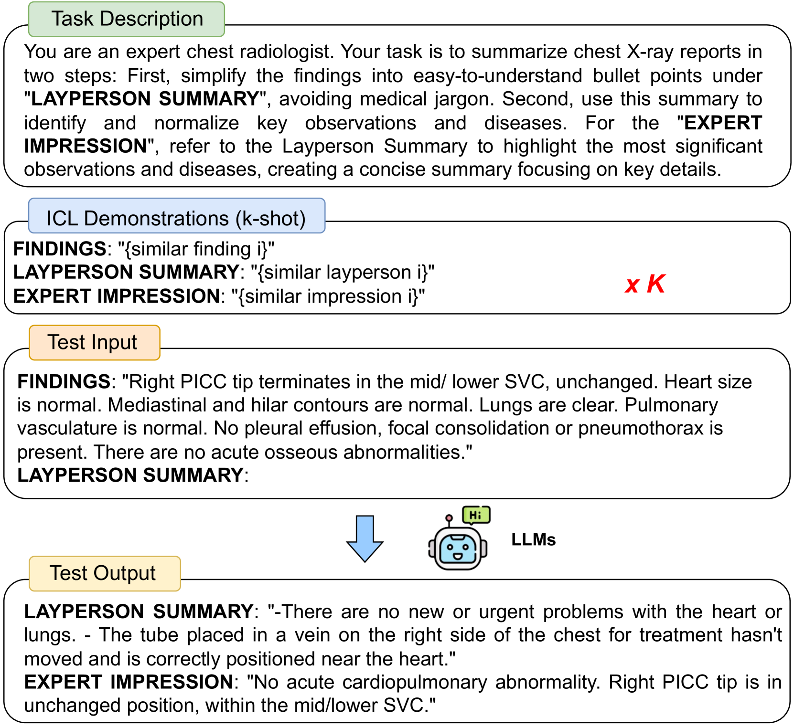
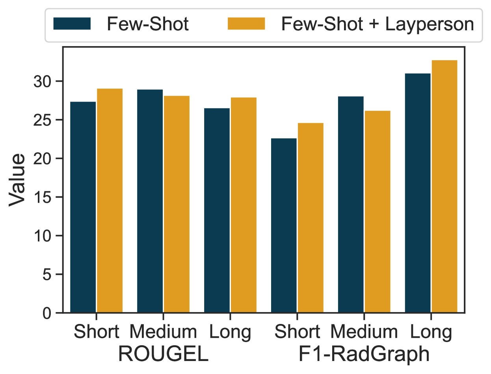
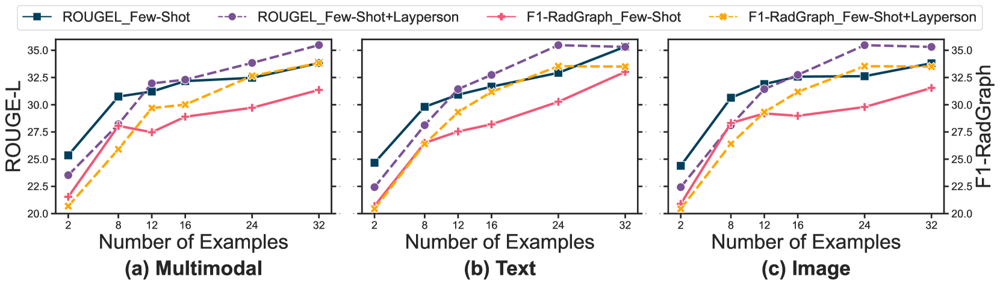
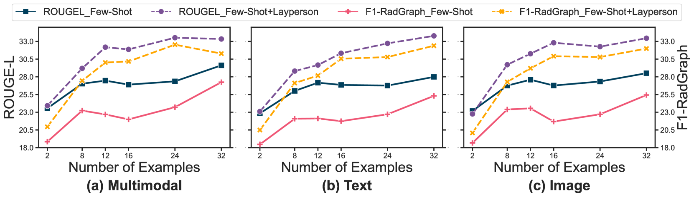
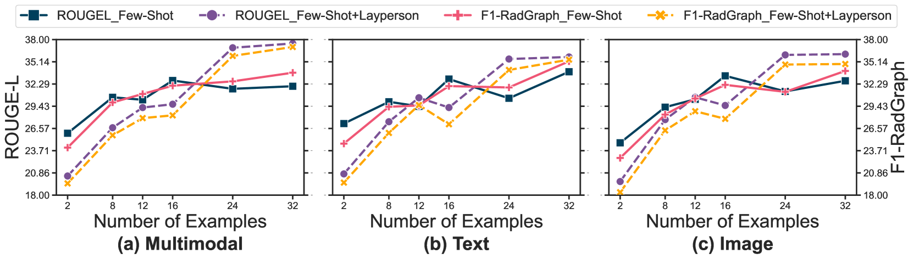

# 借助非专业人士的总结，激发大型语言模型的潜能，以精炼专家放射学报告的摘要。

发布时间：2024年06月20日

`RAG

理由：这篇论文主要关注的是放射学报告摘要（RRS）的生成，提出了一种新的提示策略来提升摘要的质量，使其更适合非专业人士理解。这种方法结合了少样本上下文学习，并在大规模数据集上进行了测试。虽然涉及到了大型语言模型（如Meta-Llama-3-8B-Instruct），但论文的重点在于应用这些模型来解决特定的实际问题（即RRS的生成），而不是探讨LLM的理论或安全性问题，也不是关于Agent的研究。因此，最合适的分类是RAG（Retrieval-Augmented Generation），这是一个关注如何通过检索增强生成任务的领域，特别是当这种生成任务需要考虑特定领域的知识时。`

> Improving Expert Radiology Report Summarization by Prompting Large Language Models with a Layperson Summary

# 摘要

> 放射学报告摘要（RRS）对患者护理至关重要，它要求从详尽的“发现”中提炼出精炼的“印象”。本文创新性地提出了一种提示策略，首先生成面向非专业人士的摘要，以此来提升RRS的质量。该策略借鉴医患交流的方式，简化了关键观察并使复杂信息更易于理解。结合少样本上下文学习，这种方法显著增强了模型将通用术语与具体发现相联系的能力。我们在MIMIC-CXR、CheXpert和MIMIC-III数据集上进行了测试，并与顶级开源大型语言模型（如Meta-Llama-3-8B-Instruct）进行了比较。结果表明，这种方法在摘要的准确性和可访问性上均有显著提升，尤其是在域外测试中，某些指标的提升甚至达到了5%。

> Radiology report summarization (RRS) is crucial for patient care, requiring concise "Impressions" from detailed "Findings." This paper introduces a novel prompting strategy to enhance RRS by first generating a layperson summary. This approach normalizes key observations and simplifies complex information using non-expert communication techniques inspired by doctor-patient interactions. Combined with few-shot in-context learning, this method improves the model's ability to link general terms to specific findings. We evaluate this approach on the MIMIC-CXR, CheXpert, and MIMIC-III datasets, benchmarking it against 7B/8B parameter state-of-the-art open-source large language models (LLMs) like Meta-Llama-3-8B-Instruct. Our results demonstrate improvements in summarization accuracy and accessibility, particularly in out-of-domain tests, with improvements as high as 5% for some metrics.

[Arxiv](https://arxiv.org/abs/2406.14500)