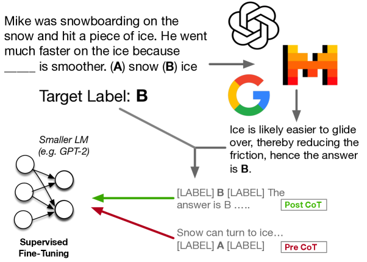
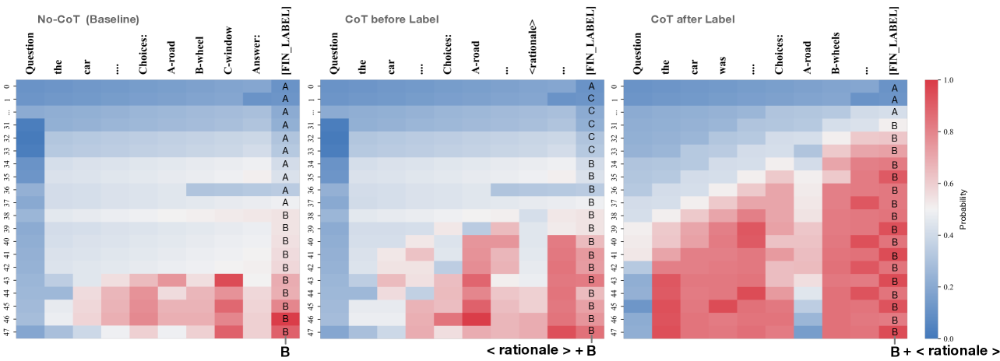
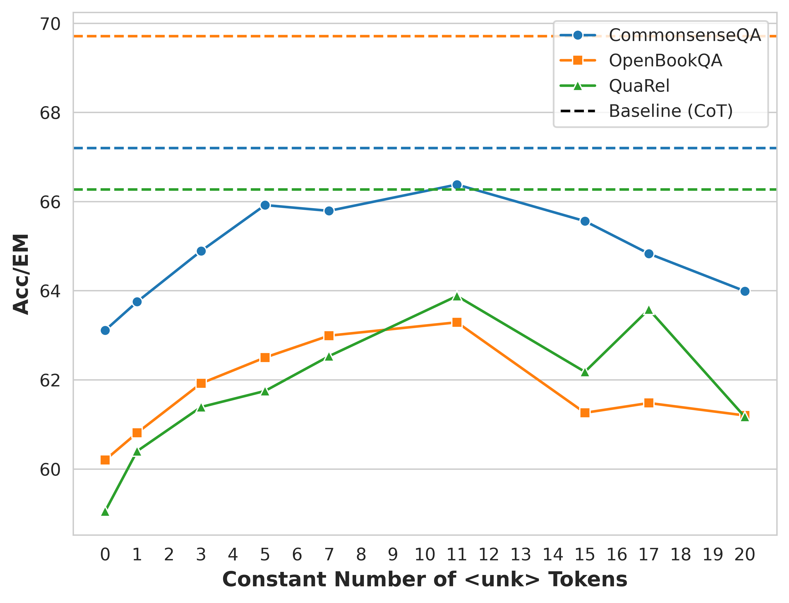
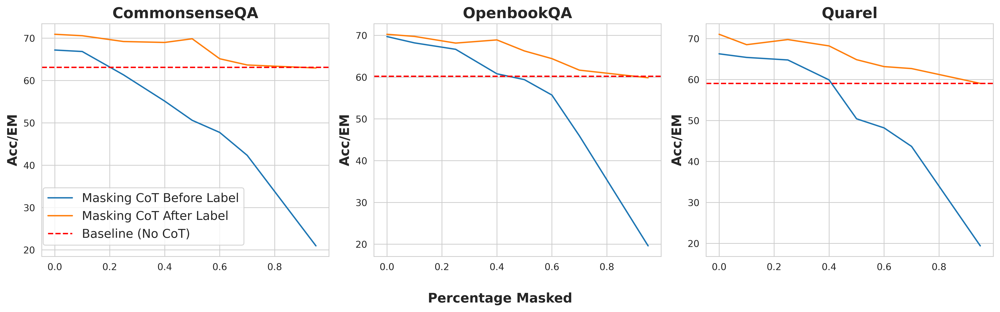
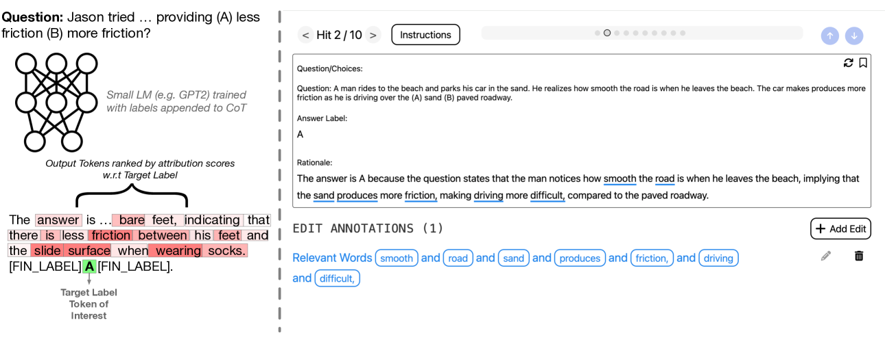
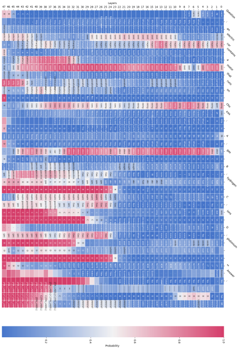
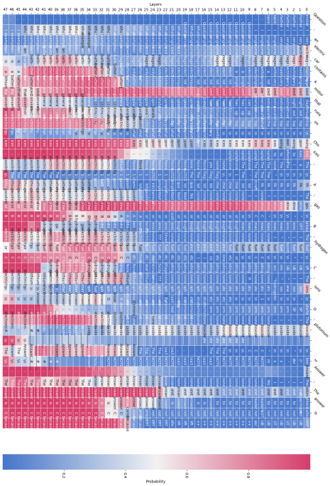
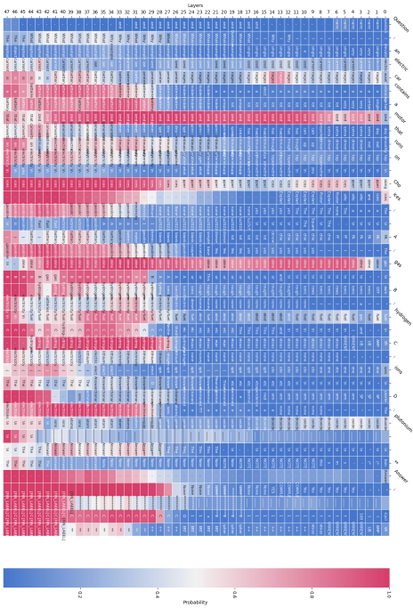

# 揭秘 CoT-Augmented Distillation 的神秘面纱

发布时间：2024年06月20日

`LLM理论

这篇论文主要探讨了大型语言模型（LLM）中的“思维链”（CoT）理性在模型蒸馏过程中的作用和效果。研究内容涉及CoT序列如何影响模型性能，以及在模型蒸馏中如何有效利用这些序列。这些发现对于理解LLM的工作原理和优化其性能具有理论意义，因此属于LLM理论分类。` `问答系统` `模型蒸馏`

> Investigating Mysteries of CoT-Augmented Distillation

# 摘要

> 通过引入“思维链”（CoT）理性——一系列传达推理过程的令牌——已证实能显著提升大型语言模型（LLM）在问答任务上的表现。近期研究进一步发现，这些理性在模型蒸馏中也大有裨益：在微调小型模型时，若加入来自大型“教师”模型的CoT序列及目标标签，往往能带来显著性能提升。本研究旨在探究这一额外训练信号为何及如何助力模型蒸馏，并揭示了一些出人意料的发现。具体而言：（1）将CoT序列置于标签之后而非之前，能持续提升下游任务表现，这意味着在测试阶段，学生模型无需实际推理即可受益。（2）即便CoT序列并非连贯推理，仅简单附加亦能带来性能提升，且对令牌顺序变化具有较强适应性。更有甚者，（3）仅需少数关键令牌，便能达到与完整理性蒸馏相当的改进效果。

> Eliciting "chain of thought" (CoT) rationales -- sequences of token that convey a "reasoning" process -- has been shown to consistently improve LLM performance on tasks like question answering. More recent efforts have shown that such rationales can also be used for model distillation: Including CoT sequences (elicited from a large "teacher" model) in addition to target labels when fine-tuning a small student model yields (often substantial) improvements. In this work we ask: Why and how does this additional training signal help in model distillation? We perform ablations to interrogate this, and report some potentially surprising results. Specifically: (1) Placing CoT sequences after labels (rather than before) realizes consistently better downstream performance -- this means that no student "reasoning" is necessary at test time to realize gains. (2) When rationales are appended in this way, they need not be coherent reasoning sequences to yield improvements; performance increases are robust to permutations of CoT tokens, for example. In fact, (3) a small number of key tokens are sufficient to achieve improvements equivalent to those observed when full rationales are used in model distillation.

[Arxiv](https://arxiv.org/abs/2406.14511)