# 图胜千言？探索视觉语言模型中的空间推理之谜

发布时间：2024年06月20日

`LLM理论

理由：这篇论文主要探讨了大型语言模型（LLMs）和视觉-语言模型（VLMs）在空间理解与推理方面的表现和挑战，这是对LLMs理论层面的深入研究。论文通过开发新的基准测试来评估这些模型在空间推理任务上的性能，并揭示了一些重要的发现和反直觉现象。这些研究结果有助于理解LLMs和VLMs在复杂认知任务中的局限性，并提出了改进的方向，因此属于LLM理论分类。` `人工智能` `空间推理`

> Is A Picture Worth A Thousand Words? Delving Into Spatial Reasoning for Vision Language Models

# 摘要

> 大型语言模型（LLMs）与视觉-语言模型（VLMs）在众多任务和领域中表现出色，但空间理解与推理——这一人类认知的核心要素——仍未得到充分研究。我们为此开发了一系列新颖的基准测试，涵盖了空间推理的多个维度，如关系理解、导航及计数。通过全面评估这些顶尖的语言与视觉-语言模型，我们发现了一些文献中未被重视的反直觉现象：（1）空间推理对模型构成巨大挑战，有时甚至不如随机猜测；（2）尽管增加了视觉输入，VLMs的表现往往不及LLMs；（3）当文本与视觉信息并存时，若文本线索充足，多模态模型对视觉信息的依赖会降低。我们还展示了利用视觉与文本间的冗余信息能显著提升模型性能。我们期望这项研究能推动多模态模型的发展，增强空间智能，进一步拉近与人类智能的距离。

> Large language models (LLMs) and vision-language models (VLMs) have demonstrated remarkable performance across a wide range of tasks and domains. Despite this promise, spatial understanding and reasoning -- a fundamental component of human cognition -- remains under-explored. We develop novel benchmarks that cover diverse aspects of spatial reasoning such as relationship understanding, navigation, and counting. We conduct a comprehensive evaluation of competitive language and vision-language models. Our findings reveal several counter-intuitive insights that have been overlooked in the literature: (1) Spatial reasoning poses significant challenges where competitive models can fall behind random guessing; (2) Despite additional visual input, VLMs often under-perform compared to their LLM counterparts; (3) When both textual and visual information is available, multi-modal language models become less reliant on visual information if sufficient textual clues are provided. Additionally, we demonstrate that leveraging redundancy between vision and text can significantly enhance model performance. We hope our study will inform the development of multimodal models to improve spatial intelligence and further close the gap with human intelligence.

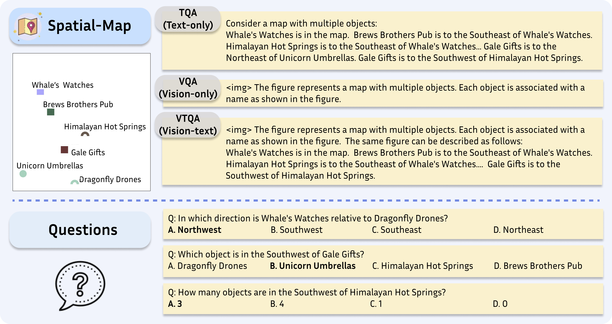

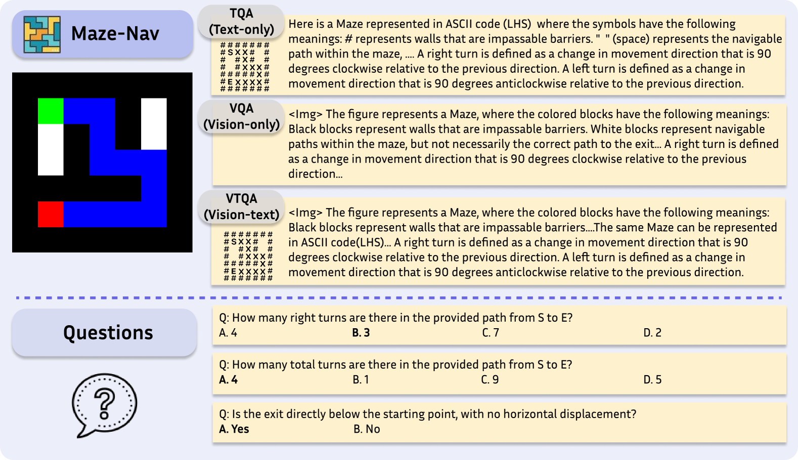

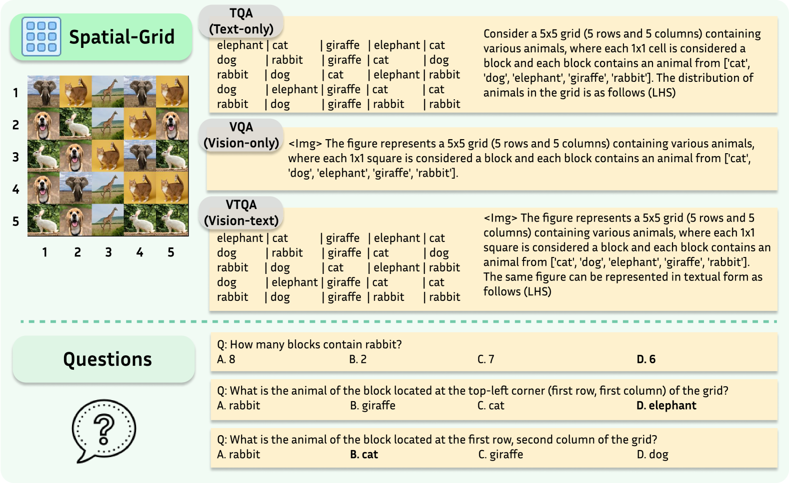

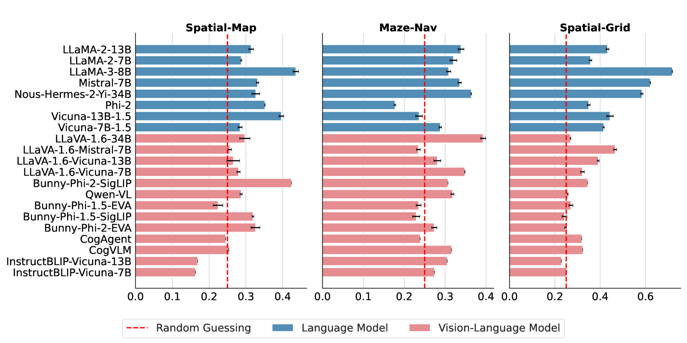

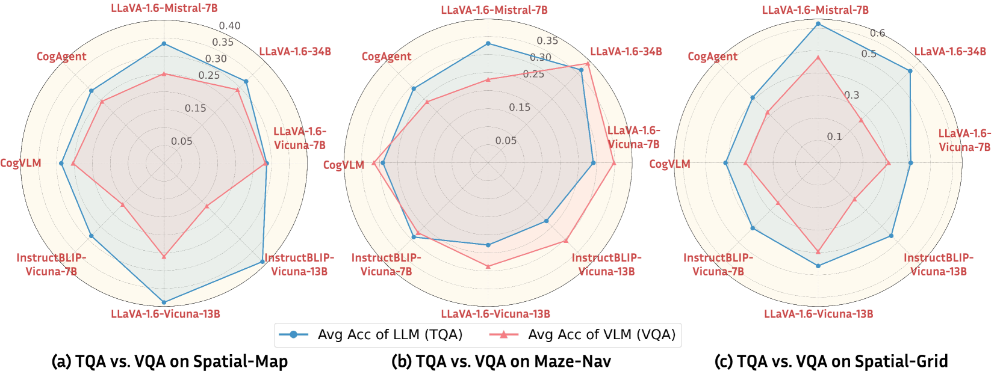

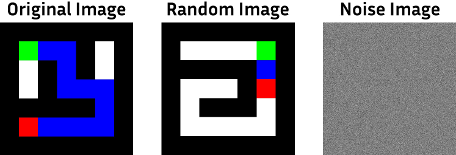

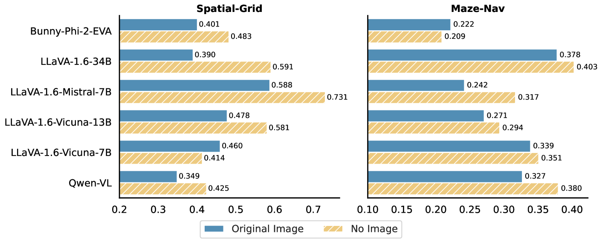

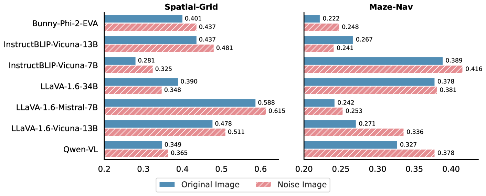

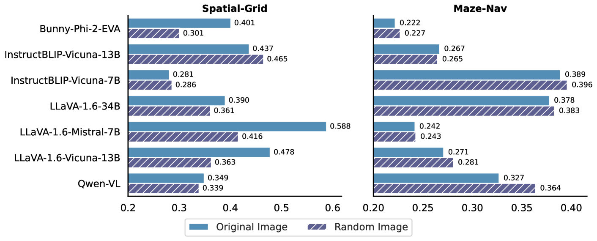

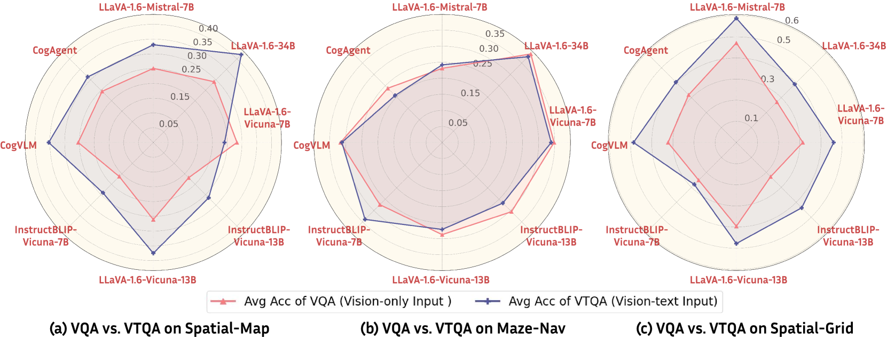

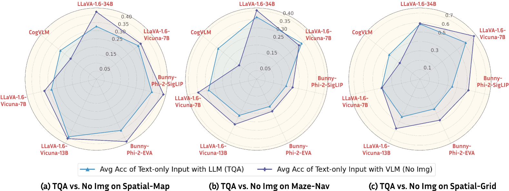

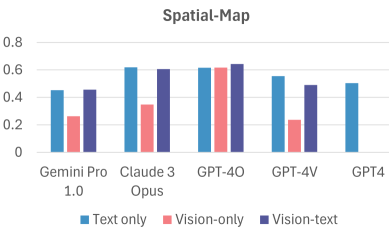

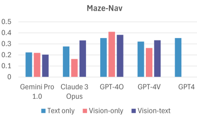

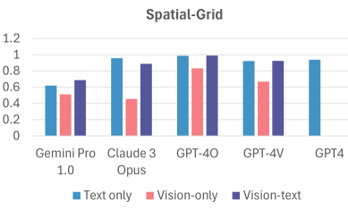

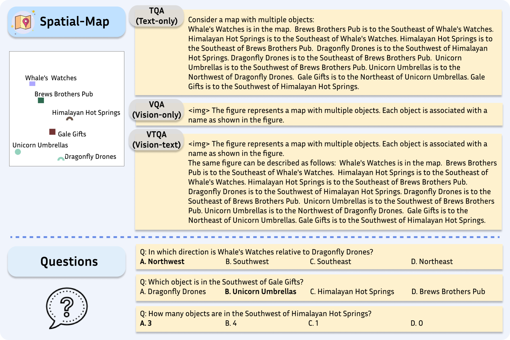

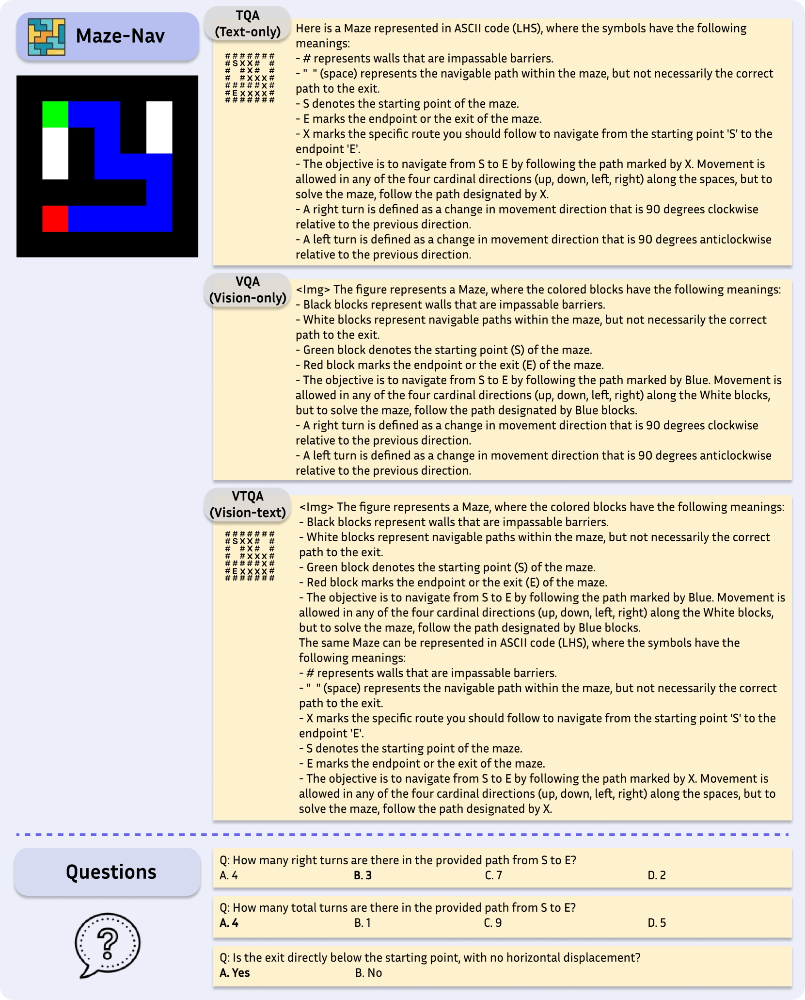

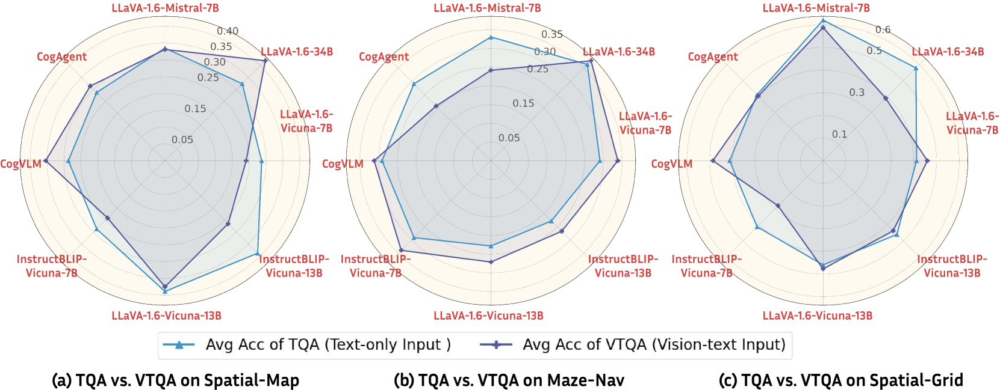

[Arxiv](https://arxiv.org/abs/2406.14852)