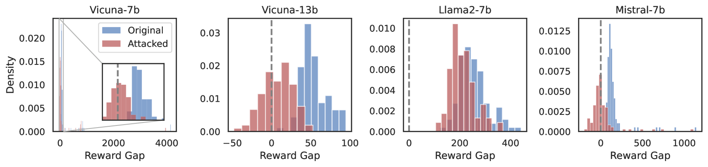

# 越狱现象：奖励机制的误设问题

发布时间：2024年06月20日

`LLM理论

这篇论文主要关注大型语言模型（LLMs）的安全性和可靠性问题，特别是对抗性攻击的脆弱性。论文提出了一个新的视角，即这种脆弱性可能源于对齐过程中的奖励设定错误，并开发了ReGap指标来衡量这种错误。此外，论文还推出了ReMiss系统，这是一个专门用于生成对抗性提示的自动化工具。这些内容主要涉及LLM的理论分析和改进，因此归类为LLM理论。` `人工智能`

> Jailbreaking as a Reward Misspecification Problem

# 摘要

> 随着大型语言模型（LLMs）的普及，其安全性和可靠性问题日益凸显，尤其是它们对对抗性攻击的脆弱性。本文提出了一种新视角，认为这种脆弱性源于对齐过程中的奖励设定错误。我们开发了ReGap指标，用以衡量奖励设定错误的程度，并验证了其在识别有害后门提示上的高效与稳健。在此基础上，我们推出了ReMiss系统，这是一个自动化的红队工具，专门生成针对多种对齐LLMs的对抗性提示。ReMiss不仅在AdvBench基准上取得了顶尖的攻击成功率，还确保了生成提示的人类可读性。深入分析表明，与以往方法相比，我们提出的奖励设定错误目标带来了显著的优势。

> The widespread adoption of large language models (LLMs) has raised concerns about their safety and reliability, particularly regarding their vulnerability to adversarial attacks. In this paper, we propose a novel perspective that attributes this vulnerability to reward misspecification during the alignment process. We introduce a metric ReGap to quantify the extent of reward misspecification and demonstrate its effectiveness and robustness in detecting harmful backdoor prompts. Building upon these insights, we present ReMiss, a system for automated red teaming that generates adversarial prompts against various target aligned LLMs. ReMiss achieves state-of-the-art attack success rates on the AdvBench benchmark while preserving the human readability of the generated prompts. Detailed analysis highlights the unique advantages brought by the proposed reward misspecification objective compared to previous methods.

[Arxiv](https://arxiv.org/abs/2406.14393)