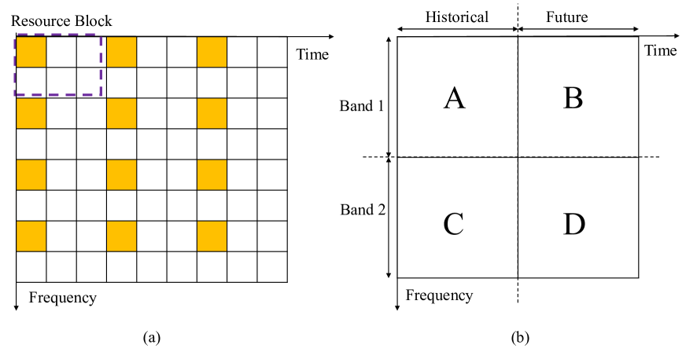

# LLM4CP：大型语言模型在信道预测中的应用与适应

发布时间：2024年06月20日

`LLM应用

这篇论文摘要描述了一种利用大型语言模型（LLMs）进行信道预测技术的方法，称为LLM4CP。该方法通过历史上行信道状态信息（CSI）序列来预测未来的下行CSI，利用了LLMs的强大建模和泛化能力。这种方法特别强调了在保持预训练LLM大部分参数不变的同时，通过微调网络来促进跨模态知识迁移，并针对信道数据的特性定制了预处理器、嵌入和输出模块。因此，这项工作属于LLM的应用领域，具体是在通信系统中的应用。` `无线网络`

> LLM4CP: Adapting Large Language Models for Channel Prediction

# 摘要

> 信道预测技术在m-MIMO系统中有效降低了反馈和估计的负担。但现有方法因模型不匹配或泛化能力不足而精度有限。大型语言模型（LLMs）以其卓越的建模和泛化能力，在跨模态任务中大放异彩，包括时间序列分析。我们借助LLMs的强大表达力，开发了LLM4CP方法，通过历史上行CSI序列预测未来下行CSI。在保持预训练LLM大部分参数不变的同时，我们微调网络以促进跨模态知识迁移。针对信道数据的特性，我们定制了预处理器、嵌入和输出模块。模拟结果显示，该方法在全样本、少样本及泛化测试中均以低成本达到了顶尖的预测性能。

> Channel prediction is an effective approach for reducing the feedback or estimation overhead in massive multi-input multi-output (m-MIMO) systems. However, existing channel prediction methods lack precision due to model mismatch errors or network generalization issues. Large language models (LLMs) have demonstrated powerful modeling and generalization abilities, and have been successfully applied to cross-modal tasks, including the time series analysis. Leveraging the expressive power of LLMs, we propose a pre-trained LLM-empowered channel prediction method (LLM4CP) to predict the future downlink channel state information (CSI) sequence based on the historical uplink CSI sequence. We fine-tune the network while freezing most of the parameters of the pre-trained LLM for better cross-modality knowledge transfer. To bridge the gap between the channel data and the feature space of the LLM, preprocessor, embedding, and output modules are specifically tailored by taking into account unique channel characteristics. Simulations validate that the proposed method achieves SOTA prediction performance on full-sample, few-shot, and generalization tests with low training and inference costs.

[Arxiv](https://arxiv.org/abs/2406.14440)