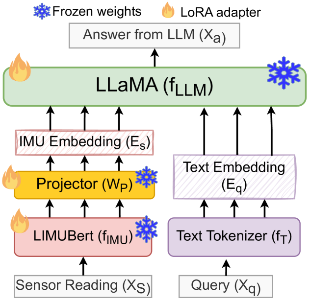

# LLaSA：大型多模态代理，专为通过可穿戴传感器分析人类活动而设计

发布时间：2024年06月20日

`Agent

理由：这篇论文介绍了一个名为 LLaSA 的大型多模态代理，它结合了 IMUs（惯性测量单元）和大型语言模型（LLMs）来理解和回应与人类活动和运动分析相关的查询。这个代理能够处理多模态数据，并在活动分类和问答任务中表现出色。因此，它符合Agent分类，因为它描述了一个能够执行特定任务的智能代理系统。` `体育科学`

> LLaSA: Large Multimodal Agent for Human Activity Analysis Through Wearable Sensors

# 摘要

> 结合IMUs与LLMs，我们通过深化对人类活动的理解，推动了多模态AI的进步。我们推出了SensorCaps数据集，包含26,288项IMU记录的活动描述，以及OpenSQA，一个拥有257,562对问答的指令遵循数据集。通过融合LIMU-BERT与Llama，我们创造了LLaSA——一个强大的大型多模态代理，能解读并回应活动与运动分析的查询。评估结果表明，LLaSA在活动分类与问答任务中表现出色，预示其在医疗、体育科学及人机交互领域的广阔应用前景。这些成果不仅提升了传感器感知语言模型的能力，也为相关研究开辟了新天地。我们的代码与数据集已公开于https://github.com/BASHLab/LLaSA。

> Integrating inertial measurement units (IMUs) with large language models (LLMs) advances multimodal AI by enhancing human activity understanding. We introduce SensorCaps, a dataset of 26,288 IMU-derived activity narrations, and OpenSQA, an instruction-following dataset with 257,562 question-answer pairs. Combining LIMU-BERT and Llama, we develop LLaSA, a Large Multimodal Agent capable of interpreting and responding to activity and motion analysis queries. Our evaluation demonstrates LLaSA's effectiveness in activity classification and question answering, highlighting its potential in healthcare, sports science, and human-computer interaction. These contributions advance sensor-aware language models and open new research avenues. Our code repository and datasets can be found on https://github.com/BASHLab/LLaSA.

[Arxiv](https://arxiv.org/abs/2406.14498)