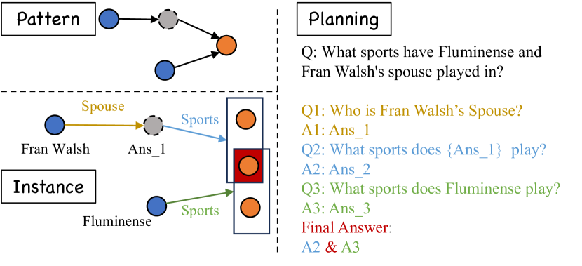
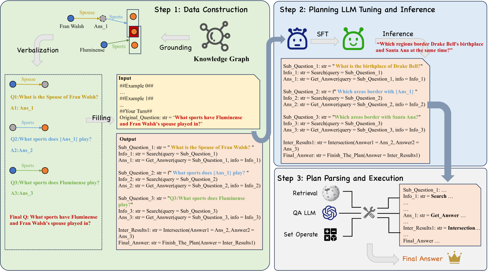
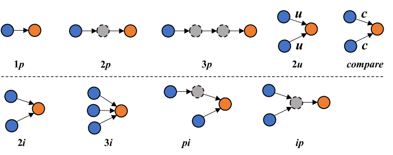
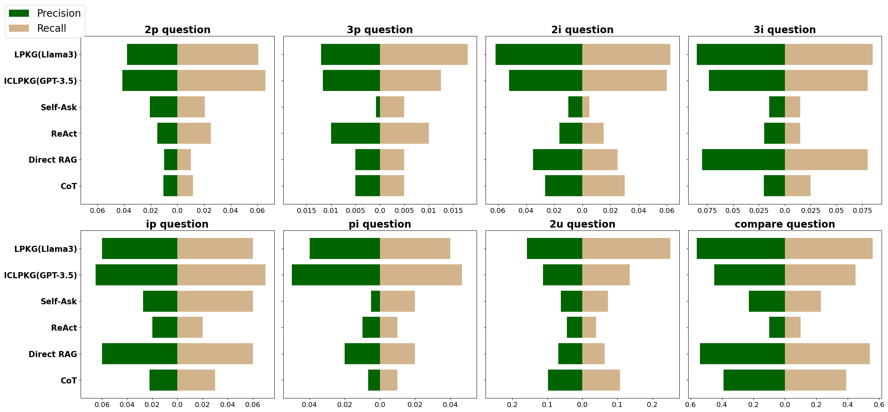
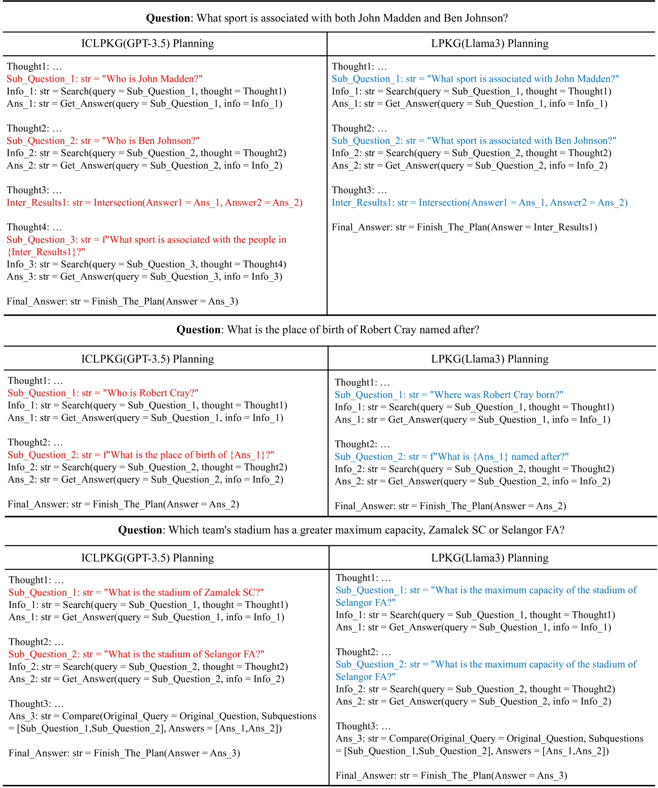

# 学习从知识图谱中规划，以提升大型语言模型的检索增强能力

发布时间：2024年06月20日

`Agent

这篇论文主要探讨了如何通过结合知识图谱衍生的规划数据来提升大型语言模型（LLMs）在复杂问答场景中的性能。论文提出了一种新的框架，该框架通过使用知识图谱衍生的规划数据对LLMs进行微调，以增强其规划能力。这种方法特别针对小型LLMs在分解复杂问题时的不足，提供了一种新的解决方案。因此，这篇论文更符合Agent分类，因为它关注的是如何通过外部数据和规划来增强语言模型的代理能力，使其能够更好地处理复杂的问答任务。` `问答系统` `知识图谱`

> Learning to Plan for Retrieval-Augmented Large Language Models from Knowledge Graphs

# 摘要

> 提升大型语言模型在复杂问答场景中的性能一直是研究的热点。近期研究通过结合逐步规划与外部信息检索，试图增强LLMs的表现。尽管此法对GPT-3.5等先进模型有效，但小型LLMs在分解复杂问题时仍显吃力，需借助监督微调。传统方法依赖人工标注及教师模型的知识蒸馏，耗时且精度有限。本文提出一种新框架，利用知识图谱衍生的规划数据，强化LLMs的规划能力。经此数据微调的模型，在处理需检索的复杂问答任务时更显优势。多数据集评估，包括新设基准，均证实了该框架及KG衍生规划数据的成效。

> Improving the performance of large language models (LLMs) in complex question-answering (QA) scenarios has always been a research focal point. Recent studies have attempted to enhance LLMs' performance by combining step-wise planning with external retrieval. While effective for advanced models like GPT-3.5, smaller LLMs face challenges in decomposing complex questions, necessitating supervised fine-tuning. Previous work has relied on manual annotation and knowledge distillation from teacher LLMs, which are time-consuming and not accurate enough. In this paper, we introduce a novel framework for enhancing LLMs' planning capabilities by using planning data derived from knowledge graphs (KGs). LLMs fine-tuned with this data have improved planning capabilities, better equipping them to handle complex QA tasks that involve retrieval. Evaluations on multiple datasets, including our newly proposed benchmark, highlight the effectiveness of our framework and the benefits of KG-derived planning data.

[Arxiv](https://arxiv.org/abs/2406.14282)