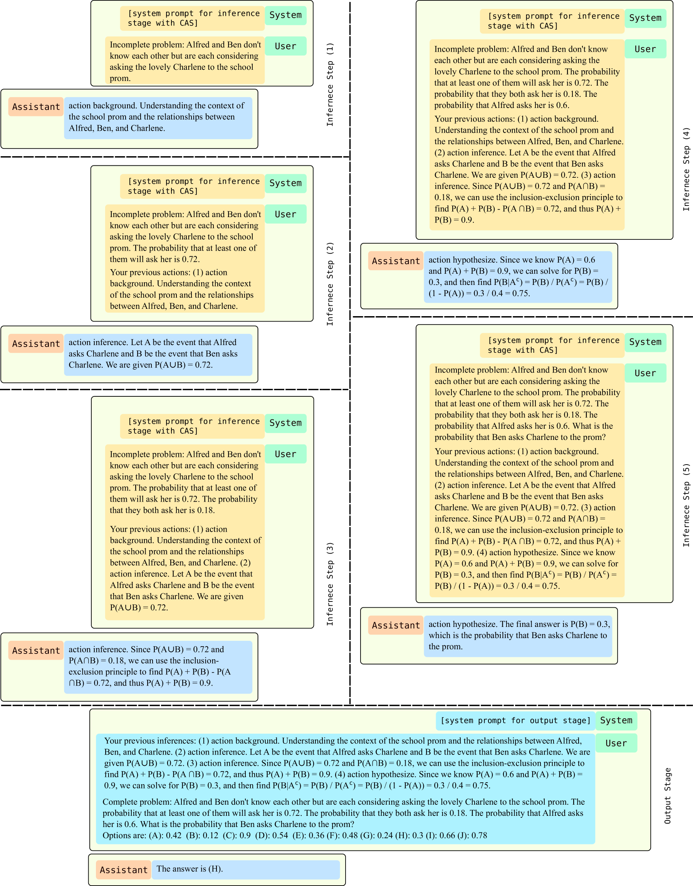

# LiveMind：实现大型语言模型低延迟的同时推理

发布时间：2024年06月20日

`LLM应用

理由：这篇论文介绍了一种针对大型语言模型（LLMs）的低延迟推理框架，该框架通过优化计算过程来减少延迟，并提升用户交互体验。这种技术直接应用于LLM的实际操作中，以改善其性能和用户体验，因此属于LLM应用类别。论文中提到的技术改进和性能提升都是在实际应用场景中对LLM进行优化的体现，而非理论研究或Agent、RAG相关的研究。` `人工智能` `用户体验`

> LiveMind: Low-latency Large Language Models with Simultaneous Inference

# 摘要

> 本文提出了一种创新的低延迟推理框架，专为大型语言模型（LLMs）设计，使其能在不完整提示下进行推理。通过优化计算过程，我们大幅降低了延迟，显著提升了用户交互体验。该框架巧妙地控制了流式提示对模型的可见性，允许模型在接收到不完整提示时即刻推理或等待更多信息。与传统完整提示推理相比，我们的方法在MMLU-Pro数据集上平均减少了59%的响应延迟，同时保持了相似的准确性。此外，该框架还支持跨模型的协作推理和输出，通过结合LLM的推理能力和SLM的输出能力，我们在MMLU-Pro数据集上实现了68%的响应延迟减少和5.5%的准确性提升。对于超过20句的长提示，延迟减少可达93%。

> In this paper, we introduce a novel low-latency inference framework for large language models (LLMs) inference which enables LLMs to perform inferences with incomplete prompts. By reallocating computational processes to prompt input phase, we achieve a substantial reduction in latency, thereby significantly enhancing the interactive experience for users of LLMs. The framework adeptly manages the visibility of the streaming prompt to the model, allowing it to infer from incomplete prompts or await additional prompts. Compared with traditional inference methods that utilize complete prompts, our approach demonstrates an average reduction of 59% in response latency on the MMLU-Pro dataset, while maintaining comparable accuracy. Additionally, our framework facilitates collaborative inference and output across different models. By employing an LLM for inference and a small language model (SLM) for output, we achieve an average 68% reduction in response latency, alongside a 5.5% improvement in accuracy on the MMLU-Pro dataset compared with the SLM baseline. For long prompts exceeding 20 sentences, the response latency can be reduced by up to 93%.

[Arxiv](https://arxiv.org/abs/2406.14319)