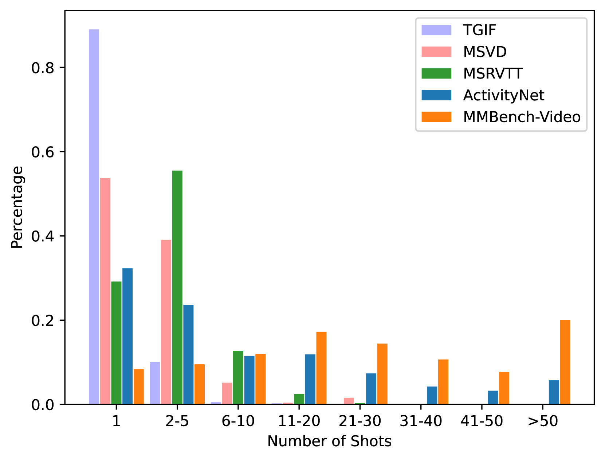

# MMBench-Video：全面视频理解的长格式多镜头评估标杆

发布时间：2024年06月20日

`LLM应用

理由：这篇论文主要介绍了MMBench-Video这一量化基准，用于评估大型视觉-语言模型（LVLMs）在视频理解方面的能力。它专注于模型的应用层面，即如何通过特定的基准来测试和提升模型的实际应用能力，而不是探讨LLM的理论基础或Agent的设计与实现。因此，它属于LLM应用类别。` `视频理解` `多模态学习`

> MMBench-Video: A Long-Form Multi-Shot Benchmark for Holistic Video Understanding

# 摘要

> 随着大型视觉-语言模型（LVLMs）的兴起，研究者们开始探索其在多模态环境，尤其是视频理解中的应用。尽管传统的VideoQA基准提供了量化评估，但它们往往未能全面捕捉视频内容的深度，且对模型的时间理解能力评估不足。为此，我们推出了MMBench-Video，一个专为严格评估LVLMs视频理解能力而设计的量化基准。该基准采用YouTube长视频和自由形式的问答，贴近实际应用，精心设计以测试模型的时间推理技能，所有问题均依据详细的能力分类法进行人工标注。我们采用GPT-4进行自动评估，其表现优于以往基于LLM的评估。通过MMBench-Video，我们对包括专有和开源在内的LVLMs进行了全面评估，涉及图像和视频。MMBench-Video不仅是研究社区的宝贵资源，也助力于提升LVLMs的评估标准，推动视频理解领域的进步。MMBench-Video的评估代码将整合至VLMEvalKit：https://github.com/open-compass/VLMEvalKit。

> The advent of large vision-language models (LVLMs) has spurred research into their applications in multi-modal contexts, particularly in video understanding. Traditional VideoQA benchmarks, despite providing quantitative metrics, often fail to encompass the full spectrum of video content and inadequately assess models' temporal comprehension. To address these limitations, we introduce MMBench-Video, a quantitative benchmark designed to rigorously evaluate LVLMs' proficiency in video understanding. MMBench-Video incorporates lengthy videos from YouTube and employs free-form questions, mirroring practical use cases. The benchmark is meticulously crafted to probe the models' temporal reasoning skills, with all questions human-annotated according to a carefully constructed ability taxonomy. We employ GPT-4 for automated assessment, demonstrating superior accuracy and robustness over earlier LLM-based evaluations. Utilizing MMBench-Video, we have conducted comprehensive evaluations that include both proprietary and open-source LVLMs for images and videos. MMBench-Video stands as a valuable resource for the research community, facilitating improved evaluation of LVLMs and catalyzing progress in the field of video understanding. The evalutation code of MMBench-Video will be integrated into VLMEvalKit: https://github.com/open-compass/VLMEvalKit.

[Arxiv](https://arxiv.org/abs/2406.14515)