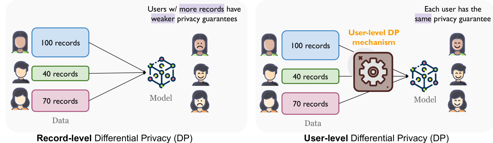
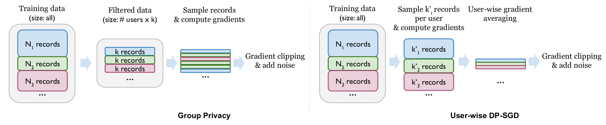
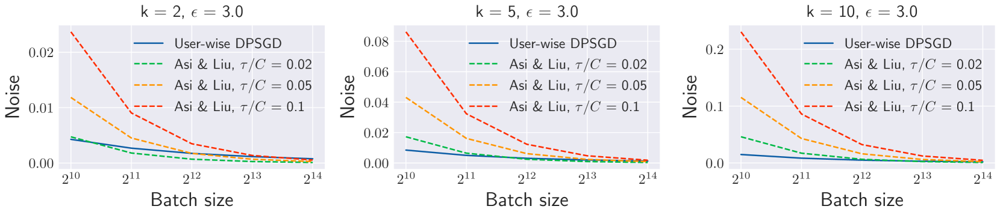
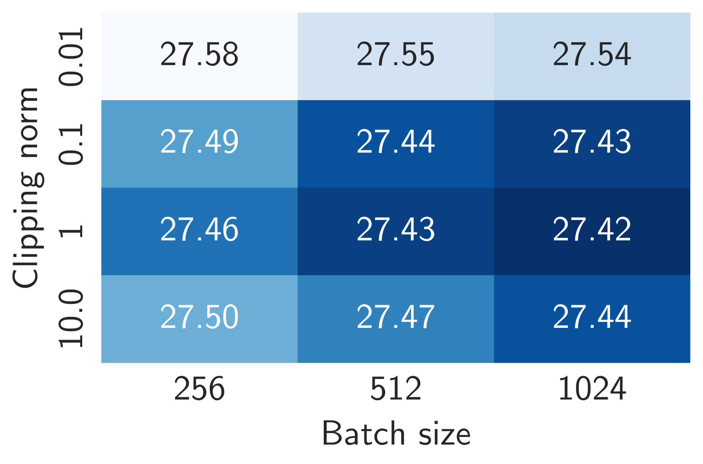
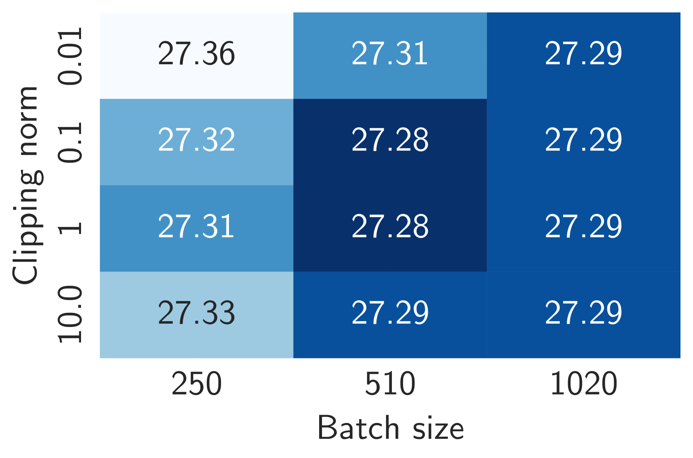
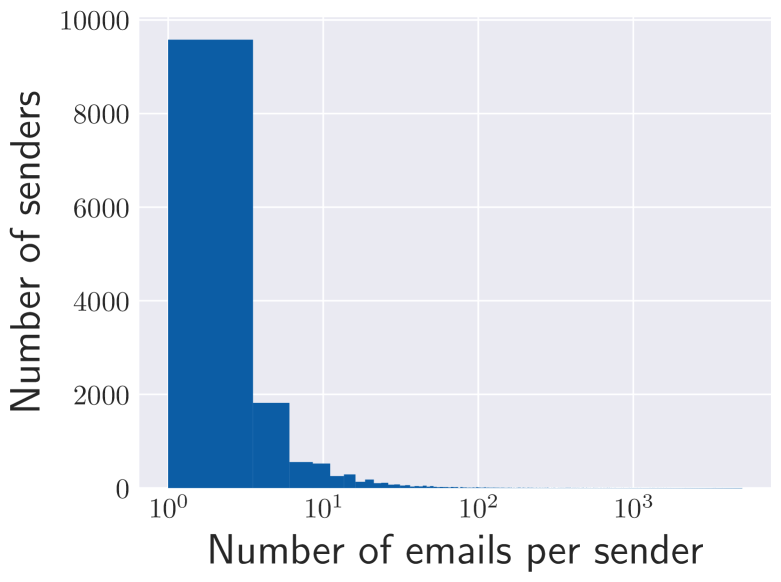
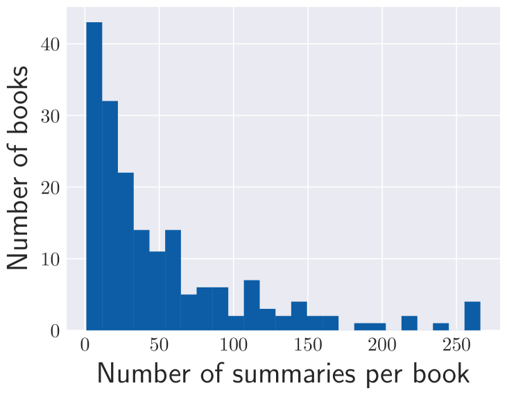
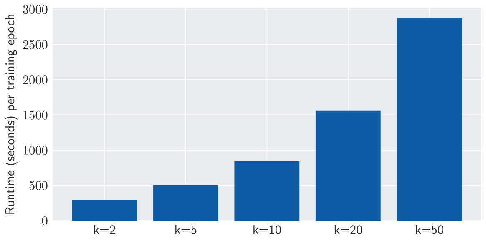
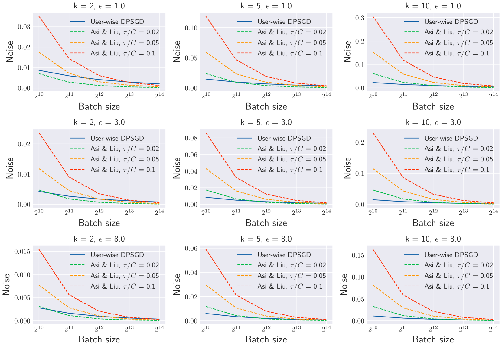

# 关注隐私细节！语言模型微调中的用户级差分隐私保护

发布时间：2024年06月20日

`LLM理论

理由：这篇论文主要探讨了大型语言模型（LLMs）在处理敏感数据时的隐私保护问题，特别是通过差分隐私（DP）机制来保护用户隐私。论文关注的是如何在微调LLM时实现用户级别的DP，并评估了不同的实现机制。这属于对LLM理论层面的深入研究，特别是在隐私保护和模型效用之间的平衡问题，因此归类为LLM理论。` `隐私保护`

> Mind the Privacy Unit! User-Level Differential Privacy for Language Model Fine-Tuning

# 摘要

> 大型语言模型（LLMs）虽为解决多领域复杂任务提供了强大工具，但在处理敏感数据时，其微调过程可能引发隐私泄露风险。差分隐私（DP）作为一种解决方案，确保模型在有无特定隐私单元时“几乎无法区分”。然而，当前评估多将每个文本记录视为隐私单元，导致用户贡献不均时隐私保障失衡。为此，我们探讨了用户级别的DP，确保在需一致保护用户隐私的场景下，每位用户都能得到同等保护。我们系统评估了在自然语言生成任务中微调LLM时应用用户级别DP的效果，并深入研究了实现这一目标的两种机制：组隐私和用户级DP-SGD，同时探讨了数据选择和参数调整等策略，以期在隐私与效用间找到最佳平衡点。

> Large language models (LLMs) have emerged as powerful tools for tackling complex tasks across diverse domains, but they also raise privacy concerns when fine-tuned on sensitive data due to potential memorization. While differential privacy (DP) offers a promising solution by ensuring models are `almost indistinguishable' with or without any particular privacy unit, current evaluations on LLMs mostly treat each example (text record) as the privacy unit. This leads to uneven user privacy guarantees when contributions per user vary. We therefore study user-level DP motivated by applications where it necessary to ensure uniform privacy protection across users. We present a systematic evaluation of user-level DP for LLM fine-tuning on natural language generation tasks. Focusing on two mechanisms for achieving user-level DP guarantees, Group Privacy and User-wise DP-SGD, we investigate design choices like data selection strategies and parameter tuning for the best privacy-utility tradeoff.

[Arxiv](https://arxiv.org/abs/2406.14322)