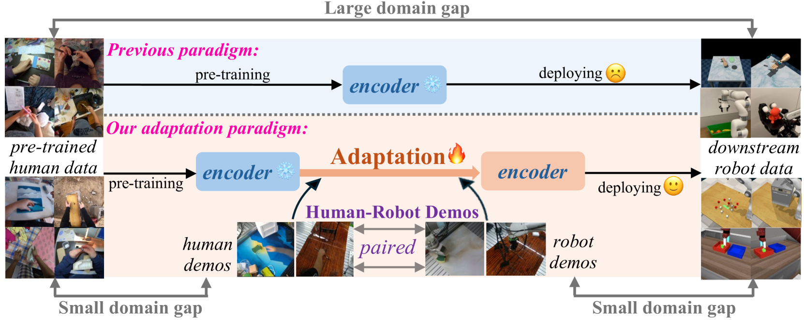
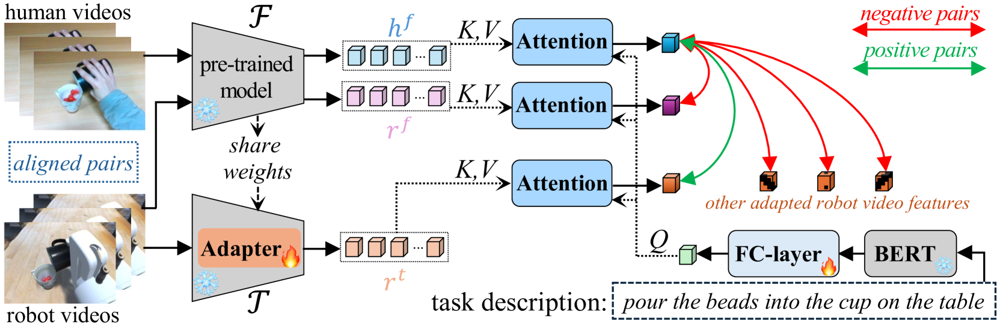
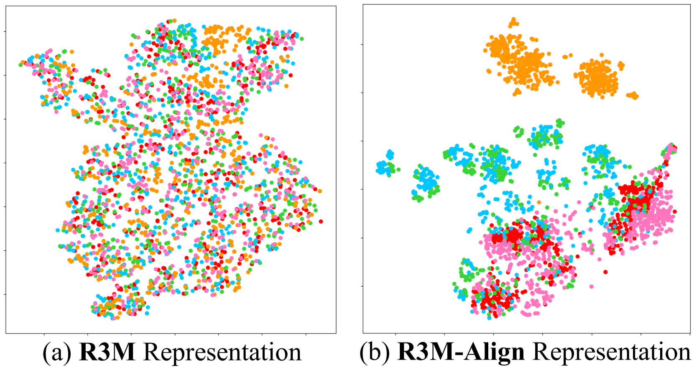

# 缩小视觉预训练中人机交互的领域鸿沟，优化机器人操作性能

发布时间：2024年06月20日

`Agent

这篇论文主要关注的是机器人操作领域中的视觉动态适应问题，并提出了一种新的适应策略，通过人-机器人对比对齐损失来对齐视频语义，使得预训练模型能够更好地适应机器人领域。这与Agent（代理）的概念相符，因为Agent通常指的是能够自主执行任务的实体，如机器人或智能系统。论文中的方法旨在提高机器人的性能，使其能够更好地理解和执行任务，这是Agent领域的一个重要研究方向。因此，将这篇论文分类为Agent是合适的。` `机器人技术` `自动化`

> Mitigating the Human-Robot Domain Discrepancy in Visual Pre-training for Robotic Manipulation

# 摘要

> 在机器人操作领域，掌握跨环境的通用视觉动态至关重要。尽管机器人演示数据有限，但借助人类数据的大规模预训练已成为新趋势。然而，人类与机器人的形态差异导致了显著的领域差异，限制了这些预训练模型在实际操作任务中的应用。为此，我们创新性地提出了一种适应策略，通过利用现有的人-机器人配对视频数据来缩小这一差距。我们的方法通过人-机器人对比对齐损失，有效对齐了两者的视频语义，使得预训练模型能够高效适应机器人领域。实验结果显示，在涵盖单任务和语言条件多任务的25个任务中，我们的方法在三个不同基准上均取得了显著提升。特别是在RLBench这一大型基准上，我们的方法在多个任务上的成功率比预训练的R3M模型平均提高了8.9%。我们计划在接受后公开代码和模型。

> Learning generalizable visual dynamic representation across different embodied environments is crucial for real-world robotic manipulation. As the scale and diversity of robot demonstration data are limited, recent works have turned to large-scale pre-training using human data. However, the morphological differences between humans and robots introduce a significant human-robot domain discrepancy, challenging the generalization of these human-data pre-trained models to downstream manipulation tasks. To address this, we propose a novel adaptation paradigm that utilizes readily available paired human-robot video data to bridge the discrepancy. Following this paradigm, our method exploits a human-robot contrastive alignment loss to align the semantics of human and robot videos, adapting pre-trained models to the robotic domain in a parameter-efficient manner. The experiments demonstrate significant improvements on 25 tasks across three different benchmarks, where the single-task, language-conditioned multi-task settings are covered, and two different pre-trained models are evaluated. On the large RLBench benchmark, our adaptation method achieves an average improvement of $8.9\%$ in success rate over the pre-trained R3M model across multiple tasks. We will release the code and models upon acceptance.

[Arxiv](https://arxiv.org/abs/2406.14235)