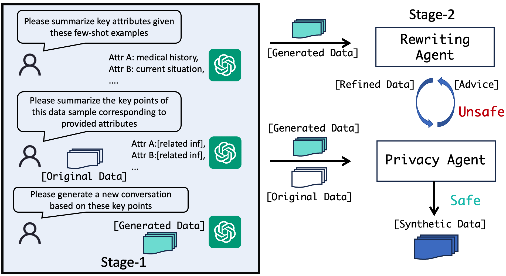
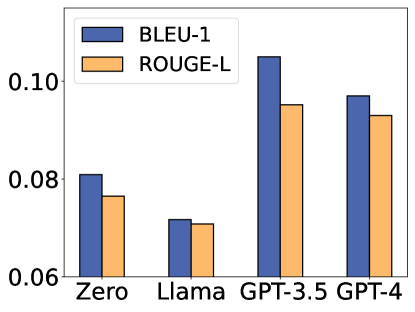

# 利用纯合成数据缓解检索增强生成模型（RAG）中的隐私隐患

发布时间：2024年06月20日

`RAG

这篇论文主要探讨了检索增强生成（RAG）系统在处理私人数据时的隐私问题，并提出了一种使用合成数据来保护隐私的方法。这与RAG系统的应用和改进直接相关，因此应归类为RAG。虽然论文中涉及了语言模型的应用，但其核心贡献在于RAG系统的隐私保护方法，而不是语言模型本身的理论或应用。` `隐私保护` `数据安全`

> Mitigating the Privacy Issues in Retrieval-Augmented Generation (RAG) via Pure Synthetic Data

# 摘要

> 检索增强生成（RAG）通过融合外部知识源的相关信息，提升了语言模型的表现。但当触及私人数据时，RAG系统可能遭遇隐私泄露的风险。为此，我们提出使用合成数据作为保护隐私的检索数据替代品，并推出了SAGE，一种创新的两阶段合成数据生成模式。首先，我们通过基于属性的方法提取并生成关键上下文信息。其次，通过代理的迭代细化，进一步强化了合成数据的隐私保护。实验证明，使用合成数据作为检索上下文，不仅性能与原始数据相当，还大幅降低了隐私风险。我们的研究首次探索了为RAG生成既实用又保护隐私的合成数据的可能性，为RAG在多领域的安全应用开启了新篇章。

> Retrieval-augmented generation (RAG) enhances the outputs of language models by integrating relevant information retrieved from external knowledge sources. However, when the retrieval process involves private data, RAG systems may face severe privacy risks, potentially leading to the leakage of sensitive information. To address this issue, we propose using synthetic data as a privacy-preserving alternative for the retrieval data. We propose SAGE, a novel two-stage synthetic data generation paradigm. In the stage-1, we employ an attribute-based extraction and generation approach to preserve key contextual information from the original data. In the stage-2, we further enhance the privacy properties of the synthetic data through an agent-based iterative refinement process. Extensive experiments demonstrate that using our synthetic data as the retrieval context achieves comparable performance to using the original data while substantially reducing privacy risks. Our work takes the first step towards investigating the possibility of generating high-utility and privacy-preserving synthetic data for RAG, opening up new opportunities for the safe application of RAG systems in various domains.

[Arxiv](https://arxiv.org/abs/2406.14773)