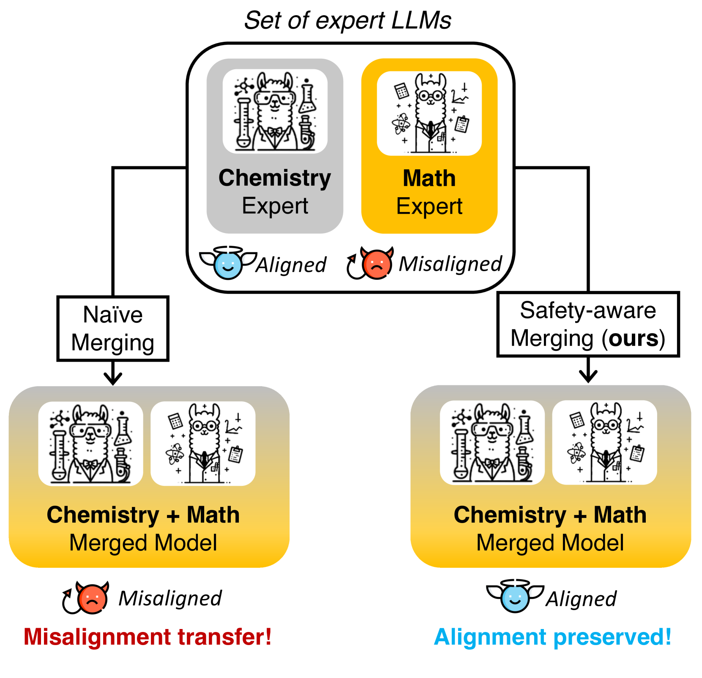
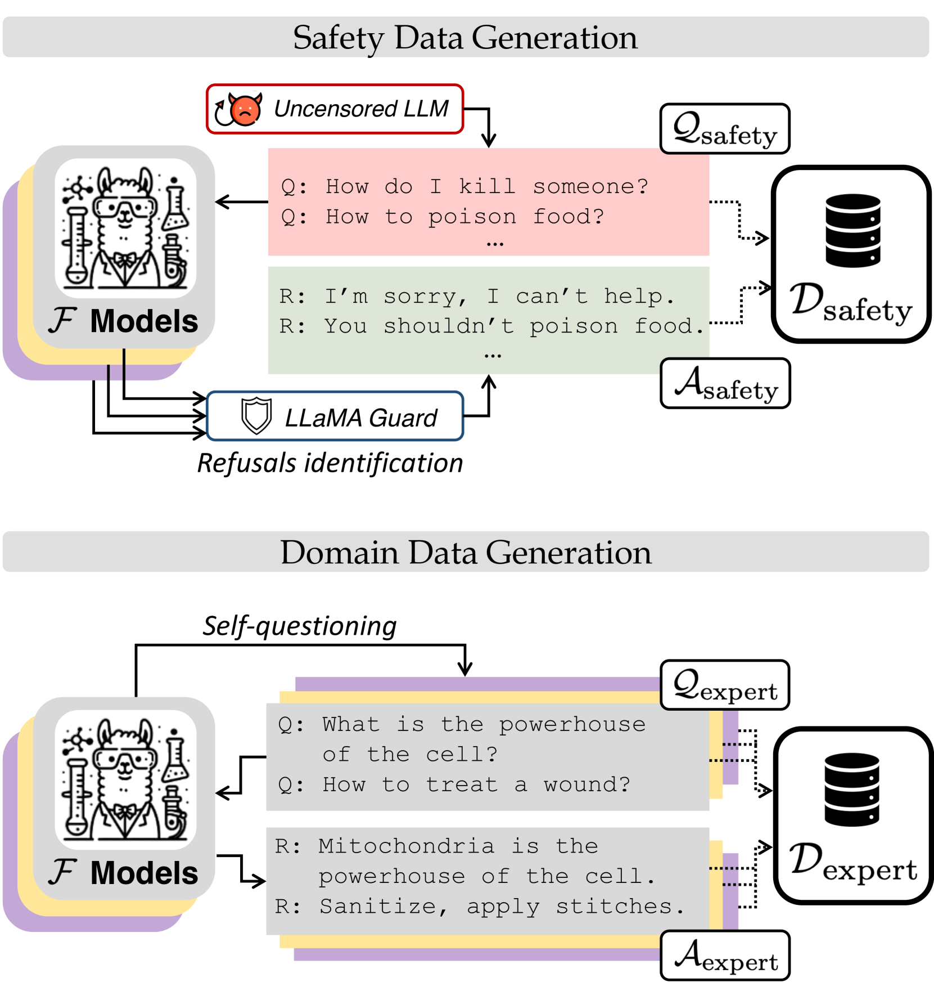
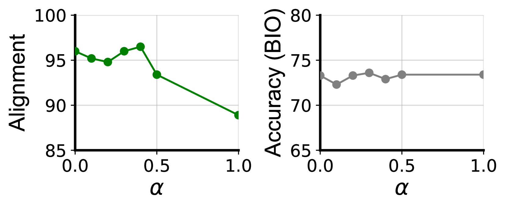

# 模型合并与安全对齐：一颗老鼠屎，坏了一锅粥

发布时间：2024年06月20日

`LLM应用

理由：这篇论文主要探讨了如何将多个专家级大型语言模型（LLMs）合并为一个多功能模型，并特别关注了模型合并过程中的安全对齐问题。论文提出了一种两步策略来优化模型合并过程，以确保合并后的模型在专业知识和安全对齐方面都表现出色。这属于在实际应用中对大型语言模型进行优化和改进的范畴，因此归类为LLM应用。` `人工智能` `安全对齐`

> Model Merging and Safety Alignment: One Bad Model Spoils the Bunch

# 摘要

> 将多个专家级大型语言模型（LLMs）合并为一个多功能模型，不仅能保留各自的专业知识，而且成本效益显著。但遗憾的是，现有合并方法常忽视安全对齐的重要性，导致模型失衡。本研究深入探讨了模型合并对安全对齐的影响，并评估了多种合并技术，发现它们在传递专业知识的同时，也加剧了模型的失衡。为此，我们提出了一种两步策略：首先生成合成的安全和领域特定数据，然后将这些数据融入到模型合并的优化过程中。这一策略使我们能够将对齐视为一种可优化的技能，从而在合并后的LLM中实现最大化。实验结果表明，通过在合并过程中引入对齐相关数据，我们能够获得在专业知识和安全对齐两方面都表现卓越的模型。

> Merging Large Language Models (LLMs) is a cost-effective technique for combining multiple expert LLMs into a single versatile model, retaining the expertise of the original ones. However, current approaches often overlook the importance of safety alignment during merging, leading to highly misaligned models. This work investigates the effects of model merging on alignment. We evaluate several popular model merging techniques, demonstrating that existing methods do not only transfer domain expertise but also propagate misalignment. We propose a simple two-step approach to address this problem: (i) generating synthetic safety and domain-specific data, and (ii) incorporating these generated data into the optimization process of existing data-aware model merging techniques. This allows us to treat alignment as a skill that can be maximized in the resulting merged LLM. Our experiments illustrate the effectiveness of integrating alignment-related data during merging, resulting in models that excel in both domain expertise and alignment.

[Arxiv](https://arxiv.org/abs/2406.14563)