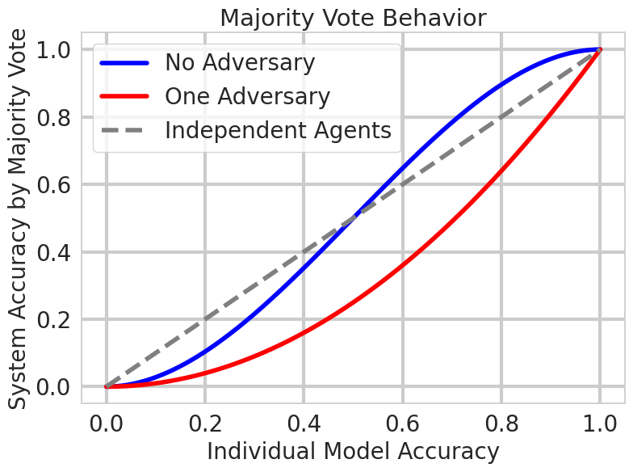

# 辩论中的多智能体协作攻击：探究大型语言模型协作中的对抗性策略

发布时间：2024年06月20日

`Agent

这篇论文主要探讨了大型语言模型（LLMs）作为智能代理，在多模型协作环境中执行复杂任务的能力，特别是在敌对干扰下的协作行为。研究关注了模型网络通过辩论进行协作的行为，并引入了新的指标来衡量敌对效果，特别关注系统准确性和模型间的一致性。这与Agent分类中的智能代理行为和协作机制的研究相符合，因此将其归类为Agent。` `人工智能` `网络安全`

> MultiAgent Collaboration Attack: Investigating Adversarial Attacks in Large Language Model Collaborations via Debate

# 摘要

> 大型语言模型（LLMs）在独立运行时已展现出卓越的性能。随着技术进步，这些模型不仅在参数和推理时间上更为精简，还能作为智能代理，协同执行复杂任务。这种多模型协作不仅利用了各自的专业技能（如编程），还通过多重计算增强了决策信心，并激发了更丰富的创意输出。因此，语言模型间的协作预计将在未来几年内显著增长。本研究聚焦于一个模型网络在敌对干扰下通过辩论进行协作的行为，并引入了衡量敌对效果的新指标，特别关注系统准确性和模型间的一致性。研究结果凸显了模型说服力的重要性，并探索了在推理阶段生成更具说服力论点的方法，以及基于提示的防御策略的潜力。

> Large Language Models (LLMs) have shown exceptional results on current benchmarks when working individually. The advancement in their capabilities, along with a reduction in parameter size and inference times, has facilitated the use of these models as agents, enabling interactions among multiple models to execute complex tasks. Such collaborations offer several advantages, including the use of specialized models (e.g. coding), improved confidence through multiple computations, and enhanced divergent thinking, leading to more diverse outputs. Thus, the collaborative use of language models is expected to grow significantly in the coming years. In this work, we evaluate the behavior of a network of models collaborating through debate under the influence of an adversary. We introduce pertinent metrics to assess the adversary's effectiveness, focusing on system accuracy and model agreement. Our findings highlight the importance of a model's persuasive ability in influencing others. Additionally, we explore inference-time methods to generate more compelling arguments and evaluate the potential of prompt-based mitigation as a defensive strategy.

[Arxiv](https://arxiv.org/abs/2406.14711)