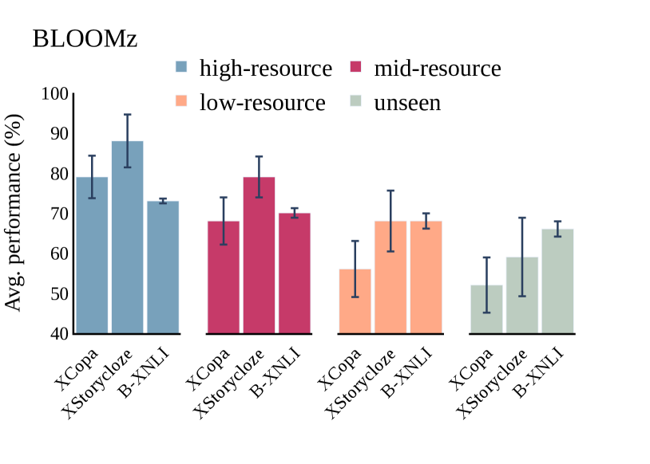
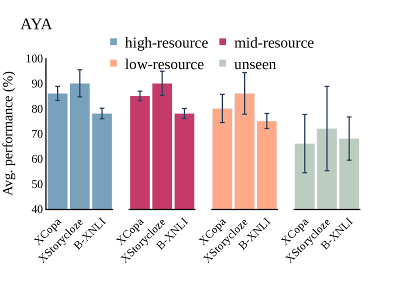
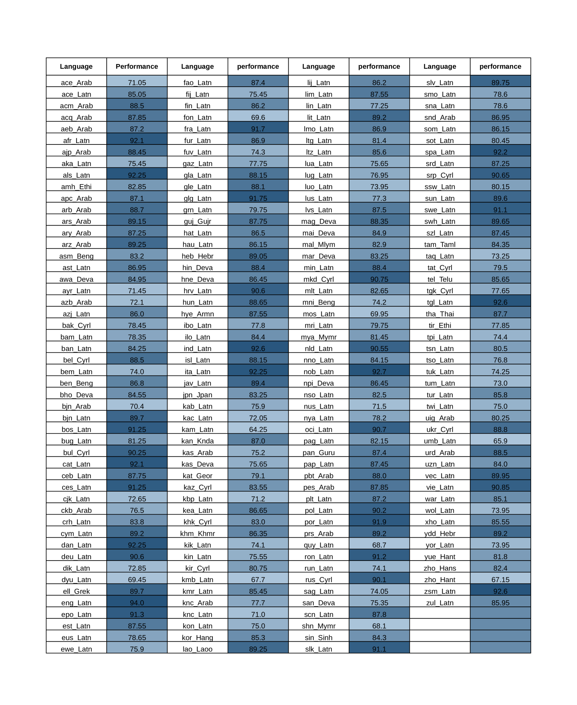

# 多语言NLP评估实践中，机器翻译是否能成为人类翻译的有效替代方案？

发布时间：2024年06月20日

`LLM理论

这篇论文主要探讨了多语言语言模型（MLMs）的评估问题，特别是在低资源和未知语言方面的评估挑战。它分析了现有的评估框架，并提出了改进方向，同时通过机器翻译模型进行了大规模的跨语言评估实验。这些内容更偏向于对LLM理论的探讨和改进，而不是具体的应用、Agent行为或RAG（检索增强生成）技术。因此，将其归类为LLM理论是合适的。` `机器翻译`

> On the Evaluation Practices in Multilingual NLP: Can Machine Translation Offer an Alternative to Human Translations?

# 摘要

> 多语言语言模型（MLMs）虽已涉猎百余种语言，却因多数语言测试数据匮乏，仅在少数几种上接受考验。尤其在评估MLMs对低资源及未知语言的潜力时，这一局限尤为突出。本文深入分析了多语言NLP的现有评估框架，指出其不足，并提出若干改进方向，以期评估更为稳健可靠。我们还实证探讨了机器翻译在大规模跨语言评估MLMs中作为人类翻译替代品的可靠性。通过最先进的翻译模型，我们将四项任务的测试数据翻译成198种语言，以此检验三种MLMs。结果显示，尽管高资源语言的样本足以代表更广泛的高资源语言，我们对MLMs在低资源语言上的表现却往往过于乐观。此外，我们发现，一些未经大规模多语言预训练的简单模型，其表现亦相当不俗。

> While multilingual language models (MLMs) have been trained on 100+ languages, they are typically only evaluated across a handful of them due to a lack of available test data in most languages. This is particularly problematic when assessing MLM's potential for low-resource and unseen languages. In this paper, we present an analysis of existing evaluation frameworks in multilingual NLP, discuss their limitations, and propose several directions for more robust and reliable evaluation practices. Furthermore, we empirically study to what extent machine translation offers a {reliable alternative to human translation} for large-scale evaluation of MLMs across a wide set of languages. We use a SOTA translation model to translate test data from 4 tasks to 198 languages and use them to evaluate three MLMs. We show that while the selected subsets of high-resource test languages are generally sufficiently representative of a wider range of high-resource languages, we tend to overestimate MLMs' ability on low-resource languages. Finally, we show that simpler baselines can achieve relatively strong performance without having benefited from large-scale multilingual pretraining.

[Arxiv](https://arxiv.org/abs/2406.14267)