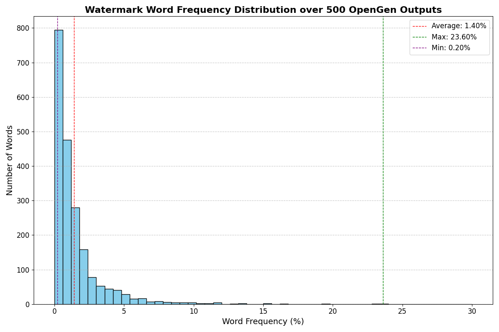

# PostMark：为大型语言模型设计的鲁棒黑盒水印方案

发布时间：2024年06月20日

`LLM应用

理由：这篇论文主要讨论了一种新的水印技术PostMark，用于检测LLM生成的文本，并且这种技术不需要访问LLM的内部logits。这属于在大型语言模型（LLM）的应用层面上的创新，特别是在安全性和文本识别方面。因此，它被归类为LLM应用。` `信息安全`

> PostMark: A Robust Blackbox Watermark for Large Language Models

# 摘要

> 检测LLM生成文本的最有效手段是在解码过程中嵌入可识别的水印。然而，现有水印技术大多需获取LLM的内部logits，这因安全顾虑而鲜少被API提供者公开。因此，水印的实施需由各LLM提供者自行负责。本文中，我们推出了PostMark，一种无需logit访问的模块化后验水印技术。它通过语义嵌入选择一组与输入相关的词汇，在文本解码后巧妙植入。PostMark不仅可由第三方实施，且在抵御改写攻击方面表现更为坚韧。我们的实验涵盖了八种算法、五种LLM及三个数据集。最终，通过自动与人工评估，我们揭示了PostMark在保持文本质量与增强抗改写能力间的微妙平衡。相关代码、结果及注释已公开于https://github.com/lilakk/PostMark。

> The most effective techniques to detect LLM-generated text rely on inserting a detectable signature -- or watermark -- during the model's decoding process. Most existing watermarking methods require access to the underlying LLM's logits, which LLM API providers are loath to share due to fears of model distillation. As such, these watermarks must be implemented independently by each LLM provider. In this paper, we develop PostMark, a modular post-hoc watermarking procedure in which an input-dependent set of words (determined via a semantic embedding) is inserted into the text after the decoding process has completed. Critically, PostMark does not require logit access, which means it can be implemented by a third party. We also show that PostMark is more robust to paraphrasing attacks than existing watermarking methods: our experiments cover eight baseline algorithms, five base LLMs, and three datasets. Finally, we evaluate the impact of PostMark on text quality using both automated and human assessments, highlighting the trade-off between quality and robustness to paraphrasing. We release our code, outputs, and annotations at https://github.com/lilakk/PostMark.

[Arxiv](https://arxiv.org/abs/2406.14517)