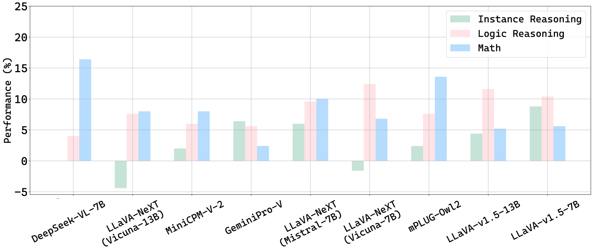

# Prism：解耦与评估视觉语言模型能力的框架

发布时间：2024年06月20日

`LLM应用

理由：这篇论文介绍了Prism框架，该框架旨在分离视觉语言模型（VLMs）在处理视觉问题时的感知与推理过程。它利用VLMs进行感知并将视觉信息转化为文本，然后使用大型语言模型（LLM）进行推理以生成答案。这种设计使得能够系统地比较不同VLMs在感知与推理上的表现，并在视觉语言任务中提供高效的解决方案。因此，这项工作属于LLM的应用领域，特别是在视觉语言任务中的应用。` `人工智能` `多模态学习`

> Prism: A Framework for Decoupling and Assessing the Capabilities of VLMs

# 摘要

> 视觉语言模型（VLMs）在处理多样化的视觉问题时展现了出色的感知与推理能力。尽管视觉与推理在现有模型中紧密交织，独立评估这两项能力对于模型优化至关重要。为此，我们推出了Prism框架，旨在分离视觉问题解决中的感知与推理过程。Prism分为两个阶段：感知阶段利用VLMs将视觉信息转化为文本；推理阶段则通过LLM基于这些信息生成答案。这种设计使得我们能够系统地比较不同VLMs在感知与推理上的表现。我们的分析揭示了Prism作为视觉语言任务高效解决方案的潜力。通过结合专注感知的VLMs与擅长推理的LLM，Prism不仅在视觉语言任务中表现卓越，还显著降低了成本。实证数据显示，配备基础2B LLaVA和免费GPT-3.5的Prism，在MMStar这一严格的多模态测试中，性能与规模大10倍的VLMs相媲美。项目详情请访问：https://github.com/SparksJoe/Prism。

> Vision Language Models (VLMs) demonstrate remarkable proficiency in addressing a wide array of visual questions, which requires strong perception and reasoning faculties. Assessing these two competencies independently is crucial for model refinement, despite the inherent difficulty due to the intertwined nature of seeing and reasoning in existing VLMs. To tackle this issue, we present Prism, an innovative framework designed to disentangle the perception and reasoning processes involved in visual question solving. Prism comprises two distinct stages: a perception stage that utilizes a VLM to extract and articulate visual information in textual form, and a reasoning stage that formulates responses based on the extracted visual information using a Large Language Model (LLM). This modular design enables the systematic comparison and assessment of both proprietary and open-source VLM for their perception and reasoning strengths. Our analytical framework provides several valuable insights, underscoring Prism's potential as a cost-effective solution for vision-language tasks. By combining a streamlined VLM focused on perception with a powerful LLM tailored for reasoning, Prism achieves superior results in general vision-language tasks while substantially cutting down on training and operational expenses. Quantitative evaluations show that Prism, when configured with a vanilla 2B LLaVA and freely accessible GPT-3.5, delivers performance on par with VLMs $10 \times$ larger on the rigorous multimodal benchmark MMStar. The project is released at: https://github.com/SparksJoe/Prism.

[Arxiv](https://arxiv.org/abs/2406.14544)