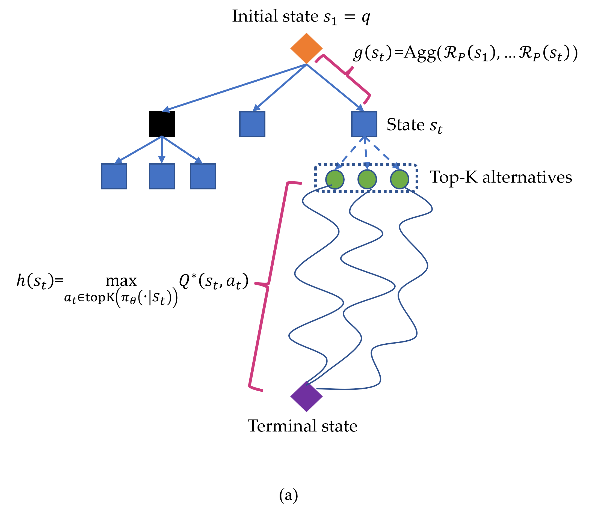

# Q*：借助审慎规划，提升大型语言模型在多步推理上的表现力

发布时间：2024年06月20日

`Agent

这篇论文摘要描述了一个名为Q*框架的指导系统，它旨在通过优化大型语言模型（LLMs）的解码过程来提高复杂推理任务的性能。该框架利用一个即插即用的Q值模型作为智能引导，以指导LLMs达到最优解，而不需要对每个任务进行模型微调。这种方法不仅节省了计算资源，还避免了其他任务性能的下降。实验结果在GSM8K、MATH和MBPP等任务上证明了其高效性。因此，这个系统可以被视为一个智能Agent，它通过智能引导来优化LLMs的行为，属于Agent分类。` `机器学习`

> Q*: Improving Multi-step Reasoning for LLMs with Deliberative Planning

# 摘要

> 大型语言模型（LLMs）在众多自然语言任务中表现出色，但其自回归生成特性在进行复杂推理时易产生错误和幻觉。为此，我们提出了Q*框架，一个灵活且通用的指导系统，旨在通过精心规划优化LLMs的解码过程。我们的Q*利用一个即插即用的Q值模型作为智能引导，无需针对每个任务微调模型，便能精准指引LLMs迈向最优解，既节省了大量计算资源，又避免了其他任务性能的下降。GSM8K、MATH和MBPP的实验结果充分证明了我们方法的高效性。

> Large Language Models (LLMs) have demonstrated impressive capability in many nature language tasks. However, the auto-regressive generation process makes LLMs prone to produce errors, hallucinations and inconsistent statements when performing multi-step reasoning. In this paper, we aim to alleviate the pathology by introducing Q*, a general, versatile and agile framework for guiding LLMs decoding process with deliberative planning. By learning a plug-and-play Q-value model as heuristic function, our Q* can effectively guide LLMs to select the most promising next step without fine-tuning LLMs for each task, which avoids the significant computational overhead and potential risk of performance degeneration on other tasks. Extensive experiments on GSM8K, MATH and MBPP confirm the superiority of our method.

[Arxiv](https://arxiv.org/abs/2406.14283)