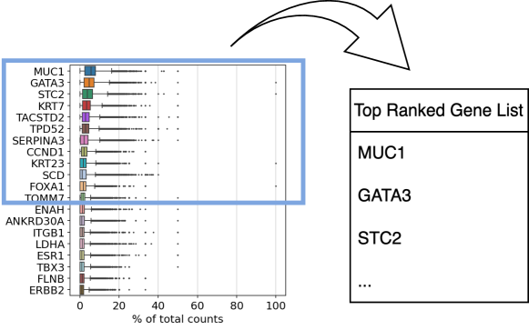
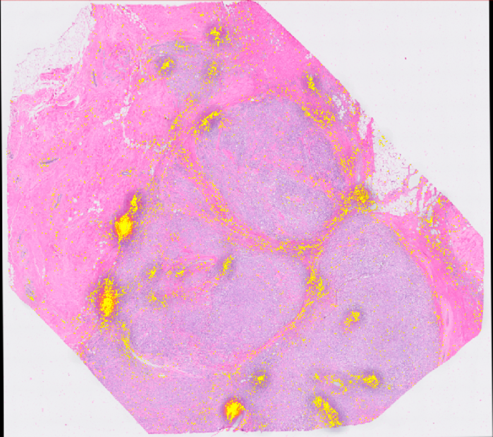

# QuST-LLM：融合大型语言模型，助力全面空间转录组学深度解析

发布时间：2024年06月20日

`LLM应用

理由：这篇论文介绍了QuST-LLM，一个利用大型语言模型（LLMs）来分析空间转录组学（ST）数据的创新扩展。它通过一个全面的工作流程，简化了ST数据的复杂性，并提高了数据解释性。这个应用展示了LLM在生物医学研究中的实际应用，因此属于LLM应用分类。` `生物医学研究` `空间转录组学`

> QuST-LLM: Integrating Large Language Models for Comprehensive Spatial Transcriptomics Analysis

# 摘要

> 本文介绍了QuST-LLM，这一QuPath的创新扩展利用大型语言模型（LLMs）分析空间转录组学（ST）数据。通过全面的工作流程，包括数据加载、区域选择、基因表达分析及功能注释，QuST-LLM简化了ST数据的复杂性。它运用LLMs将复杂数据转化为基于基因本体注释的易懂生物学叙述，大幅提升了解释性。用户得以用自然语言与ST数据互动，QuST-LLM因此成为解码组织时空与功能复杂性的利器，推动生物医学研究的新发现。

> In this paper, we introduce QuST-LLM, an innovative extension of QuPath that utilizes the capabilities of large language models (LLMs) to analyze and interpret spatial transcriptomics (ST) data. This tool effectively simplifies the intricate and high-dimensional nature of ST data by offering a comprehensive workflow that includes data loading, region selection, gene expression analysis, and functional annotation. QuST-LLM employs LLMs to transform complex ST data into understandable and detailed biological narratives based on gene ontology annotations, thereby significantly improving the interpretability of ST data. Consequently, users can interact with their own ST data using natural language. Hence, QuST-LLM provides researchers with a potent functionality to unravel the spatial and functional complexities of tissues, fostering novel insights and advancements in biomedical research.

[Arxiv](https://arxiv.org/abs/2406.14307)