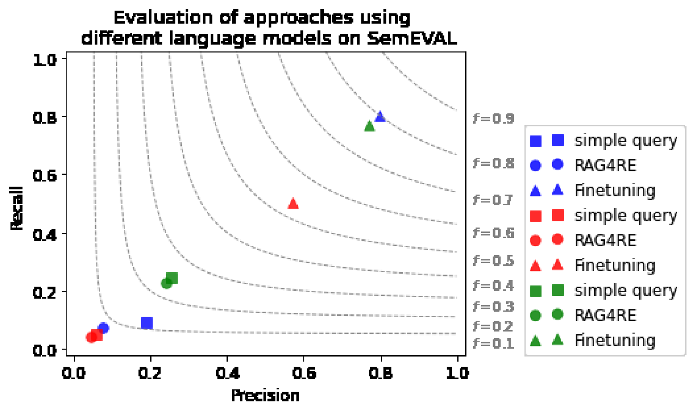

# 微调大型语言模型在检索增强生成框架下的关系抽取研究

发布时间：2024年06月20日

`RAG

理由：这篇论文主要探讨了预训练语言模型（PLMs）在关系抽取（RE）任务中的应用，特别是在检索增强型（RAG）RE方法中的应用。论文聚焦于通过微调大型语言模型（LLMs）来提升在识别句子级别隐含关系方面的性能，这是RAG框架中的关键问题。因此，这篇论文的内容与RAG分类最为相关。` `知识图谱`

> Relation Extraction with Fine-Tuned Large Language Models in Retrieval Augmented Generation Frameworks

# 摘要

> 信息抽取（IE）是将非结构化数据转化为知识图谱等结构化格式的关键技术。其中，关系抽取（RE）任务尤为重要，它旨在揭示文本中实体间的联系。RE方法多样，涵盖了监督、无监督、弱监督及基于规则的策略。近年来，预训练语言模型（PLMs）的应用在这一领域大放异彩。在大型语言模型（LLMs）盛行的今天，通过微调这些模型，我们能够克服零-shot LLM提示型RE方法在领域适应和识别句子中隐含关系方面的局限。这些隐含关系往往难以从依赖树中直接提取，需要逻辑推理来精准捕捉。本研究聚焦于微调LLMs的效能，并探讨其在检索增强型（RAG）RE方法中的应用，旨在解决句子级别隐含关系识别的难题，尤其是在LLMs作为RAG框架中的生成器时。实证分析基于TACRED、TACRED-Revisited、Re-TACRED和SemEVAL数据集，结果显示微调LLMs（如Llama2-7B、Mistral-7B和T5（Large））显著提升了性能。特别是在SemEVAL数据集上，我们的方法在处理常见隐含关系时表现出色，刷新了该数据集的记录。此外，在TACRED、TACREV和Re-TACRED上的表现也超越了以往，展现了在多变评估环境下的卓越能力。

> Information Extraction (IE) is crucial for converting unstructured data into structured formats like Knowledge Graphs (KGs). A key task within IE is Relation Extraction (RE), which identifies relationships between entities in text. Various RE methods exist, including supervised, unsupervised, weakly supervised, and rule-based approaches. Recent studies leveraging pre-trained language models (PLMs) have shown significant success in this area. In the current era dominated by Large Language Models (LLMs), fine-tuning these models can overcome limitations associated with zero-shot LLM prompting-based RE methods, especially regarding domain adaptation challenges and identifying implicit relations between entities in sentences. These implicit relations, which cannot be easily extracted from a sentence's dependency tree, require logical inference for accurate identification. This work explores the performance of fine-tuned LLMs and their integration into the Retrieval Augmented-based (RAG) RE approach to address the challenges of identifying implicit relations at the sentence level, particularly when LLMs act as generators within the RAG framework. Empirical evaluations on the TACRED, TACRED-Revisited (TACREV), Re-TACRED, and SemEVAL datasets show significant performance improvements with fine-tuned LLMs, including Llama2-7B, Mistral-7B, and T5 (Large). Notably, our approach achieves substantial gains on SemEVAL, where implicit relations are common, surpassing previous results on this dataset. Additionally, our method outperforms previous works on TACRED, TACREV, and Re-TACRED, demonstrating exceptional performance across diverse evaluation scenarios.

[Arxiv](https://arxiv.org/abs/2406.14745)