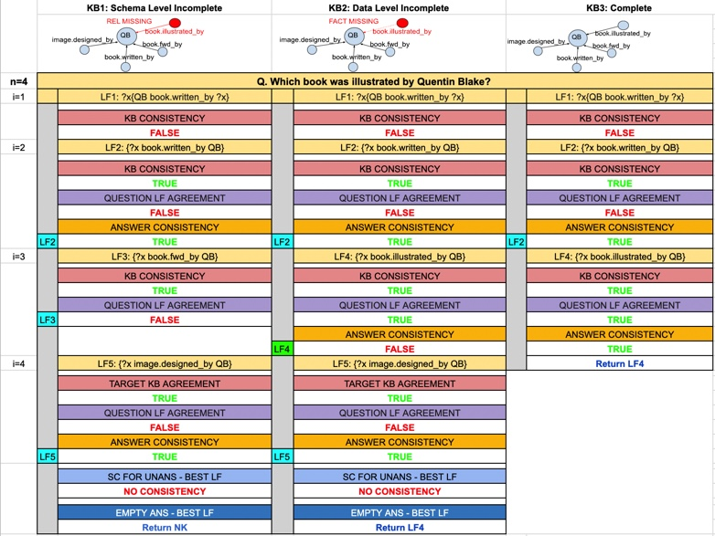

# 针对知识库问答中不可回答问题的鲁棒性少样本迁移学习：探索知识库问答系统在面对不可回答问题时的少样本学习能力，以提升系统的鲁棒性和适应性。

发布时间：2024年06月20日

`Agent

理由：这篇论文主要介绍了一个针对KBQA（知识库问答）任务的少样本迁移学习模型FUn-FuSIC，该模型专门设计来处理不可回答的问题。它通过引导大型语言模型（LLM）迭代生成问题的逻辑形式，并利用自一致性来评估LLM判断问题可答性的置信度。这个模型可以被视为一个智能Agent，因为它在特定的任务（KBQA）中表现出决策和执行的能力，特别是在处理不可回答问题时。因此，这篇论文更适合归类到Agent分类中。` `问答系统` `知识图谱`

> Robust Few-shot Transfer Learning for Knowledge Base Question Answering with Unanswerable Questions

# 摘要

> 在实际的KBQA应用中，我们需要的模型既要强健——能区分问题的可答与不可答，又要节省资源——无需庞大的训练数据。为此，我们创新性地提出了一个任务：针对KBQA的少样本迁移学习，特别关注不可回答问题。我们开发的FUn-FuSIC模型，是在SoTA的KBQA少样本迁移模型基础上进行扩展，专门用来处理不可回答问题。它通过一系列语法、语义和执行指导的反馈，引导LLM迭代生成问题的逻辑形式，并利用自一致性来评估LLM判断问题可答性的置信度。实验结果显示，FUn-FuSIC在新数据集上的表现超越了SoTA模型的调整版本，无论是在处理不可回答问题的KBQA任务上，还是在仅针对可回答问题的少样本迁移KBQA任务上。

> Real-world KBQA applications require models that are (1) robust -- e.g., can differentiate between answerable and unanswerable questions, and (2) low-resource -- do not require large training data. Towards this goal, we propose the novel task of few-shot transfer for KBQA with unanswerable questions. We present FUn-FuSIC that extends the state-of-the-art (SoTA) few-shot transfer model for answerable-only KBQA to handle unanswerability. It iteratively prompts an LLM to generate logical forms for the question by providing feedback using a diverse suite of syntactic, semantic and execution guided checks, and adapts self-consistency to assess confidence of the LLM to decide answerability. Experiments over newly constructed datasets show that FUn-FuSIC outperforms suitable adaptations of the SoTA model for KBQA with unanswerability, and the SoTA model for answerable-only few-shot-transfer KBQA.

[Arxiv](https://arxiv.org/abs/2406.14313)