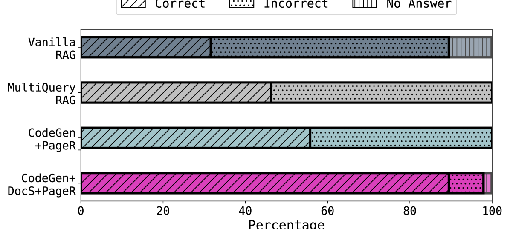

# SEC-QA：金融问答系统的系统性评估语料库

发布时间：2024年06月20日

`RAG

理由：这篇论文主要关注的是金融领域中处理长文档的挑战，并提出了一个名为SEC-QA的数据集生成框架，该框架能够半自动生成问答对，并利用未被大型语言模型（LLMs）吸收的公共文档集合进行持续更新。此外，论文还开发了一个基于思维程序的问答系统，以增强复杂信息检索和定量推理能力。这些内容与RAG（Retrieval-Augmented Generation）的概念相符，即通过检索增强生成方法来改进问答系统的性能，特别是在处理多文档问题时的应用。因此，这篇论文应归类于RAG。` `数据分析`

> SEC-QA: A Systematic Evaluation Corpus for Financial QA

# 摘要

> 金融领域常需处理大量长文档，这些文档对日常运营至关重要。尽管自动化金融数据分析的努力不断，但一个普遍挑战是缺乏能够准确反映真实世界任务的数据集。现有数据集往往受限于规模、上下文或实际应用相关性。此外，大型语言模型（LLMs）在数万亿文本标记上训练，限制了新数据或未遇文档的无偏评估。我们提出SEC-QA，一个连续数据集生成框架，具有两大特点：1）半自动生成跨越多个长金融文档的问答对，更真实地反映金融场景；2）能利用最新公共文档集合（未被LLMs吸收）持续更新数据集。实验显示，当前检索增强生成方法难以应对这些多文档问题的挑战。为此，我们开发了一个基于思维程序的问答系统，增强了复杂信息检索和定量推理能力，显著提升了问答准确性。

> The financial domain frequently deals with large numbers of long documents that are essential for daily operations. Significant effort is put towards automating financial data analysis. However, a persistent challenge, not limited to the finance domain, is the scarcity of datasets that accurately reflect real-world tasks for model evaluation. Existing datasets are often constrained by size, context, or relevance to practical applications. Moreover, LLMs are currently trained on trillions of tokens of text, limiting access to novel data or documents that models have not encountered during training for unbiased evaluation. We propose SEC-QA, a continuous dataset generation framework with two key features: 1) the semi-automatic generation of Question-Answer (QA) pairs spanning multiple long context financial documents, which better represent real-world financial scenarios; 2) the ability to continually refresh the dataset using the most recent public document collections, not yet ingested by LLMs. Our experiments show that current retrieval augmented generation methods systematically fail to answer these challenging multi-document questions. In response, we introduce a QA system based on program-of-thought that improves the ability to perform complex information retrieval and quantitative reasoning pipelines, thereby increasing QA accuracy.

[Arxiv](https://arxiv.org/abs/2406.14394)