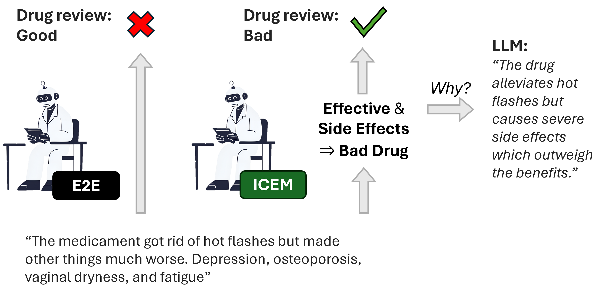
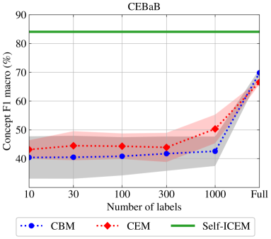
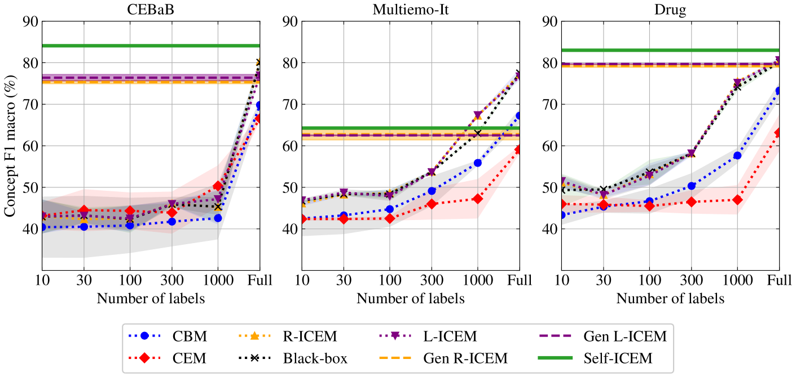
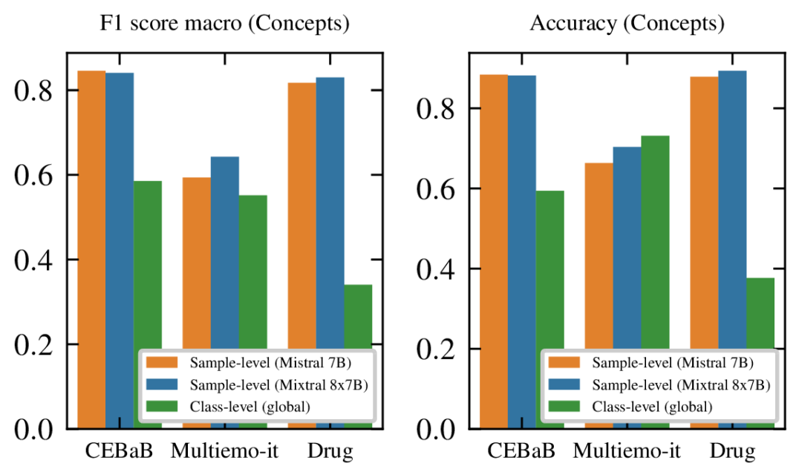
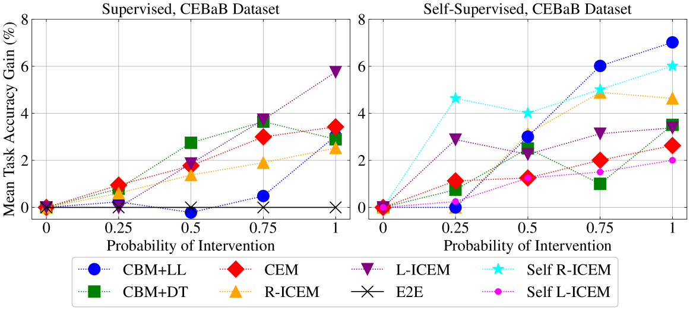
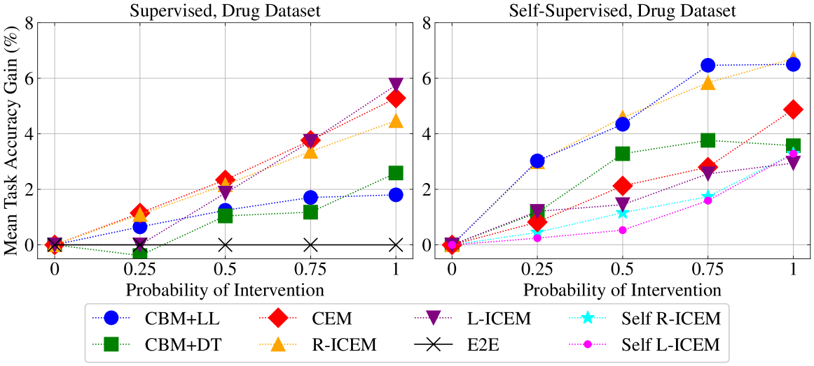
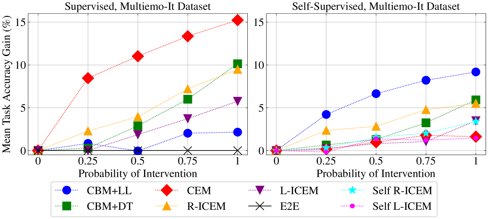

# 文本分类的自监督可解释概念模型

发布时间：2024年06月20日

`LLM理论

理由：这篇论文主要探讨了大型语言模型（LLMs）的可解释性问题，并提出了一种新的自监督的可解释概念嵌入模型（ICEMs）。该模型旨在通过自监督学习预测概念标签，并提供可解释的预测结果。这一研究不仅涉及模型的设计和实现，还深入探讨了模型的可解释性、可交互性和可控性，这些都是理论层面的研究内容。因此，这篇论文更适合归类于LLM理论。` `人工智能`

> Self-supervised Interpretable Concept-based Models for Text Classification

# 摘要

> 尽管大型语言模型（LLMs）取得了显著成就，但其缺乏可解释性仍受到批评，这影响了它们的可控性和可靠性。传统的事后解释方法，如基于注意力和梯度的分析，对模型决策过程的理解有限。在图像领域，基于概念的模型因其设计上的可解释性而崭露头角，使用人类可理解的特征作为中间表示。然而，这些方法尚未成功应用于文本数据，主要是因为它们需要昂贵的概念注释，这在实际文本数据中难以实现。本文提出了一种自监督的可解释概念嵌入模型（ICEMs），以解决这一难题。我们利用LLMs的泛化能力，以自监督方式预测概念标签，并通过一个可解释的函数提供最终预测。实验结果显示，ICEMs能以自监督方式训练，性能与完全监督的概念基模型和端到端黑盒模型相当。此外，我们的模型展现出（i）可解释性，为预测提供逻辑上合理的解释；（ii）可交互性，允许人类通过概念干预调整中间预测；以及（iii）可控性，引导LLMs的解码过程遵循特定的决策路径。

> Despite their success, Large-Language Models (LLMs) still face criticism as their lack of interpretability limits their controllability and reliability. Traditional post-hoc interpretation methods, based on attention and gradient-based analysis, offer limited insight into the model's decision-making processes. In the image field, Concept-based models have emerged as explainable-by-design architectures, employing human-interpretable features as intermediate representations. However, these methods have not been yet adapted to textual data, mainly because they require expensive concept annotations, which are impractical for real-world text data. This paper addresses this challenge by proposing a self-supervised Interpretable Concept Embedding Models (ICEMs). We leverage the generalization abilities of LLMs to predict the concepts labels in a self-supervised way, while we deliver the final predictions with an interpretable function. The results of our experiments show that ICEMs can be trained in a self-supervised way achieving similar performance to fully supervised concept-based models and end-to-end black-box ones. Additionally, we show that our models are (i) interpretable, offering meaningful logical explanations for their predictions; (ii) interactable, allowing humans to modify intermediate predictions through concept interventions; and (iii) controllable, guiding the LLMs' decoding process to follow a required decision-making path.

[Arxiv](https://arxiv.org/abs/2406.14335)