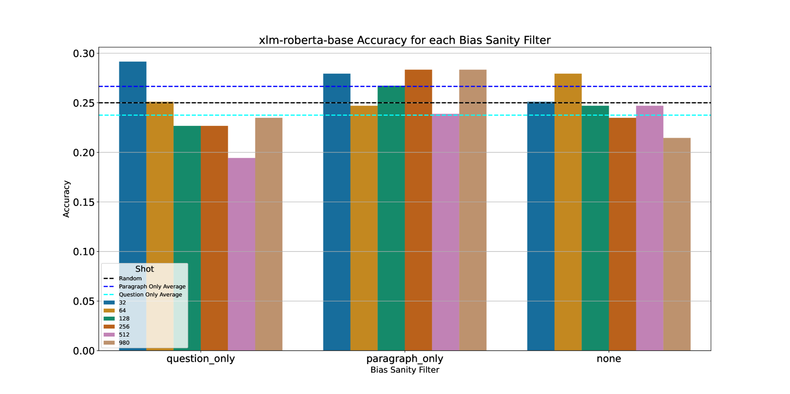

# SynDARin：低资源语言自动推理的数据集合成者

发布时间：2024年06月20日

`LLM应用

理由：这篇论文主要介绍了一种名为SynDARin的方法，用于为低资源语言自动生成和验证问答（QA）数据集，以支持多语言大型语言模型（LLM）的开发和评估。这种方法涉及从平行内容中挖掘数据，生成问答对，并进行翻译和质量验证。最终目的是创建一个高质量的QA数据集，用于评估和改进LLM在低资源语言中的表现。因此，这项工作属于LLM应用领域，因为它关注的是如何利用技术手段来改善LLM在特定语言环境下的应用性能。` `数据集开发`

> SynDARin: Synthesising Datasets for Automated Reasoning in Low-Resource Languages

# 摘要

> 问答（QA）数据集在大型语言模型（LLM）的开发和评估中扮演了关键角色，但除英语外，其他语言的数据集因收集和标注的难度与成本而稀缺。这使得在低资源语言中开发和评估多语言LLM变得困难。为此，我们开发了SynDARin方法，旨在为低资源语言自动生成和验证QA数据集。通过平行内容挖掘，我们获取了英语与目标语言间的人工精选段落，并利用英语数据生成多项选择问答对，自动翻译并验证其质量。结合这些与非英语的人工精选段落，我们构建了最终的QA数据集。这一方法不仅保持了内容质量，减少了事实错误，还避免了昂贵的标注工作。我们为亚美尼亚语创建了一个包含1.2K样本的QA数据集，并通过人工评估确认，98%的生成英语数据在问题类型和主题上保持了高质量和多样性，同时翻译验证流程成功过滤了约70%的低质量数据。我们用此数据集测试了最先进的LLM，发现它们在某些情况下甚至无法达到随机水平的准确性，这表明我们的数据集具有挑战性，适合用于评估低资源语言的推理能力。

> Question Answering (QA) datasets have been instrumental in developing and evaluating Large Language Model (LLM) capabilities. However, such datasets are scarce for languages other than English due to the cost and difficulties of collection and manual annotation. This means that producing novel models and measuring the performance of multilingual LLMs in low-resource languages is challenging. To mitigate this, we propose $\textbf{S}$yn$\textbf{DAR}$in, a method for generating and validating QA datasets for low-resource languages. We utilize parallel content mining to obtain $\textit{human-curated}$ paragraphs between English and the target language. We use the English data as context to $\textit{generate}$ synthetic multiple-choice (MC) question-answer pairs, which are automatically translated and further validated for quality. Combining these with their designated non-English $\textit{human-curated}$ paragraphs form the final QA dataset. The method allows to maintain the content quality, reduces the likelihood of factual errors, and circumvents the need for costly annotation. To test the method, we created a QA dataset with $1.2$K samples for the Armenian language. The human evaluation shows that $98\%$ of the generated English data maintains quality and diversity in the question types and topics, while the translation validation pipeline can filter out $\sim70\%$ of data with poor quality. We use the dataset to benchmark state-of-the-art LLMs, showing their inability to achieve human accuracy with some model performances closer to random chance. This shows that the generated dataset is non-trivial and can be used to evaluate reasoning capabilities in low-resource language.

[Arxiv](https://arxiv.org/abs/2406.14425)