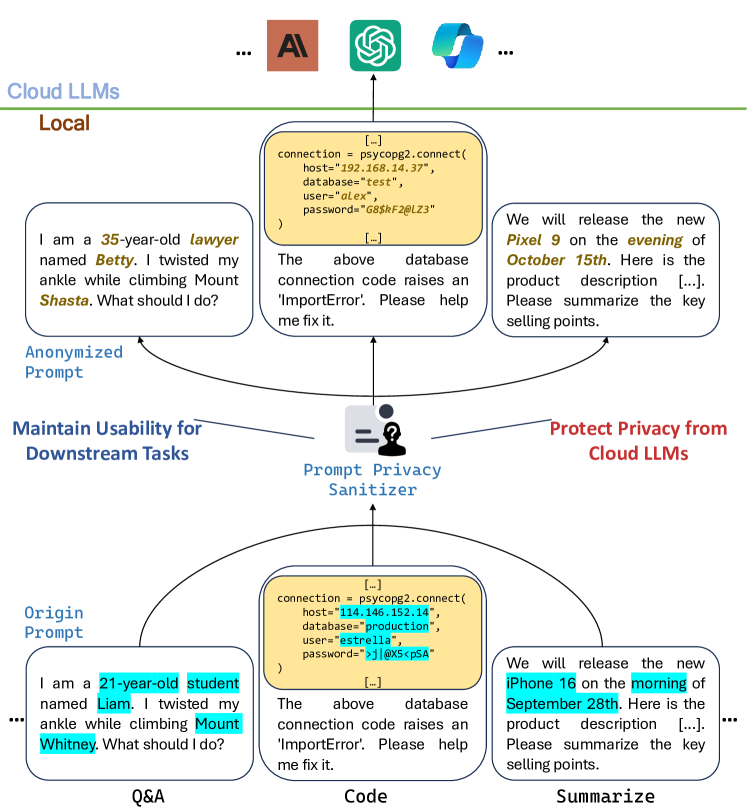
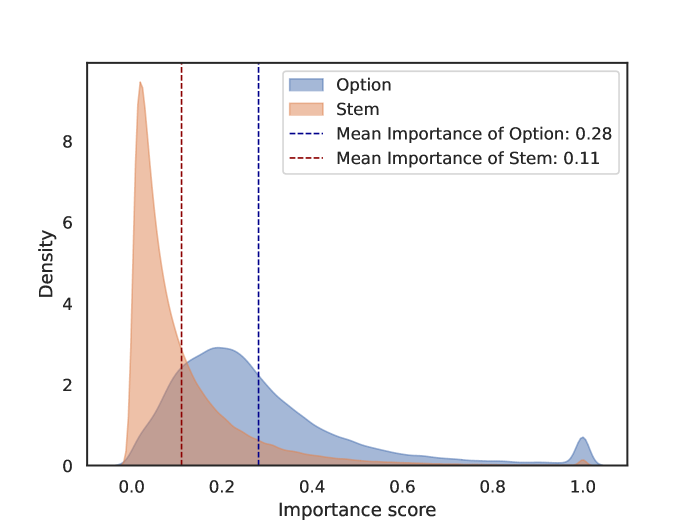
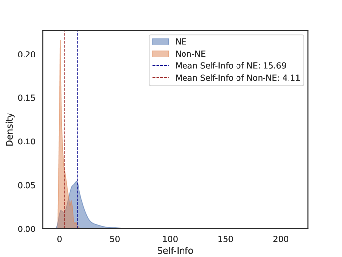
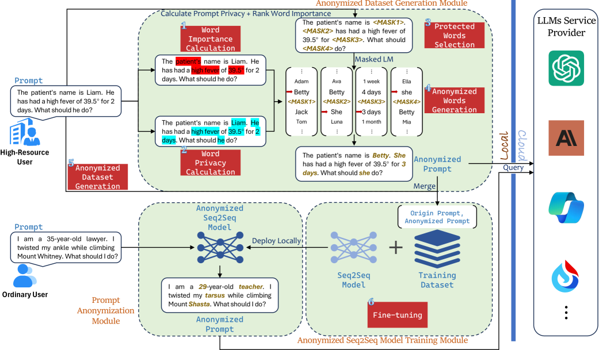
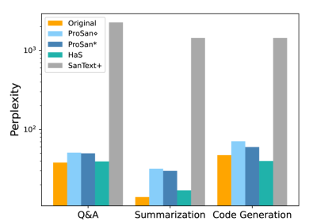
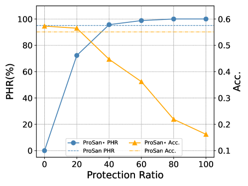
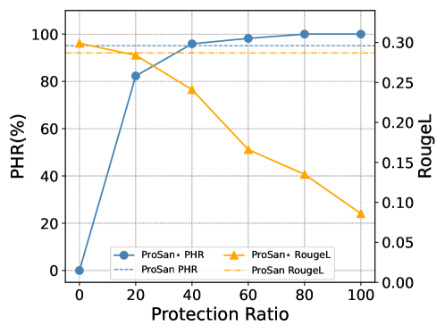
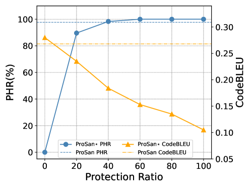
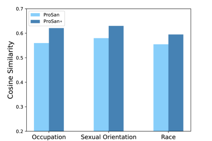

# 《盗火者亦守护者：提示中的可用性与隐私平衡之道》

发布时间：2024年06月20日

`LLM应用

这篇论文介绍了一种名为Prompt Privacy Sanitizer（ProSan）的端到端提示隐私保护框架，旨在保护在线聊天机器人等LLM应用中的用户隐私。该框架能够在不损害任务可用性和人类可读性的前提下，移除提示中的上下文隐私，并能无缝融入在线LLM服务流程。ProSan通过灵活调整保护策略，确保高可用性和动态匿名性，并能适应各种计算资源环境。实验结果表明，ProSan在多种任务中有效去除了私人信息，且对任务性能影响微乎其微。因此，这篇论文属于LLM应用分类。` `隐私保护` `人工智能`

> The Fire Thief Is Also the Keeper: Balancing Usability and Privacy in Prompts

# 摘要

> 在线聊天机器人的广泛应用标志着人工智能的一大飞跃，然而，随之而来的隐私风险不容忽视，因为提示中可能不经意间泄露敏感信息给大型语言模型（LLMs）。以往基于本地部署、嵌入扰动和同态加密的解决方案，因高昂的计算成本、任务可用性下降和系统改动过大，难以适应在线提示型LLM应用。为此，本文推出了Prompt Privacy Sanitizer（简称ProSan），一种端到端的提示隐私保护框架，它能在不损害任务可用性和人类可读性的前提下，移除提示中的上下文隐私，并能无缝融入在线LLM服务流程。ProSan根据词汇重要性和隐私泄露风险，灵活调整保护策略，确保高可用性和动态匿名性。它还能适应各种计算资源环境，即使在计算能力有限的移动设备上也能提供隐私保护。实验证明，ProSan在问答、文本摘要和代码生成等多种任务中有效去除了私人信息，且对任务性能影响微乎其微。

> The rapid adoption of online chatbots represents a significant advancement in artificial intelligence. However, this convenience brings considerable privacy concerns, as prompts can inadvertently contain sensitive information exposed to large language models (LLMs). Limited by high computational costs, reduced task usability, and excessive system modifications, previous works based on local deployment, embedding perturbation, and homomorphic encryption are inapplicable to online prompt-based LLM applications.
  To address these issues, this paper introduces Prompt Privacy Sanitizer (i.e., ProSan), an end-to-end prompt privacy protection framework that can produce anonymized prompts with contextual privacy removed while maintaining task usability and human readability. It can also be seamlessly integrated into the online LLM service pipeline. To achieve high usability and dynamic anonymity, ProSan flexibly adjusts its protection targets and strength based on the importance of the words and the privacy leakage risk of the prompts. Additionally, ProSan is capable of adapting to diverse computational resource conditions, ensuring privacy protection even for mobile devices with limited computing power. Our experiments demonstrate that ProSan effectively removes private information across various tasks, including question answering, text summarization, and code generation, with minimal reduction in task performance.

[Arxiv](https://arxiv.org/abs/2406.14318)