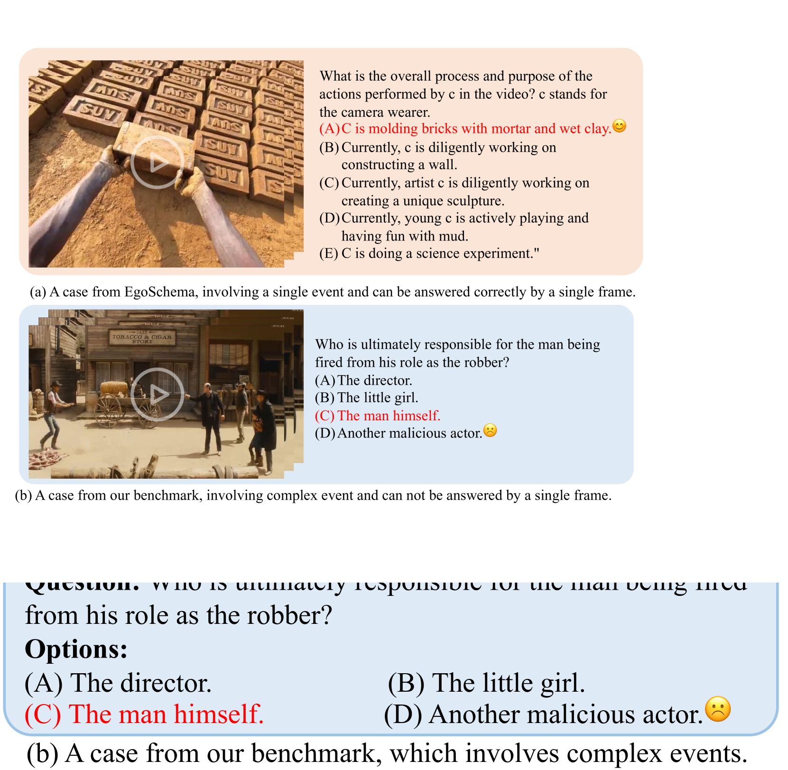
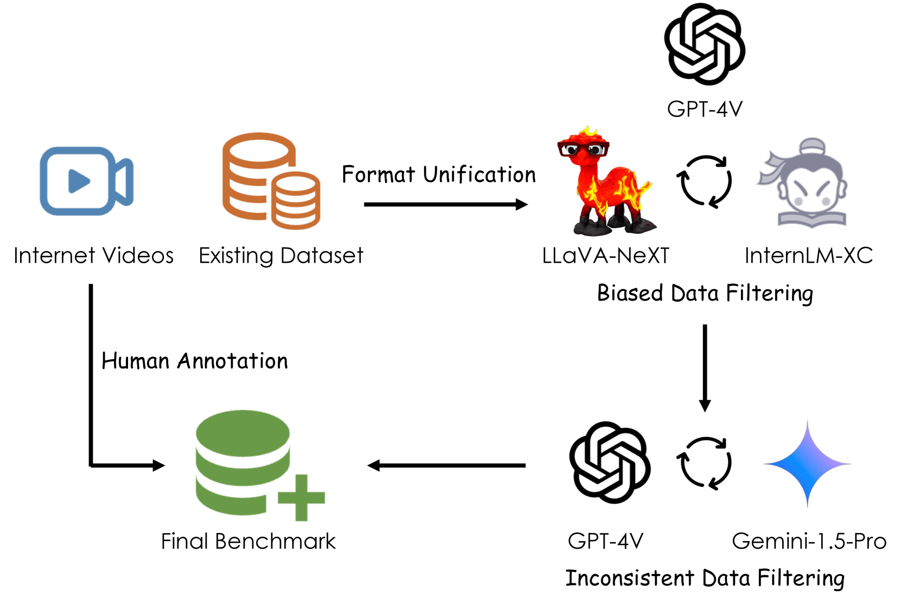

# 探索以事件为中心的长视频理解

发布时间：2024年06月20日

`LLM应用

这篇论文主要探讨了视频多模态大型语言模型（MLLMs）的视频理解能力，并提出了一个新的基准Event-Bench，以及一种新的方法视频指令合并（VIM）来提升这些模型的性能。这些内容都是关于如何应用大型语言模型（LLMs）来解决实际问题，特别是在视频理解领域，因此属于LLM应用分类。` `视频理解` `人工智能`

> Towards Event-oriented Long Video Understanding

# 摘要

> 随着视频多模态大型语言模型（MLLMs）的迅猛发展，评估其视频理解能力的基准层出不穷。然而，由于视频内容中事件的匮乏，这些基准往往容易陷入“捷径偏差”，即仅凭几帧画面就能得出答案，无需完整观看视频。为此，我们推出了Event-Bench，一个专注于长视频理解的事件导向基准，它基于现有数据集和人工标注，涵盖六个事件相关任务及2,190个测试案例，全面检验视频事件理解能力。我们还创新性地提出了视频指令合并（VIM）方法，通过整合事件密集的视频指令，有效提升了MLLMs的性能，并缓解了人工标注事件密集数据的不足。实验结果显示，GPT-4o模型以53.33%的整体准确率领先，超越最佳开源模型达41.42%。凭借高效的指令合成技术和灵活的模型架构，VIM在Event-Bench上不仅超越了顶尖开源模型，还优于GPT-4V。所有相关代码、数据和模型均已公开，详情请访问https://github.com/RUCAIBox/Event-Bench。

> With the rapid development of video Multimodal Large Language Models (MLLMs), numerous benchmarks have been proposed to assess their video understanding capability. However, due to the lack of rich events in the videos, these datasets may suffer from the short-cut bias that the answers can be deduced from a few frames, without the need to watch the entire video. To address this issue, we introduce Event-Bench, an event-oriented long video understanding benchmark built on existing datasets and human annotations. Event-Bench includes six event-related tasks and 2,190 test instances to comprehensively evaluate video event understanding ability. Additionally, we propose Video Instruction Merging~(VIM), a cost-effective method that enhances video MLLMs using merged, event-intensive video instructions, addressing the scarcity of human-annotated, event-intensive data. Extensive experiments show that the best-performing model, GPT-4o, achieves an overall accuracy of 53.33, significantly outperforming the best open-source model by 41.42%. Leveraging an effective instruction synthesis method and an adaptive model architecture, VIM surpasses both state-of-the-art open-source models and GPT-4V on the Event-Bench. All code, data, and models are publicly available at https://github.com/RUCAIBox/Event-Bench.

[Arxiv](https://arxiv.org/abs/2406.14129)