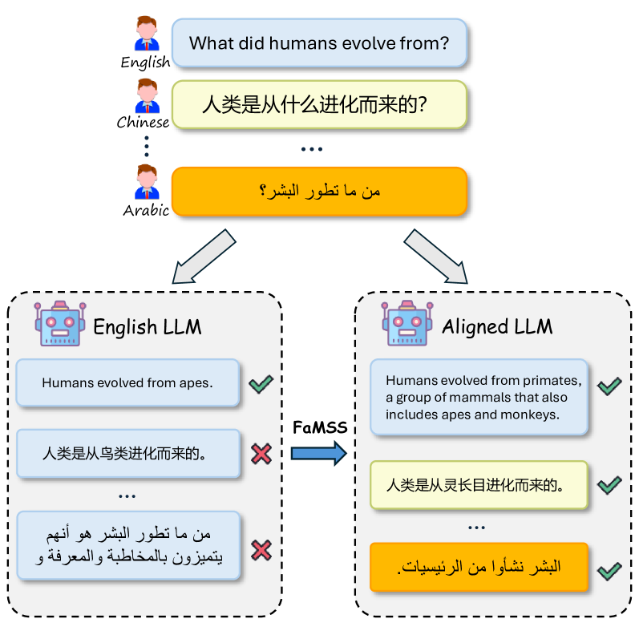
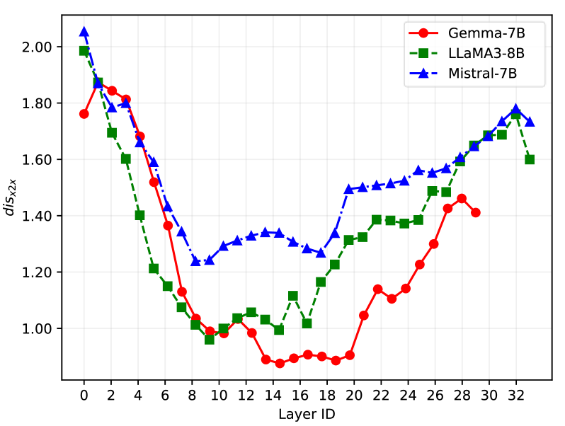

# 迈向真实多语言大型语言模型：基准测试与校准策略探索

发布时间：2024年06月20日

`LLM应用

这篇论文主要关注的是多语言大语言模型（MLLMs）的真实性问题，并提出了解决方案，包括构建评估基准和探索跨语言事实对齐策略。这些工作都是针对实际应用中的问题，即如何提高多语言大语言模型的性能和真实性，因此属于LLM应用类别。` `多语言技术`

> Towards Truthful Multilingual Large Language Models: Benchmarking and Alignment Strategies

# 摘要

> 在大语言模型时代，打造能服务全球的多语言大语言模型（MLLMs）至关重要。但目前研究对MLLMs的真实性关注不足，且多语言对齐技术在处理众多语言时难以保持真实性平衡，尤其在非英语语言中问题更为突出。我们为此构建了多语言真实性评估基准，并探索了跨语言事实对齐策略，以提升MLLMs的真实性。同时，我们提出了事实感知的多语言选择性协同（FaMSS），优化了多语言及多类型数据间的数据分配。实验证明，这一策略有效缩小了多语言表示的差异，并显著提升了LLMs的多语言处理能力。

> In the era of large language models (LLMs), building multilingual large language models (MLLMs) that can serve users worldwide holds great significance. However, existing research seldom focuses on the truthfulness of MLLMs. Meanwhile, contemporary multilingual aligning technologies struggle to balance massive languages and often exhibit serious truthfulness gaps across different languages, especially those that differ greatly from English. In our work, we construct a benchmark for truthfulness evaluation in multilingual scenarios and explore the ways to align facts across languages to enhance the truthfulness of MLLMs. Furthermore, we propose Fact-aware Multilingual Selective Synergy (FaMSS) to optimize the data allocation across a large number of languages and different data types. Experimental results demonstrate that our approach can effectively reduce the multilingual representation disparity and enhance the multilingual capabilities of LLMs.

[Arxiv](https://arxiv.org/abs/2406.14434)