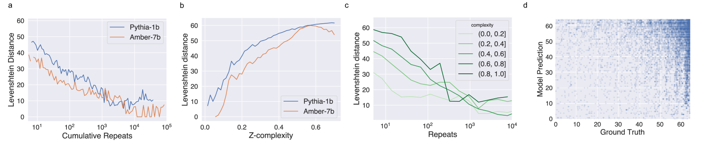
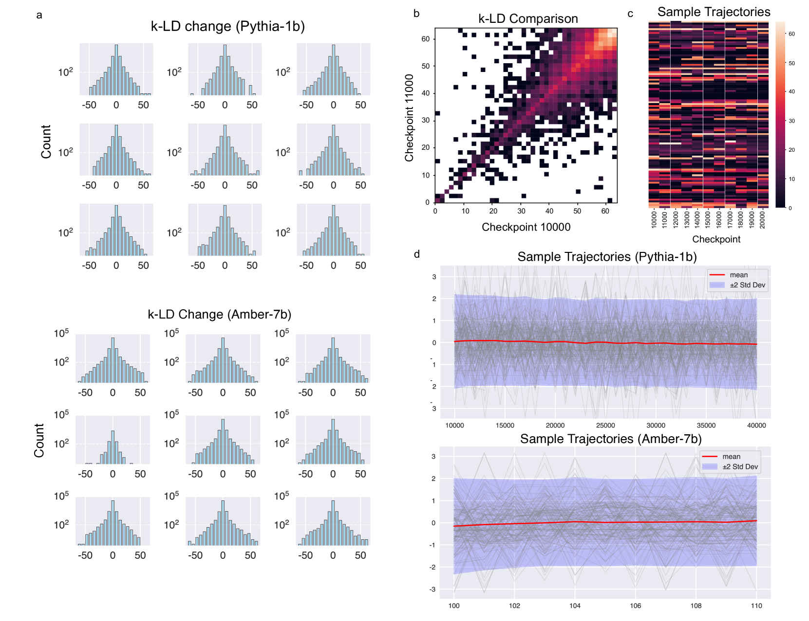
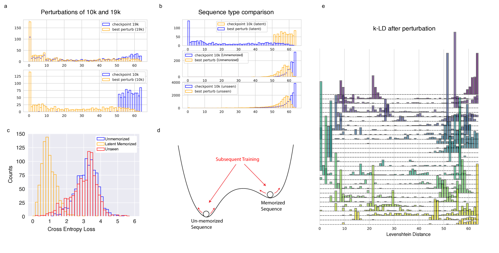
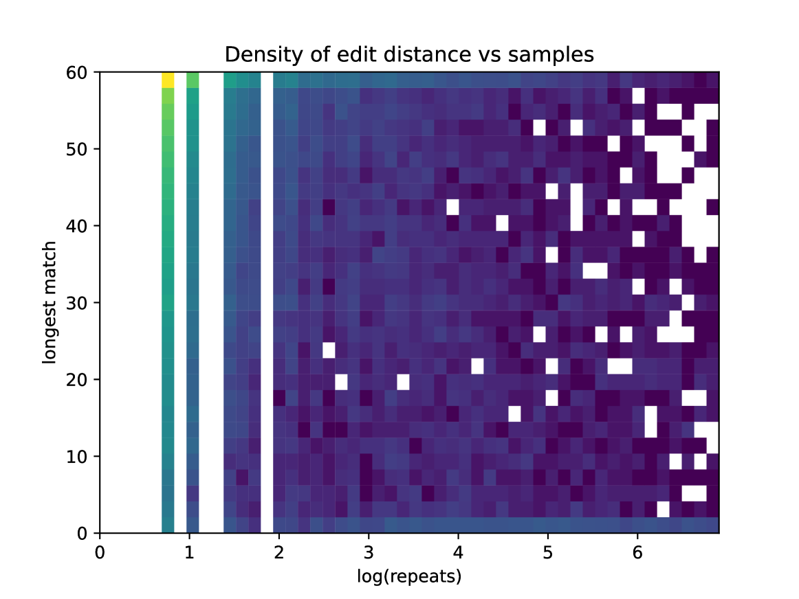
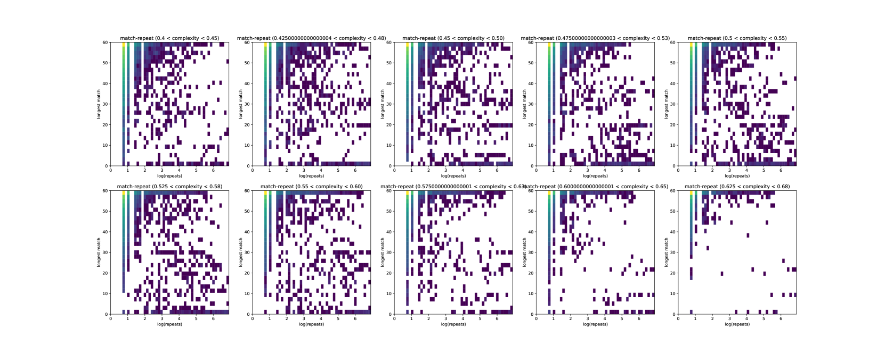
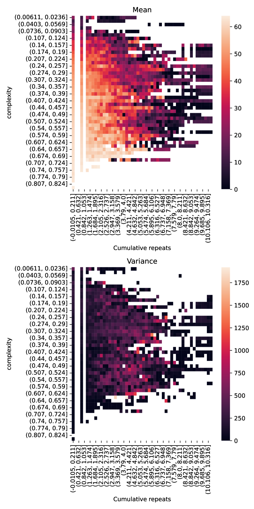
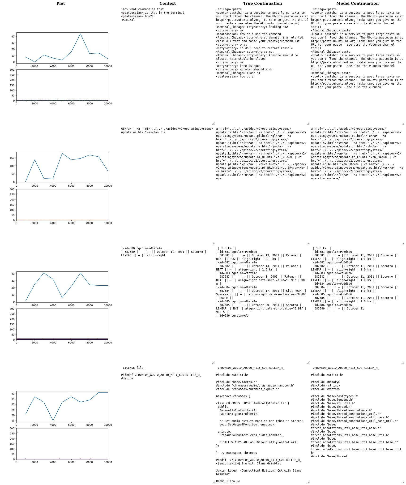

# 探秘隐匿记忆：审视大型语言模型中的数据泄露与记忆痕迹

发布时间：2024年06月20日

`LLM理论

这篇论文主要探讨了大型语言模型（LLM）在训练过程中可能产生的数据泄露问题，特别是关于模型记忆现象的量化和记忆模式的演变。研究关注的是模型内部记忆的形成机制及其与训练数据统计特性的关系，以及这些记忆如何可能威胁到数据隐私。这些问题属于对LLM工作原理和内部机制的理论性探讨，因此应归类为LLM理论。` `数据隐私` `机器学习安全`

> Uncovering Latent Memories: Assessing Data Leakage and Memorization Patterns in Large Language Models

# 摘要

> 大型语言模型的兴起虽然极大地推动了自然语言处理的发展，但也引发了关于数据隐私和安全的深切忧虑。这些模型在包含敏感或专有信息的庞大数据集上训练，而数据泄露的风险——即模型响应中可能透露此类信息——尚未得到充分认识。本研究通过量化机器学习模型中的记忆现象，并聚焦于训练过程中记忆模式的演变，来评估数据泄露的潜在风险。我们探讨了训练数据的统计特性如何塑造模型内的记忆，并发现记忆一个序列的概率与其在数据中出现的频率成对数关系。更有甚者，那些初次遭遇后看似未被记忆的序列，在无后续遭遇的情况下，也可能在训练过程中逐渐显现。这些潜在记忆的序列对数据隐私构成威胁，因为它们可能在模型的最终版本中隐匿。为此，我们开发了一种诊断工具，通过分析交叉熵损失来揭示这些潜在的记忆序列。

> The proliferation of large language models has revolutionized natural language processing tasks, yet it raises profound concerns regarding data privacy and security. Language models are trained on extensive corpora including potentially sensitive or proprietary information, and the risk of data leakage -- where the model response reveals pieces of such information -- remains inadequately understood. This study examines susceptibility to data leakage by quantifying the phenomenon of memorization in machine learning models, focusing on the evolution of memorization patterns over training. We investigate how the statistical characteristics of training data influence the memories encoded within the model by evaluating how repetition influences memorization. We reproduce findings that the probability of memorizing a sequence scales logarithmically with the number of times it is present in the data. Furthermore, we find that sequences which are not apparently memorized after the first encounter can be uncovered throughout the course of training even without subsequent encounters. The presence of these latent memorized sequences presents a challenge for data privacy since they may be hidden at the final checkpoint of the model. To this end, we develop a diagnostic test for uncovering these latent memorized sequences by considering their cross entropy loss.

[Arxiv](https://arxiv.org/abs/2406.14549)