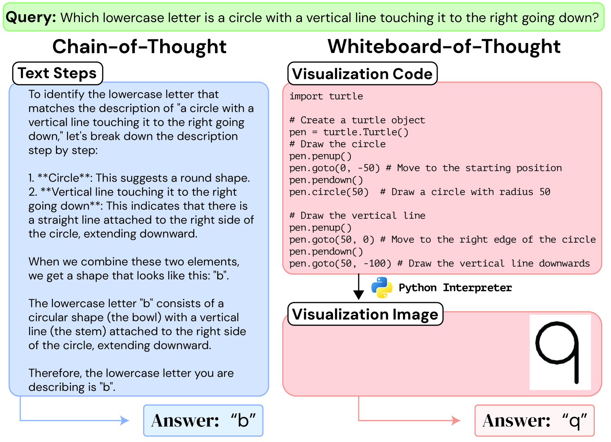
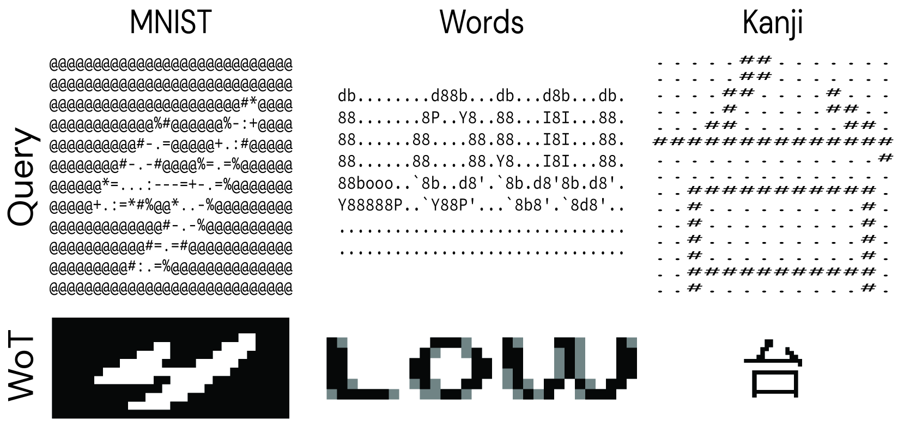
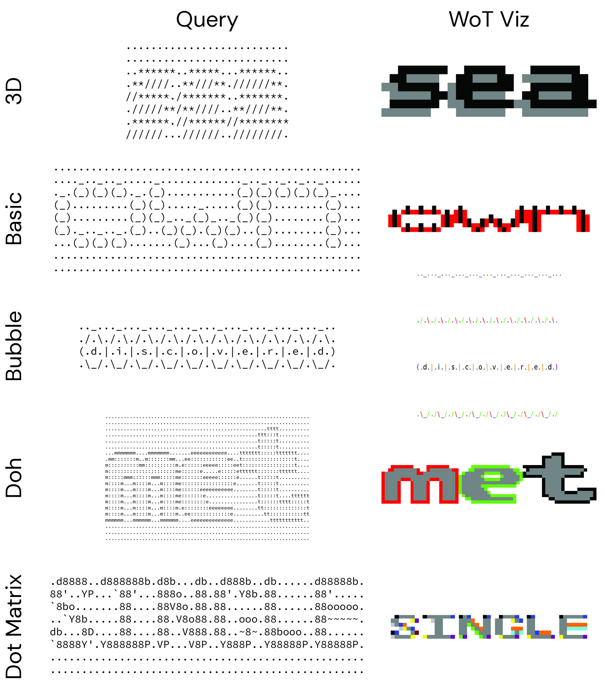
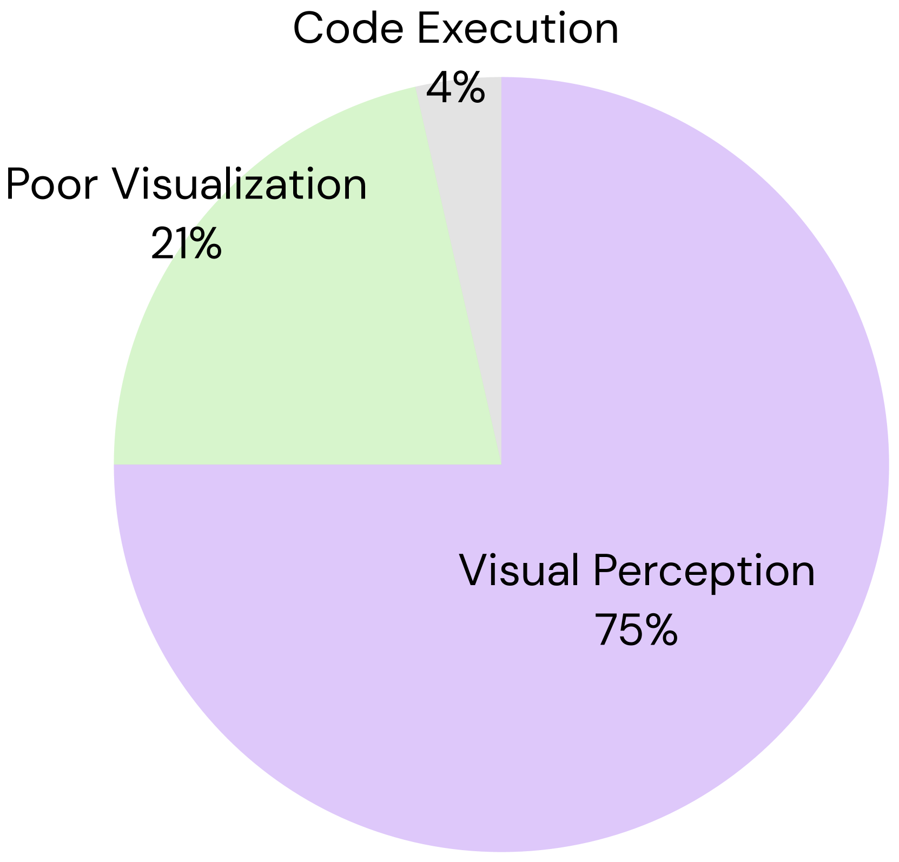
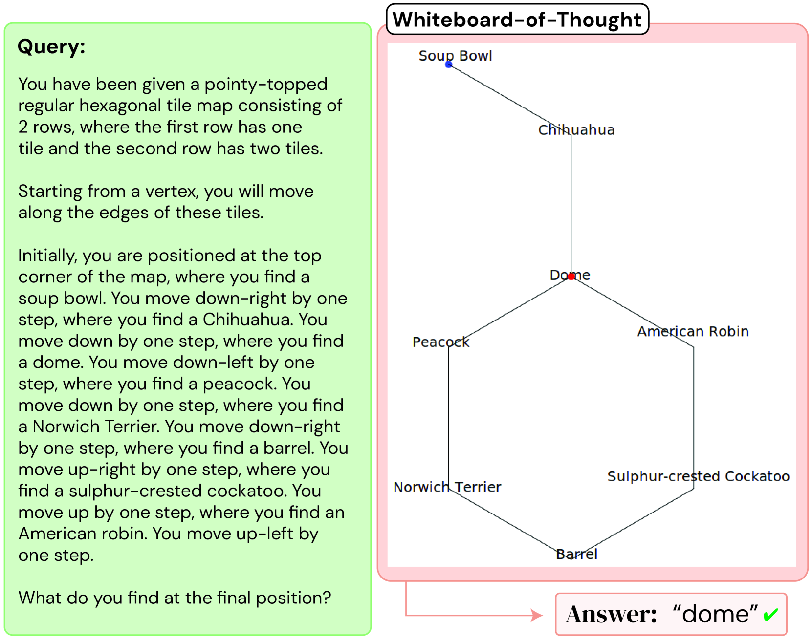
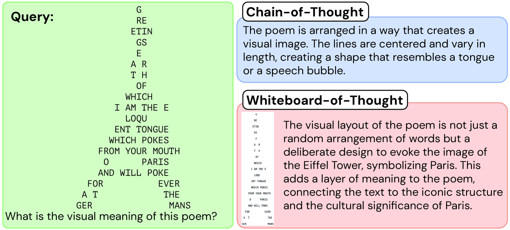
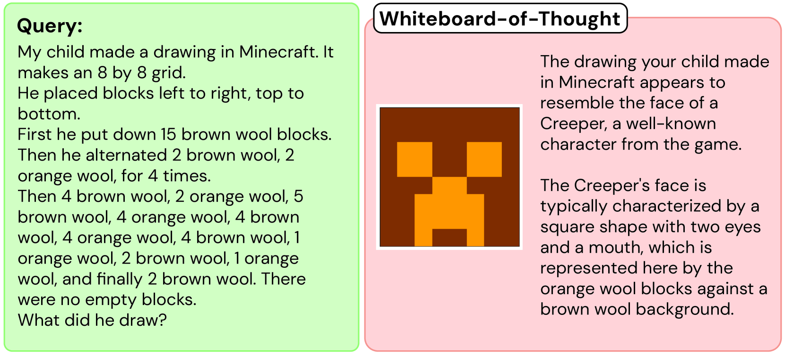

# 跨模态思维白板：逐步展开思考之旅

发布时间：2024年06月20日

`Agent

这篇论文介绍了一种新的方法——“白板思维链提示”，用于增强大型语言模型在处理需要视觉推理的文本查询时的能力。这种方法通过模拟一个虚拟的“白板”，让模型能够绘制推理步骤的图像，并利用这些图像进行更深入的处理。这种方法特别适用于多模态大型语言模型，并且不需要额外的演示或特殊模块，仅依赖于模型现有的编码能力。论文中提到的应用场景包括涉及视觉与空间推理的复杂自然语言任务，并且展示了在某些情况下，这种方法能够显著提高模型的准确率。因此，这篇论文更符合Agent分类，因为它描述了一种增强模型处理特定任务能力的方法，类似于一个智能代理的行为。` `人工智能`

> Whiteboard-of-Thought: Thinking Step-by-Step Across Modalities

# 摘要

> 面对视觉思维问题时，人类本能地切换推理模式，常借助心理图像或视觉辅助。大型语言模型虽在算术和符号推理上通过文本思维链表现优异，但在处理需视觉推理的文本查询时仍显不足，即便经过多模态预训练。为此，我们提出“白板思维链提示”，一种简便方法，旨在激发多模态大型语言模型的视觉推理潜能。此方法赋予模型一个虚拟“白板”，用于绘制推理步骤的图像，并反馈给模型深入处理。无需额外演示或特殊模块，仅凭模型现有的编码能力，利用Matplotlib和Turtle等库即可实现。该方法在四个涉及视觉与空间推理的复杂自然语言任务上刷新了记录。我们发现，在多个GPT-4o使用思维链失败的场景中，包括准确率为零的情况，白板思维链提示却能将准确率提升至92%。本文深入分析了该技术的成功案例及其潜在错误。

> When presented with questions involving visual thinking, humans naturally switch reasoning modalities, often forming mental images or drawing visual aids. Large language models have shown promising results in arithmetic and symbolic reasoning by expressing intermediate reasoning in text as a chain of thought, yet struggle to extend this capability to answer text queries that are easily solved by visual reasoning, even with extensive multimodal pretraining. We introduce a simple method, whiteboard-of-thought prompting, to unlock the visual reasoning capabilities of multimodal large language models across modalities. Whiteboard-of-thought prompting provides multimodal large language models with a metaphorical `whiteboard' to draw out reasoning steps as images, then returns these images back to the model for further processing. We find this can be accomplished with no demonstrations or specialized modules, instead leveraging models' existing ability to write code with libraries such as Matplotlib and Turtle. This simple approach shows state-of-the-art results on four difficult natural language tasks that involve visual and spatial reasoning. We identify multiple settings where GPT-4o using chain-of-thought fails dramatically, including more than one where it achieves $0\%$ accuracy, while whiteboard-of-thought enables up to $92\%$ accuracy in these same settings. We present a detailed exploration of where the technique succeeds as well as its sources of error.

[Arxiv](https://arxiv.org/abs/2406.14562)