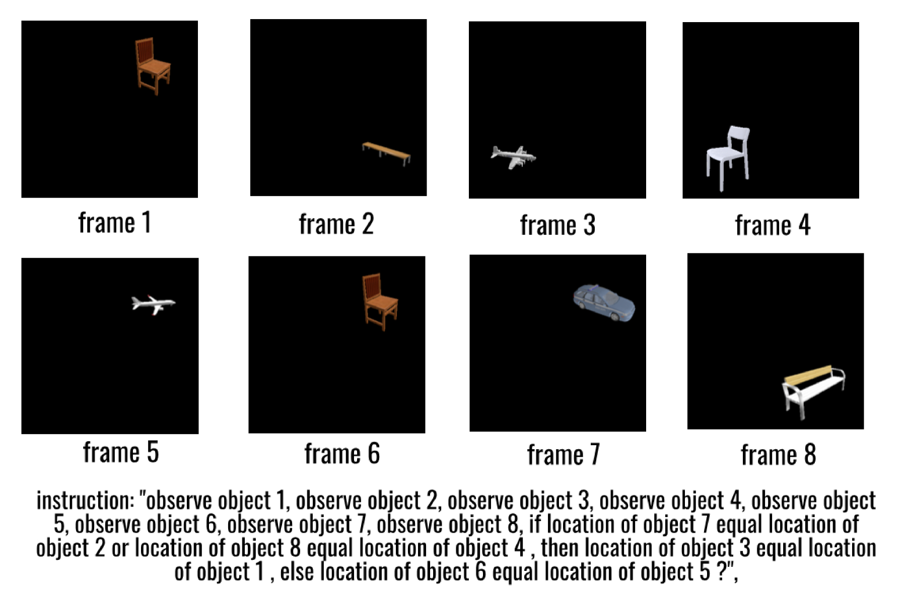
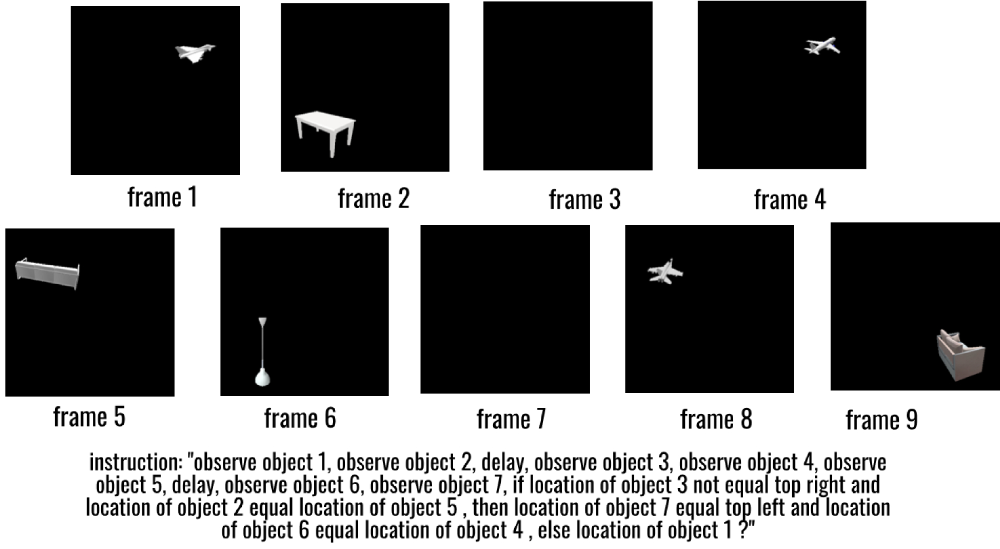

# iWISDM：探究多模态模型在大规模场景下遵循指令的表现

发布时间：2024年06月20日

`RAG

理由：这篇论文主要关注的是开发一个环境（iWISDM）来评估多模态模型的能力，特别是在视觉-语言任务上的表现。这与RAG（Retrieval-Augmented Generation）的范畴相关，因为RAG是一种结合了检索和生成的方法，用于改进语言模型的性能，尤其是在处理多模态数据时。论文中提到的“多样化的视觉-语言任务”和“测试了多款新型多模态模型”表明，这项工作是在探索和评估多模态模型在复杂任务上的表现，这是RAG研究领域的一个重要方面。因此，将这篇论文归类为RAG是合适的。` `人工智能` `多模态交互`

> iWISDM: Assessing instruction following in multimodal models at scale

# 摘要

> 人类能根据详细指令执行复杂任务，这是我们取得众多成就的关键。大型语言模型及其多模态版本，在处理复杂任务上取得了显著成功。但现有评估多局限于单一模态，限制了多模态能力的全面评估。为此，我们开发了iWISDM环境，创造性地生成了多样化的视觉-语言任务。通过iWISDM，我们建立了三个不同难度的视觉任务基准，并测试了多款新型多模态模型。结果显示，iWISDM是评估模型遵循指令能力的有效工具，同时也揭示了模型与人类在精确执行指令上的显著差距。

> The ability to perform complex tasks from detailed instructions is a key to many remarkable achievements of our species. As humans, we are not only capable of performing a wide variety of tasks but also very complex ones that may entail hundreds or thousands of steps to complete. Large language models and their more recent multimodal counterparts that integrate textual and visual inputs have achieved unprecedented success in performing complex tasks. Yet, most existing benchmarks are largely confined to single-modality inputs (either text or vision), narrowing the scope of multimodal assessments, particularly for instruction-following in multimodal contexts. To bridge this gap, we introduce the instructed-Virtual VISual Decision Making (iWISDM) environment engineered to generate a limitless array of vision-language tasks of varying complexity. Using iWISDM, we compiled three distinct benchmarks of instruction following visual tasks across varying complexity levels and evaluated several newly developed multimodal models on these benchmarks. Our findings establish iWISDM as a robust benchmark for assessing the instructional adherence of both existing and emergent multimodal models and highlight a large gap between these models' ability to precisely follow instructions with that of humans.

[Arxiv](https://arxiv.org/abs/2406.14343)