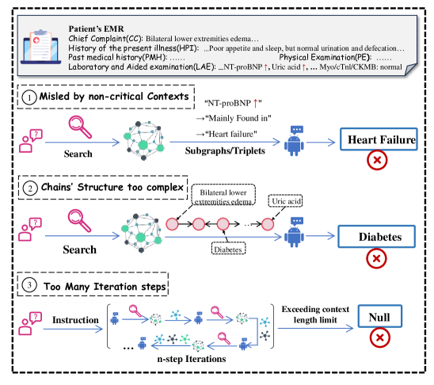
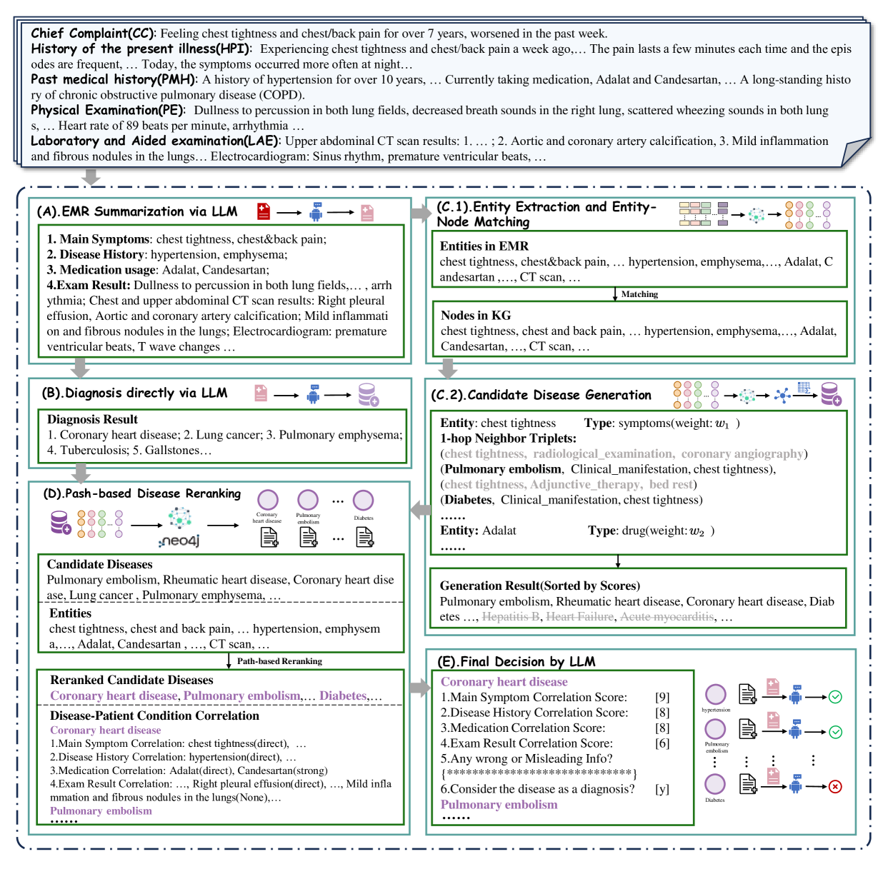
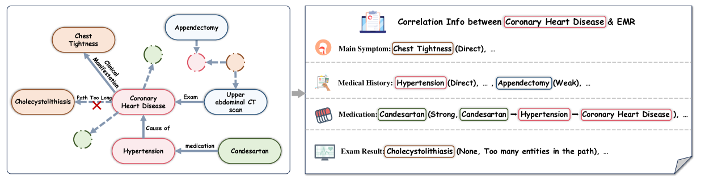
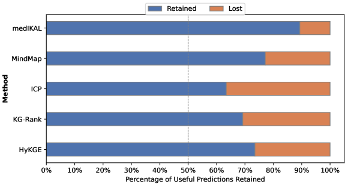
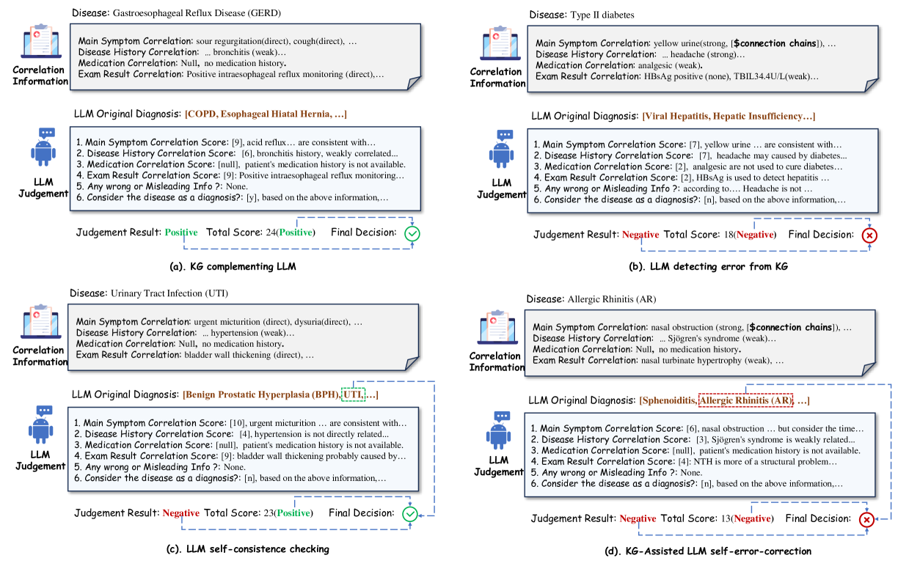

# medIKAL：融合知识图谱，助力大型语言模型，提升电子病历临床诊断精准度

发布时间：2024年06月20日

`LLM应用

这篇论文介绍了medIKAL框架，该框架结合了大型语言模型（LLMs）和知识图谱（KGs）来提高电子病历（EMRs）的诊断准确性。这种方法涉及使用LLMs进行初步诊断，并与KG搜索结果融合，通过算法优化诊断流程。这种应用展示了LLMs在医疗领域的实际应用，特别是在处理复杂和信息冗余的电子病历方面，因此适合归类为LLM应用。` `临床诊断`

> medIKAL: Integrating Knowledge Graphs as Assistants of LLMs for Enhanced Clinical Diagnosis on EMRs

# 摘要

> 电子病历（EMRs）虽是现代医疗的基石，但其复杂性和信息冗余却给临床诊断带来了难题。为此，我们开发了medIKAL框架，巧妙融合大型语言模型（LLMs）与知识图谱（KGs），以提升诊断的精准度。medIKAL根据实体类型赋予病历中实体不同权重，精准锁定知识图谱中的疾病候选。它创新性地借鉴残差网络思路，将LLM的初步诊断与KG搜索结果融合，再通过路径重排序算法和填空式提示，进一步优化诊断流程。我们在新开源的中文EMR数据集上进行了大量实验，证实了medIKAL在实际临床环境中提升诊断准确性的潜力。

> Electronic Medical Records (EMRs), while integral to modern healthcare, present challenges for clinical reasoning and diagnosis due to their complexity and information redundancy. To address this, we proposed medIKAL (Integrating Knowledge Graphs as Assistants of LLMs), a framework that combines Large Language Models (LLMs) with knowledge graphs (KGs) to enhance diagnostic capabilities. medIKAL assigns weighted importance to entities in medical records based on their type, enabling precise localization of candidate diseases within KGs. It innovatively employs a residual network-like approach, allowing initial diagnosis by the LLM to be merged into KG search results. Through a path-based reranking algorithm and a fill-in-the-blank style prompt template, it further refined the diagnostic process. We validated medIKAL's effectiveness through extensive experiments on a newly introduced open-sourced Chinese EMR dataset, demonstrating its potential to improve clinical diagnosis in real-world settings.

[Arxiv](https://arxiv.org/abs/2406.14326)