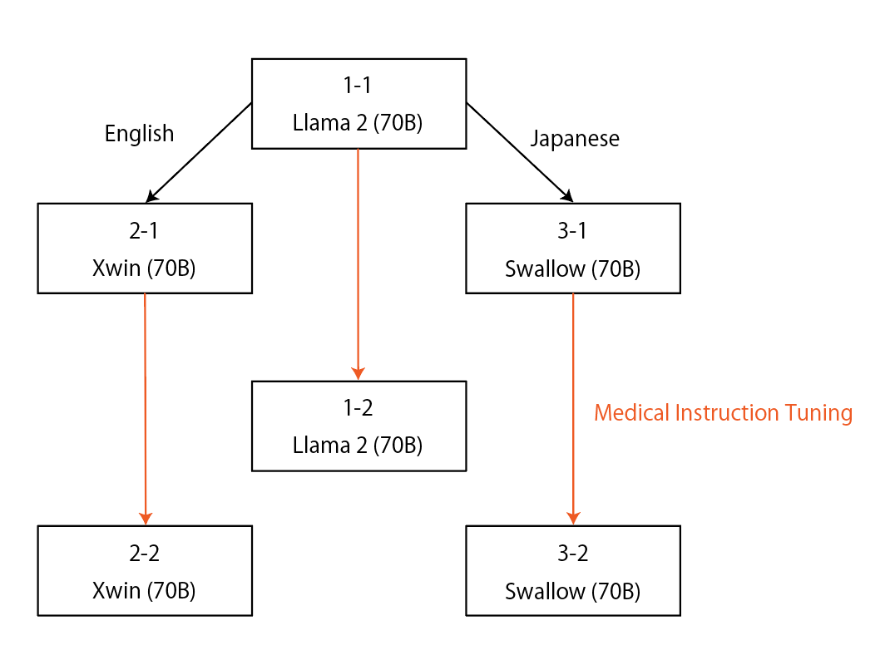
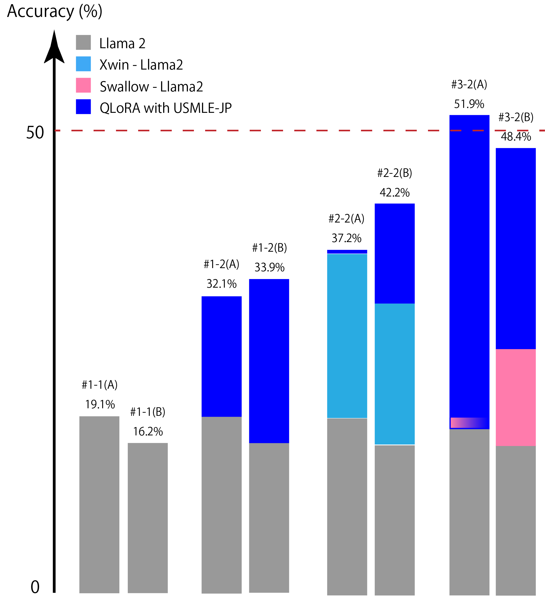

# 日语医疗问答领域中，700亿参数的大型语言模型展现出其强大的能力。

发布时间：2024年06月21日

`LLM应用

这篇论文主要关注的是大型语言模型（LLMs）在特定领域（日本医学）的应用和适应性问题。通过使用日本医学问答数据集对LLMs进行指令调整，研究者们显著提高了模型在日本医学执照考试中的表现。这一研究不仅展示了LLMs在非英语领域的应用潜力，还强调了本地化调整（如持续预训练和本地语言分词器调整）的重要性。因此，这篇论文属于LLM应用分类。` `语言模型`

> 70B-parameter large language models in Japanese medical question-answering

# 摘要

> 随着大型语言模型（LLMs）的兴起，领域适应成为研究热点。尽管英语医学数据集训练的LLMs已广泛公开，但日本医学领域的LLMs研究尚显不足。我们首次采用多个70B参数的LLMs，并通过日本医学问答数据集的指令调整，显著提升了日本LLMs在医学执照考试中的表现，准确率突破50%。特别是，以日本为中心的模型在指令调整后，其性能提升远超以英语为中心的模型，凸显了持续预训练和本地语言分词器调整的重要性。此外，我们探索了两种不同的提示格式，均带来了显著的性能改进。

> Since the rise of large language models (LLMs), the domain adaptation has been one of the hot topics in various domains. Many medical LLMs trained with English medical dataset have made public recently. However, Japanese LLMs in medical domain still lack its research. Here we utilize multiple 70B-parameter LLMs for the first time and show that instruction tuning using Japanese medical question-answering dataset significantly improves the ability of Japanese LLMs to solve Japanese medical license exams, surpassing 50\% in accuracy. In particular, the Japanese-centric models exhibit a more significant leap in improvement through instruction tuning compared to their English-centric counterparts. This underscores the importance of continual pretraining and the adjustment of the tokenizer in our local language. We also examine two slightly different prompt formats, resulting in non-negligible performance improvement.

[Arxiv](https://arxiv.org/abs/2406.14882)