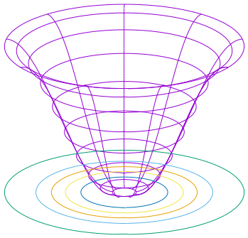
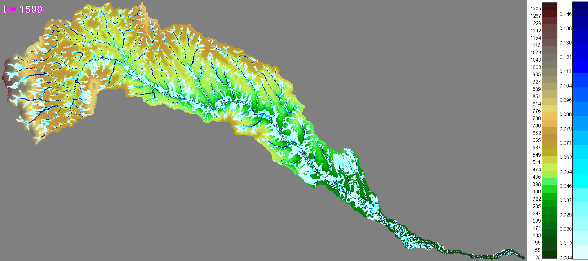
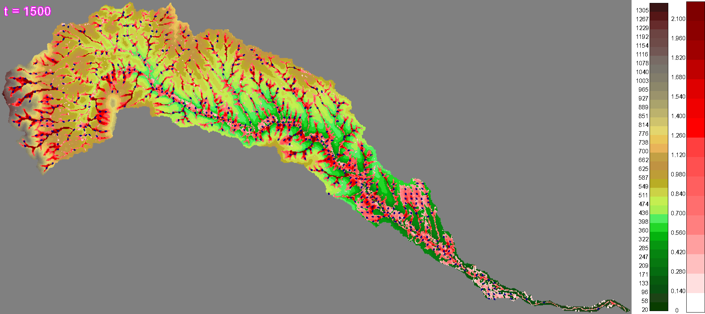
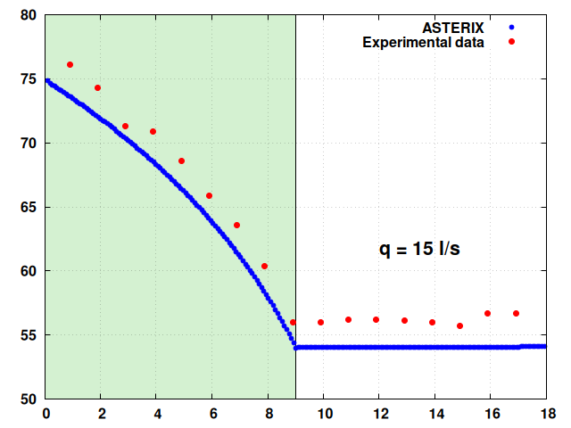
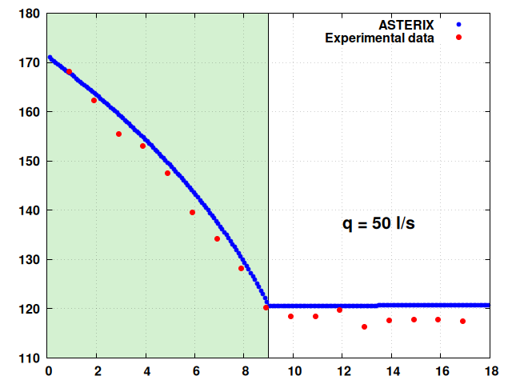

# ASTERIX：模拟植被山坡水流之模块

发布时间：2024年06月21日

`Agent

理由：虽然ASTERIX软件涉及数值积分和流体力学模拟，但它主要关注的是模拟水流在植被覆盖山坡上的行为，并通过数学模型来解释这些复杂机制。这更像是一个模拟环境中的“Agent”，即一个能够模拟和预测环境行为的系统，而不是直接与大型语言模型（LLM）相关的应用或理论。此外，该软件的设计目的是为了帮助广泛的利益相关者理解水流机制，而不是专注于LLM的理论研究或应用。因此，将其归类为Agent更为合适。` `水文学` `流体力学`

> ASTERIX: Module for modelling the water flow on vegetated hillslopes

# 摘要

> ASTERIX是一款开源软件，专为数值积分扩展的Saint-Venant方程系统设计，用于模拟基于流体力学原理的水流，从实验室到大规模空间域。现场观测显示，植被覆盖对流域水文通量调控至关重要。植物根系促进渗透，冠层截留降雨，茎干减缓水流。强降雨时，渗透和截留迅速停止，引发Hortonian地表径流和山洪。文章还探讨了土壤表面梯度和植被覆盖密度如何影响Hortonian流中的水动力学。ASTERIX和数学模型设计简洁，便于广泛利益相关者理解植物覆盖山坡上水流的复杂机制。该软件采用C语言编写，根据GNU许可证免费提供，已通过一系列基准问题、实验室实验和理论问题的测试，结果与理论或测量数据高度吻合。

> The paper presents ASTERIX, an open source software for numerical integration of an extended Saint-Venant system of equations used as a mathematical tool to model the water flow from laboratory up to large-scale spatial domains applying physically-based principles of fluid mechanics. Many in-situ observations have shown that the plant cover plays a key roll in controlling the hydrological flux at a catchment scale. The plant roots facilitate the infiltration processes, the canopy intercept some proportion of rain, and plant stems slow down the flow. In case of heavy rains, the infiltration and interception processes cease in a short time, the remaining rainfall gives rise to the Hortonian overland flow and the flash flood is thus initiated. In this context, the following problem is also addressed in the article: how do the gradient of soil surface and the density of the plant cover influence the water dynamics in the Hortonian flow? The mathematical model and ASTERIX were kept as simple as possible in order to be accessible to a wide range of stakeholders interested in understanding the complex processes behind the water flow on hillslopes covered by plants.
  The software is written in C programming language and it is free under GNU license. It was tested on a series of benchmark problems, laboratory experiments, and theoretical problems; and the results have shown a good agreement with the theoretical or measured data.

[Arxiv](https://arxiv.org/abs/2406.14933)