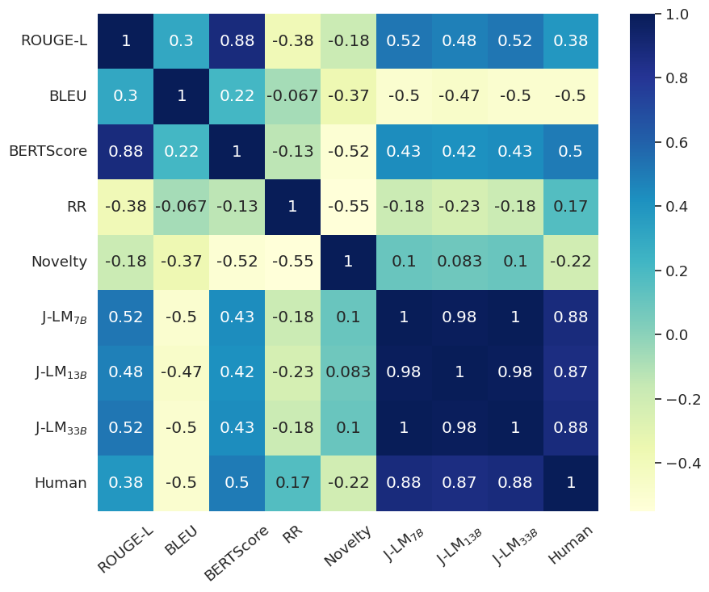
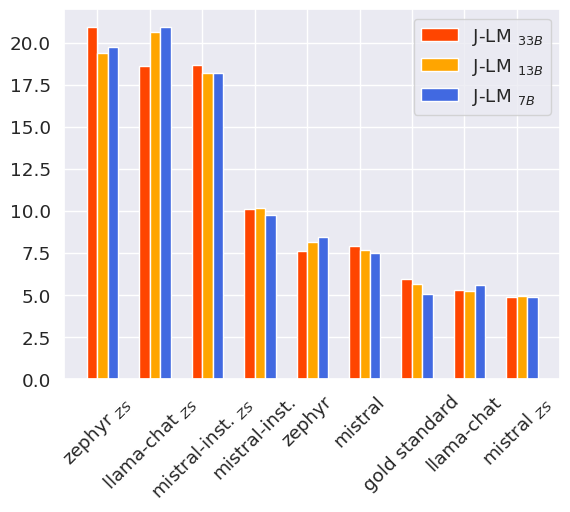
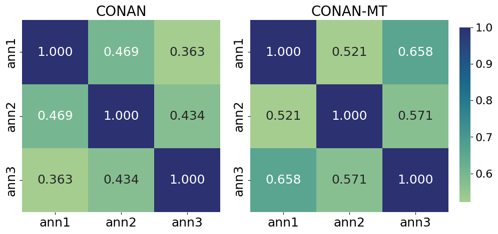
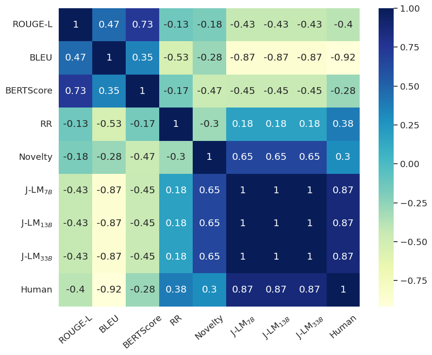
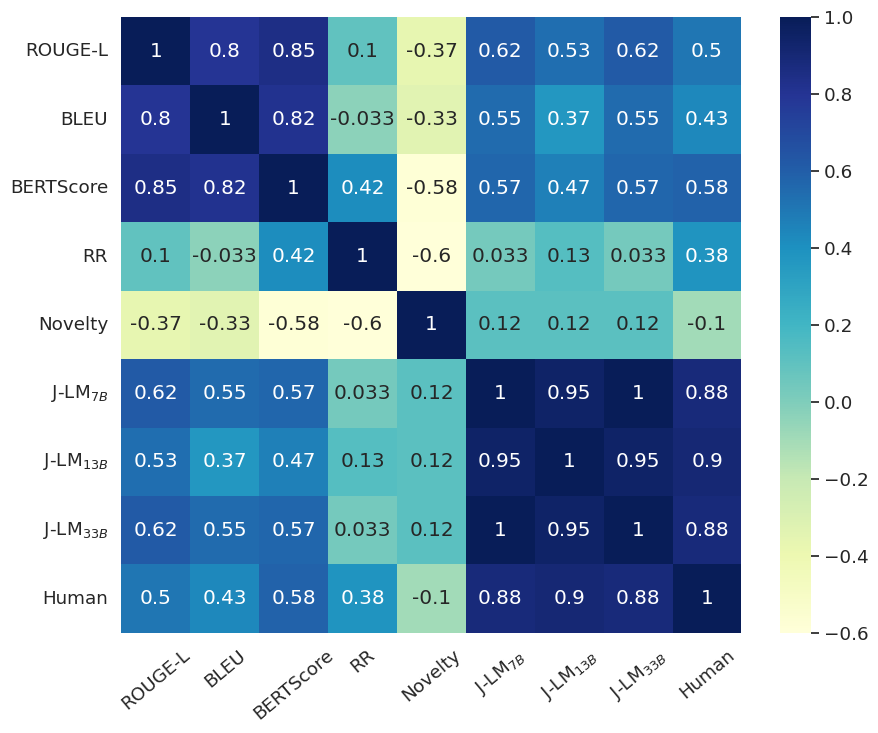

# 大型语言模型驱动的排名法：评估自动反叙事生成的新途径

发布时间：2024年06月21日

`LLM应用

这篇论文主要探讨了大型语言模型（LLM）在生成反叙事（CN）和评估这些生成内容方面的应用。论文提出了一种新的评估方法，利用LLM进行成对比较，以构建与人类偏好高度相关的模型排名系统。此外，论文还研究了LLMs作为零-shot（ZS）CN生成器的潜力，并对不同类型的LLM模型进行了比较，以评估它们在特定领域数据处理上的性能。这些内容主要集中在LLM的实际应用层面，特别是在处理错误信息和有害叙事方面的应用，因此归类为LLM应用。` `社交媒体` `信息安全`

> A LLM-Based Ranking Method for the Evaluation of Automatic Counter-Narrative Generation

# 摘要

> 网络讨论中错误信息和有害叙事的激增，凸显了开发高效反叙事（CN）生成技术的重要性。现有的自动评估方法往往难以解释，且未能准确反映生成的CN与人类感知之间的微妙联系。为此，本文提出了一种创新方法，利用大型语言模型（LLM）作为评估工具，通过锦标赛式的成对比较，构建了一个与人类偏好高度相关的模型排名系统（相关系数达0.88）。此外，我们还探讨了LLMs作为零-shot（ZS）CN生成器的潜力，并对不同模型（聊天、指令和基础模型）进行了深入比较，揭示了它们在特定领域数据处理上的性能差异。经过一系列微调实验的严格评估，我们发现，在ZS条件下，聊天对齐模型是执行任务的首选，只要它们不因安全问题而拒绝生成答案。

> The proliferation of misinformation and harmful narratives in online discourse has underscored the critical need for effective Counter Narrative (CN) generation techniques. However, existing automatic evaluation methods often lack interpretability and fail to capture the nuanced relationship between generated CNs and human perception. Aiming to achieve a higher correlation with human judgments, this paper proposes a novel approach to asses generated CNs that consists on the use of a Large Language Model (LLM) as a evaluator. By comparing generated CNs pairwise in a tournament-style format, we establish a model ranking pipeline that achieves a correlation of $0.88$ with human preference. As an additional contribution, we leverage LLMs as zero-shot (ZS) CN generators and conduct a comparative analysis of chat, instruct, and base models, exploring their respective strengths and limitations. Through meticulous evaluation, including fine-tuning experiments, we elucidate the differences in performance and responsiveness to domain-specific data. We conclude that chat-aligned models in ZS are the best option for carrying out the task, provided they do not refuse to generate an answer due to security concerns.

[Arxiv](https://arxiv.org/abs/2406.15227)