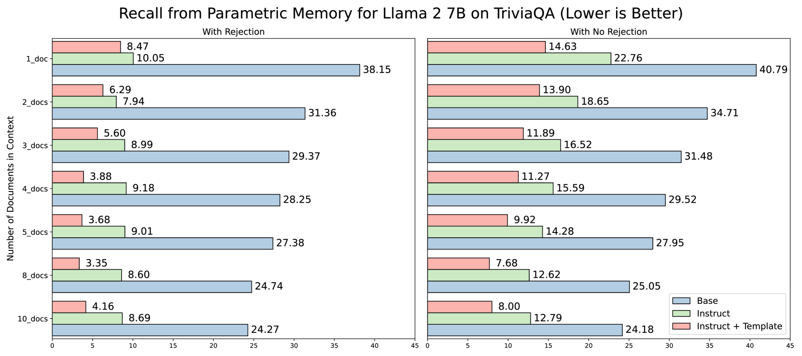
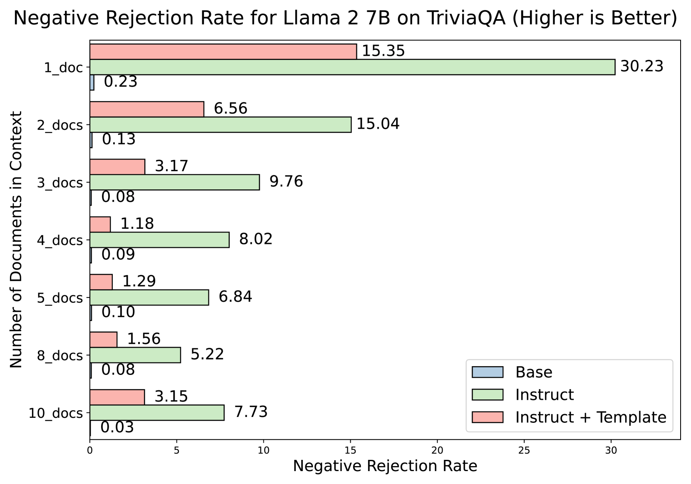
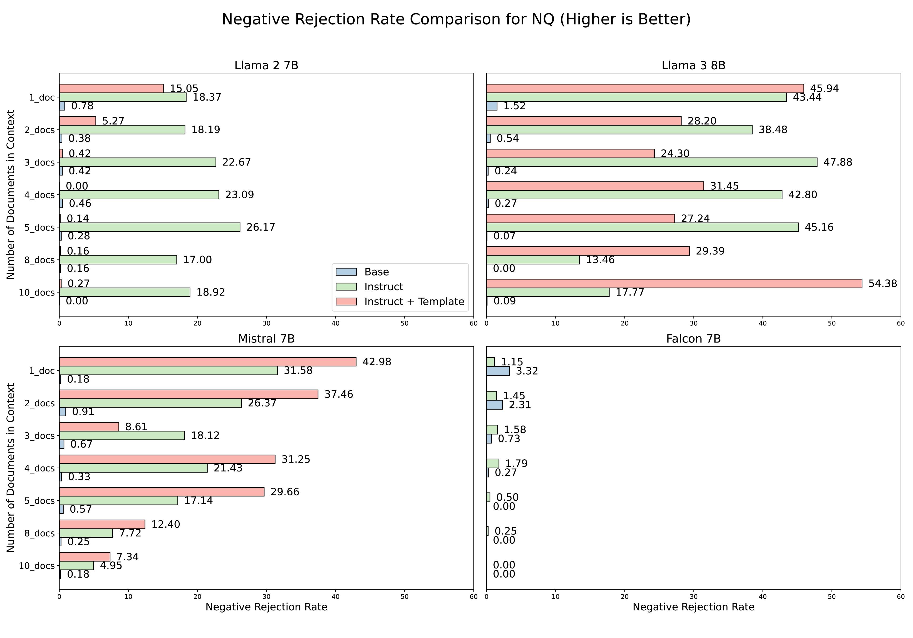
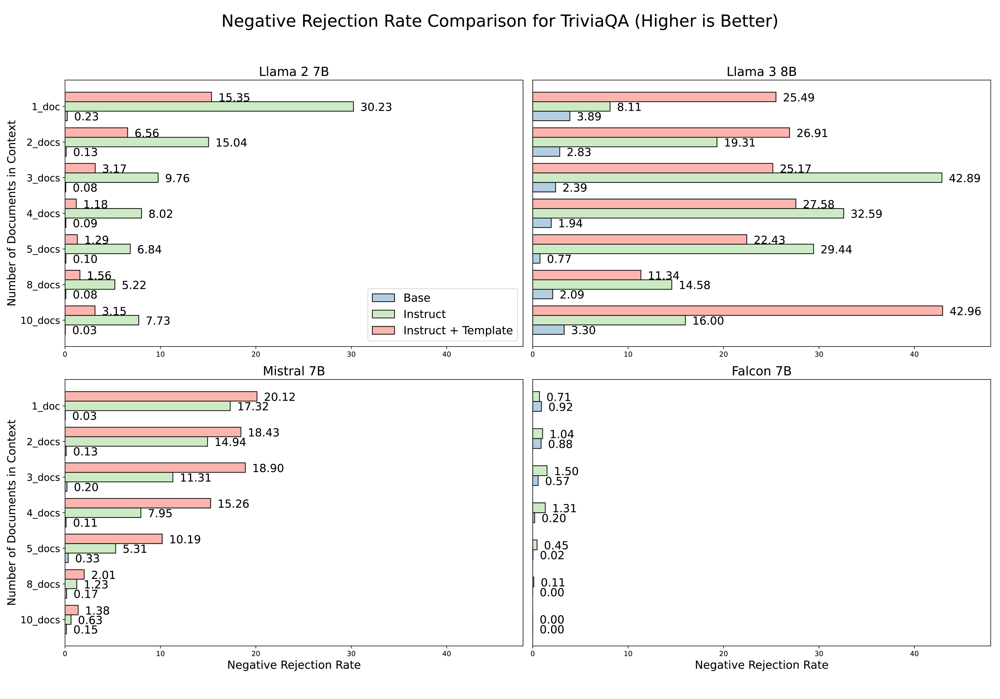

# 信任与准确性的较量：基础LLM与指令LLM在RAG系统中的较量

发布时间：2024年06月21日

`RAG

这篇论文摘要主要讨论了检索增强生成（RAG）技术在结合检索与生成阶段时的应用，特别是关于大型语言模型（LLMs）的使用和性能比较。它探讨了基础模型与经过监督训练微调的“指导型”LLMs在RAG任务中的表现差异，并提出了对RAG本质的深入探讨和该领域的广泛讨论。因此，这篇论文更符合RAG分类，因为它专注于RAG技术的实践和理论探讨。` `人工智能`

> A Tale of Trust and Accuracy: Base vs. Instruct LLMs in RAG Systems

# 摘要

> 检索增强生成（RAG）技术结合了检索与生成两个阶段，后者通常依赖于大型语言模型（LLMs），标志着人工智能的一大飞跃。目前，RAG实践中常采用经过监督训练微调的“指导型”LLMs，以更好地遵循指令并符合人类偏好。然而，我们的研究发现，在RAG任务中，基础模型平均比指导型模型高出20%的表现，这与普遍认为指导型LLMs更优越的观点相悖。这一发现促使我们深入探讨RAG的本质，并呼吁对该领域进行更广泛的讨论，正如Fromm所言，“统计数据背后的深意，往往不是一眼就能看穿的”。

> Retrieval Augmented Generation (RAG) represents a significant advancement in artificial intelligence combining a retrieval phase with a generative phase, with the latter typically being powered by large language models (LLMs). The current common practices in RAG involve using "instructed" LLMs, which are fine-tuned with supervised training to enhance their ability to follow instructions and are aligned with human preferences using state-of-the-art techniques. Contrary to popular belief, our study demonstrates that base models outperform their instructed counterparts in RAG tasks by 20% on average under our experimental settings. This finding challenges the prevailing assumptions about the superiority of instructed LLMs in RAG applications. Further investigations reveal a more nuanced situation, questioning fundamental aspects of RAG and suggesting the need for broader discussions on the topic; or, as Fromm would have it, "Seldom is a glance at the statistics enough to understand the meaning of the figures".

[Arxiv](https://arxiv.org/abs/2406.14972)