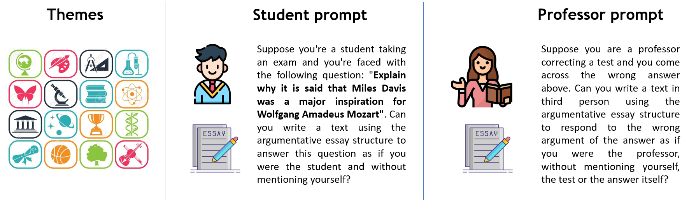

# 评析 ChatGPT 所产之论：优劣与瑕疵——新数据集、方法论及其相关任务

发布时间：2024年06月21日

`LLM应用

这篇论文关注的是大型语言模型（LLMs）在生成议论文方面的应用，特别是如何识别和分类这些模型生成的不同质量的论点。它提出了一种方法来提取和评估从ChatGPT生成的论点，并创建了一个新的数据集ArGPT来支持这一研究。这个研究直接应用于LLM的输出分析和质量评估，因此属于LLM应用类别。`

> Assessing Good, Bad and Ugly Arguments Generated by ChatGPT: a New Dataset, its Methodology and Associated Tasks

# 摘要

> 大型语言模型（LLMs）的最新成功引发了对其可能传播错误信息的担忧，迫切需要工具来识别这些模型生成的“虚假论点”。为此，本文提出了一种从ChatGPT生成的议论文中提取优质、劣质及糟糕论点的方法，并介绍了一个包含多样化论点的新数据集ArGPT。我们验证了该数据集的有效性，并为其在多个论证任务中设定了基准。最终，我们证明了这些人工生成的数据与人类论证高度相关，可作为训练和测试相关系统的有效工具。

> The recent success of Large Language Models (LLMs) has sparked concerns about their potential to spread misinformation. As a result, there is a pressing need for tools to identify ``fake arguments'' generated by such models. To create these tools, examples of texts generated by LLMs are needed. This paper introduces a methodology to obtain good, bad and ugly arguments from argumentative essays produced by ChatGPT, OpenAI's LLM. We then describe a novel dataset containing a set of diverse arguments, ArGPT. We assess the effectiveness of our dataset and establish baselines for several argumentation-related tasks. Finally, we show that the artificially generated data relates well to human argumentation and thus is useful as a tool to train and test systems for the defined tasks.

[Arxiv](https://arxiv.org/abs/2406.15130)