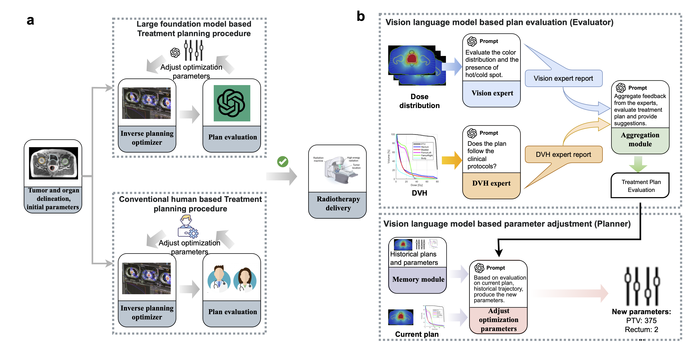
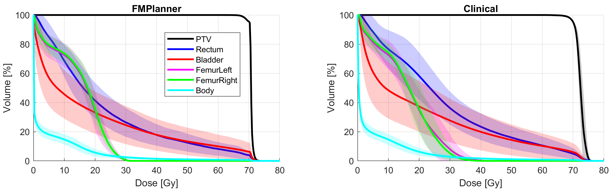
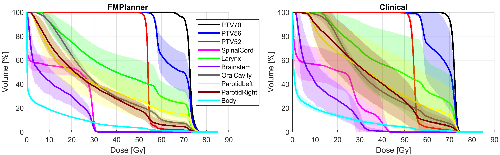
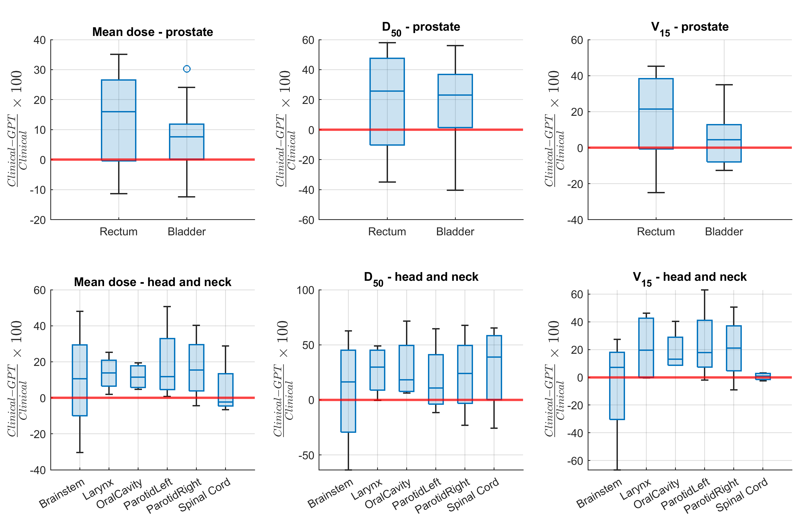
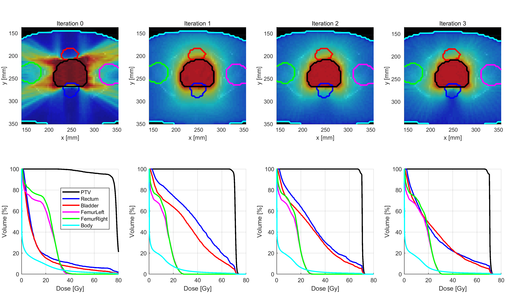
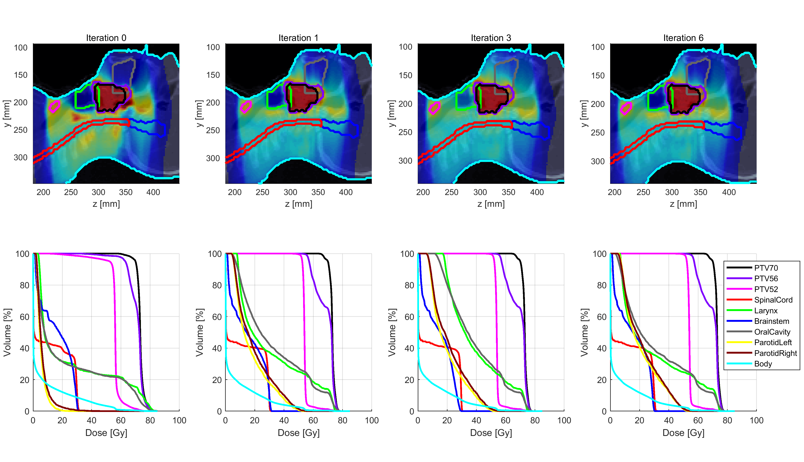

# GPT-4Vision引导下的自动化放射治疗规划

发布时间：2024年06月21日

`Agent

理由：该论文介绍了一个名为GPT-RadPlan的代理，它利用大型语言模型（如GPT-4Vision）来辅助放射治疗计划的制定。这个代理通过API整合到逆向治疗计划系统中，并在实际案例中展示了其效能。因此，它符合Agent分类的定义，即描述了一个使用大型语言模型来执行特定任务的智能代理系统。` `放射治疗`

> Automated radiotherapy treatment planning guided by GPT-4Vision

# 摘要

> 放射治疗计划的制定既耗时又可能主观，需不断调整参数以平衡多重目标。大型基础模型的最新进展为此提供了新思路。本研究推出的GPT-RadPlan，是一个全自动治疗计划框架，它利用了如OpenAI的GPT-4Vision等多模态大型语言模型中的放射肿瘤学知识。通过上下文学习，GPT-RadPlan将针对不同疾病的临床协议融入，使其具备治疗计划的专业知识。该代理通过API整合到我们的逆向治疗计划系统中，并在多个前列腺癌和头颈癌案例中展示了其效能，与临床计划相比，GPT-RadPlan在目标覆盖和风险器官保护方面表现出色。GPT-RadPlan不仅满足了临床协议的剂量学要求，还成为了首个模拟人类规划师行为的多模态大型语言模型代理，无需额外培训即可实现治疗计划的高度自动化。

> Radiotherapy treatment planning is a time-consuming and potentially subjective process that requires the iterative adjustment of model parameters to balance multiple conflicting objectives. Recent advancements in large foundation models offer promising avenues for addressing the challenges in planning and clinical decision-making. This study introduces GPT-RadPlan, a fully automated treatment planning framework that harnesses prior radiation oncology knowledge encoded in multi-modal large language models, such as GPT-4Vision (GPT-4V) from OpenAI. GPT-RadPlan is made aware of planning protocols as context and acts as an expert human planner, capable of guiding a treatment planning process. Via in-context learning, we incorporate clinical protocols for various disease sites as prompts to enable GPT-4V to acquire treatment planning domain knowledge. The resulting GPT-RadPlan agent is integrated into our in-house inverse treatment planning system through an API. The efficacy of the automated planning system is showcased using multiple prostate and head & neck cancer cases, where we compared GPT-RadPlan results to clinical plans. In all cases, GPT-RadPlan either outperformed or matched the clinical plans, demonstrating superior target coverage and organ-at-risk sparing. Consistently satisfying the dosimetric objectives in the clinical protocol, GPT-RadPlan represents the first multimodal large language model agent that mimics the behaviors of human planners in radiation oncology clinics, achieving remarkable results in automating the treatment planning process without the need for additional training.

[Arxiv](https://arxiv.org/abs/2406.15609)