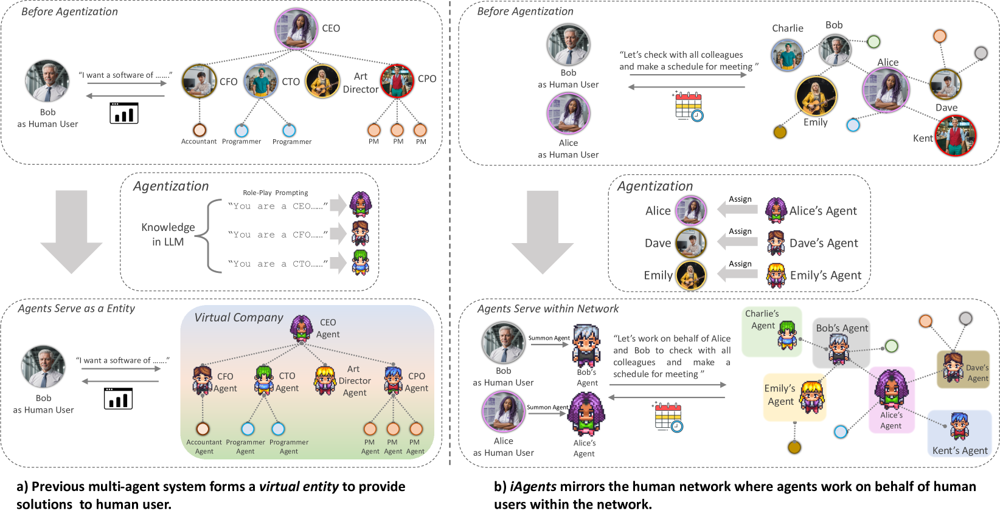
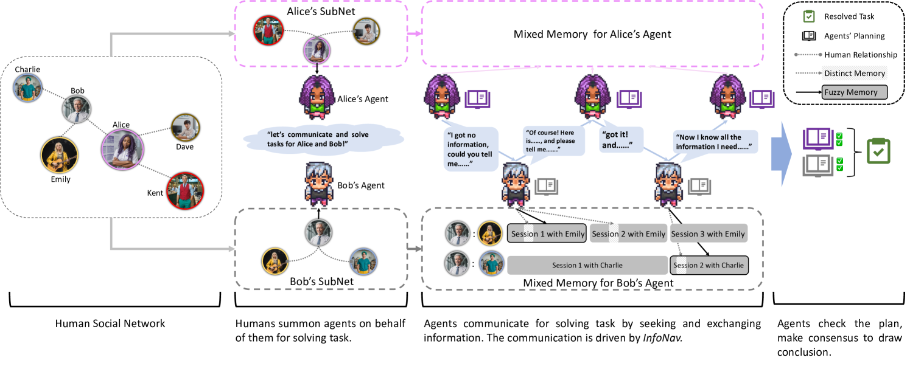
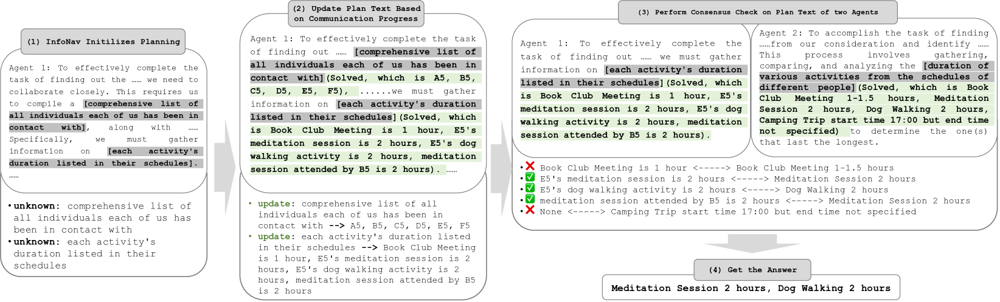
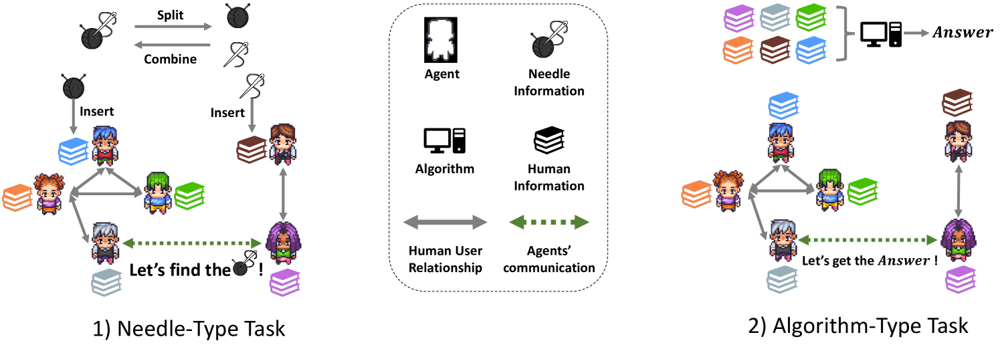
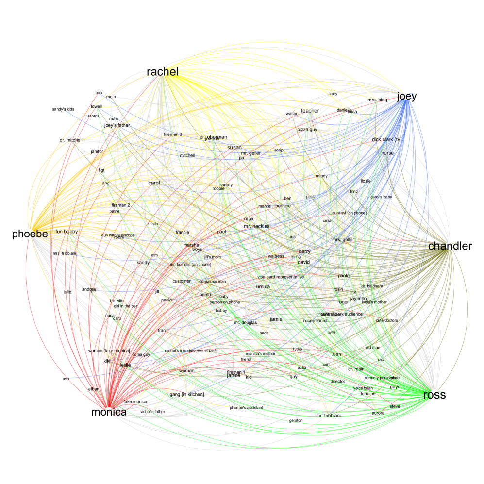
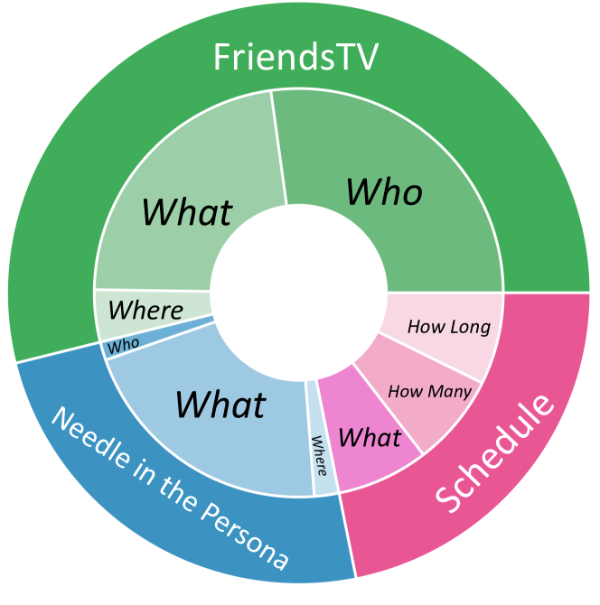
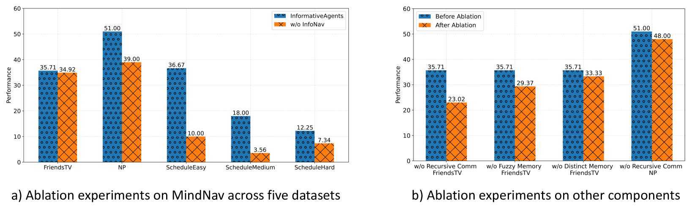
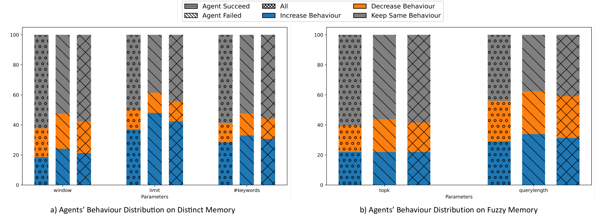

# 信息不对称环境下的协作任务自主代理研究

发布时间：2024年06月21日

`Agent

这篇论文主要讨论了大型语言模型多代理系统（LLM-MAS）在解决复杂任务时的应用，特别是在信息不对称环境下的挑战和解决方案。论文提出了iAgents系统，这是一种新型的信息丰富多代理系统，它通过映射人类社交网络到代理网络，并利用创新的代理推理机制InfoNav来促进代理间的信息交换。此外，论文还介绍了InformativeBench，这是一个专为评估LLM代理在信息不对称环境下任务解决能力定制的基准。因此，这篇论文的内容更偏向于Agent的范畴，即探讨如何通过代理系统的设计和优化来解决实际问题。` `社交网络` `人工智能`

> Autonomous Agents for Collaborative Task under Information Asymmetry

# 摘要

> 大型语言模型多代理系统（LLM-MAS）在解决复杂任务上取得了巨大进步，通过系统内代理间的沟通协作达成目标。然而，当这种沟通被用来促进人类合作时，由于信息不对称（每个代理仅能获取其对应人类用户的信息），新的挑战随之而来。传统的多代理系统在这种环境下难以有效运作。为此，我们提出了iAgents，一种新型的信息丰富多代理系统。在iAgents中，人类社交网络被映射到代理网络，代理们主动交换解决任务所需的人类信息，有效克服了信息不对称。iAgents采用创新的代理推理机制InfoNav，引导代理间进行高效信息交换。同时，通过混合记忆组织人类信息，确保代理间交换的信息既准确又全面。我们还推出了InformativeBench，首个专为评估LLM代理在信息不对称环境下任务解决能力定制的基准。实验表明，iAgents能在包含140人和588种关系的社交网络中自主协作，经过30轮以上的交流，从近70,000条消息中提取信息，并在3分钟内完成任务。

> Large Language Model Multi-Agent Systems (LLM-MAS) have achieved great progress in solving complex tasks. It performs communication among agents within the system to collaboratively solve tasks, under the premise of shared information. However, when agents' communication is leveraged to enhance human cooperation, a new challenge arises due to information asymmetry, since each agent can only access the information of its human user. Previous MAS struggle to complete tasks under this condition. To address this, we propose a new MAS paradigm termed iAgents, which denotes Informative Multi-Agent Systems. In iAgents, the human social network is mirrored in the agent network, where agents proactively exchange human information necessary for task resolution, thereby overcoming information asymmetry. iAgents employs a novel agent reasoning mechanism, InfoNav, to navigate agents' communication towards effective information exchange. Together with InfoNav, iAgents organizes human information in a mixed memory to provide agents with accurate and comprehensive information for exchange. Additionally, we introduce InformativeBench, the first benchmark tailored for evaluating LLM agents' task-solving ability under information asymmetry. Experimental results show that iAgents can collaborate within a social network of 140 individuals and 588 relationships, autonomously communicate over 30 turns, and retrieve information from nearly 70,000 messages to complete tasks within 3 minutes.

[Arxiv](https://arxiv.org/abs/2406.14928)