# 利用浅层未训练的多头注意力网络，模拟类脑语言处理机制

发布时间：2024年06月21日

`LLM理论

理由：这篇论文主要探讨了大型语言模型（LLMs）的架构如何与人类大脑的语言处理机制对齐，并分析了哪些架构要素是关键的。研究通过识别LLM中对语言敏感的单元，并在大脑记录数据集上评估这些单元的性能，揭示了分词策略和多头注意力等架构特点对脑对齐的影响。此外，论文还展示了模型在语言建模中的效率和对行为对齐的改进。这些内容更偏向于理论分析和模型架构的探讨，而非具体的应用或Agent的设计，因此归类为LLM理论。` `神经科学` `语言建模`

> Brain-Like Language Processing via a Shallow Untrained Multihead Attention Network

# 摘要

> 大型语言模型（LLMs）在模拟人类语言系统方面表现出色，某些模型甚至能解释大脑活动数据中的大部分变异。即使在未经训练的模型中，其架构先验也能与大脑数据形成合理对齐。本研究聚焦于揭示驱动这种未训练模型与大脑对齐的关键架构要素。我们首先在LLM中识别出对语言敏感的单元，类似神经科学家在人脑中定位语言网络的方法。随后，我们在五个大脑记录数据集上评估这些LLM单元的脑对齐性能。通过分析Transformer架构的关键部分，我们发现分词策略和多头注意力是促进脑对齐的主要因素，而简单的循环机制则进一步增强了对齐效果。我们通过重现语言神经科学领域的经典研究，展示了我们模型的脑对齐能力，表明局部模型单元能像人脑中的语言体素一样，更准确地区分词汇差异而非语法差异，并在相同实验条件下呈现相似的反应模式。此外，我们的模型在语言建模中展现出更高的样本和参数效率，其对惊奇度的估计在行为对齐方面达到了新的高度。综上，我们提出了一种与大脑和行为高度对齐的模型，将人类语言系统视为一个结合结构先验的未训练浅层特征编码器，并通过训练的解码器实现高效的语言处理。

> Large Language Models (LLMs) have been shown to be effective models of the human language system, with some models predicting most explainable variance of brain activity in current datasets. Even in untrained models, the representations induced by architectural priors can exhibit reasonable alignment to brain data. In this work, we investigate the key architectural components driving the surprising alignment of untrained models. To estimate LLM-to-brain similarity, we first select language-selective units within an LLM, similar to how neuroscientists identify the language network in the human brain. We then benchmark the brain alignment of these LLM units across five different brain recording datasets. By isolating critical components of the Transformer architecture, we identify tokenization strategy and multihead attention as the two major components driving brain alignment. A simple form of recurrence further improves alignment. We further demonstrate this quantitative brain alignment of our model by reproducing landmark studies in the language neuroscience field, showing that localized model units -- just like language voxels measured empirically in the human brain -- discriminate more reliably between lexical than syntactic differences, and exhibit similar response profiles under the same experimental conditions. Finally, we demonstrate the utility of our model's representations for language modeling, achieving improved sample and parameter efficiency over comparable architectures. Our model's estimates of surprisal sets a new state-of-the-art in the behavioral alignment to human reading times. Taken together, we propose a highly brain- and behaviorally-aligned model that conceptualizes the human language system as an untrained shallow feature encoder, with structural priors, combined with a trained decoder to achieve efficient and performant language processing.

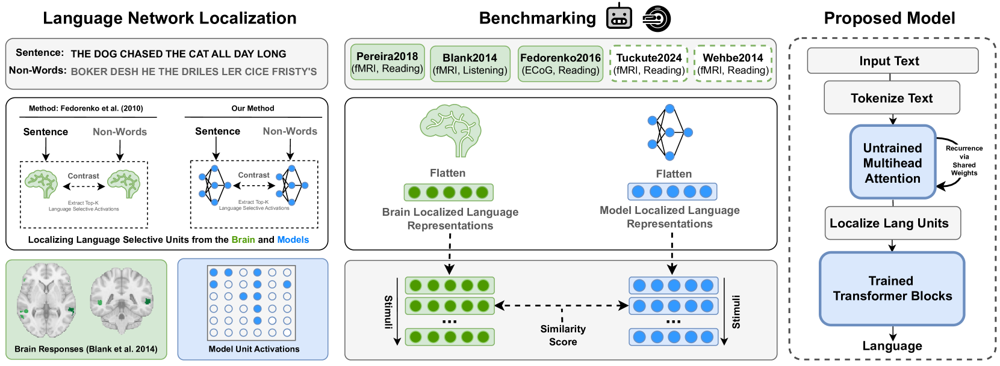

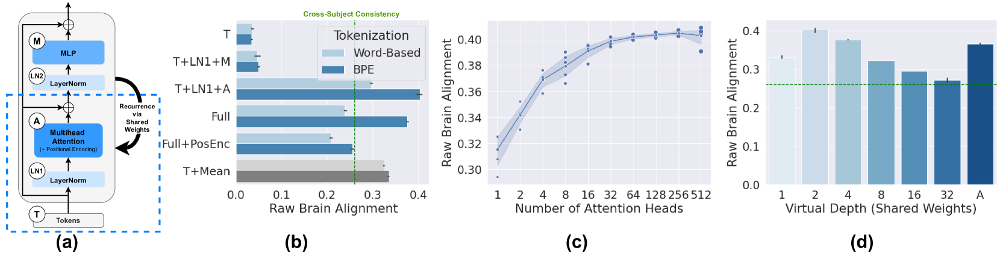

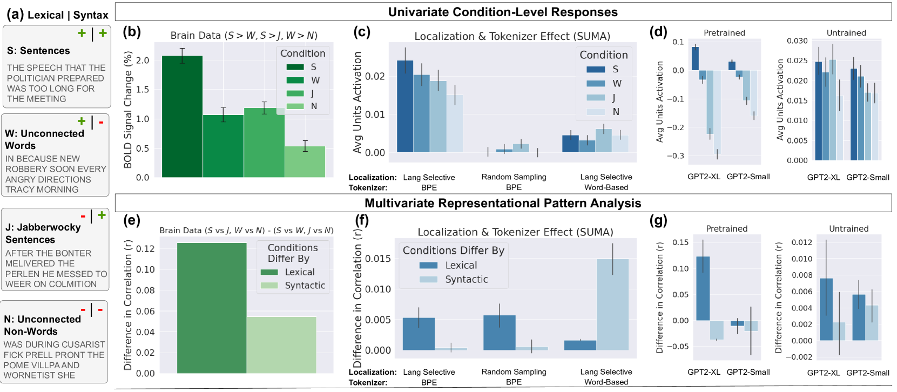

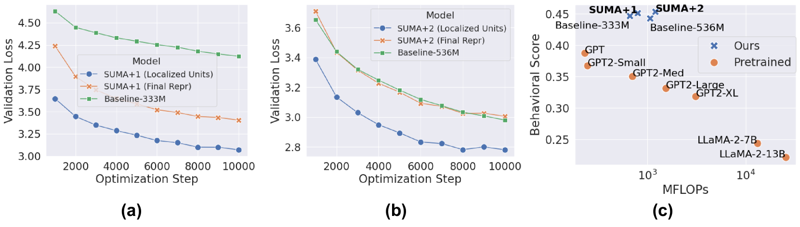

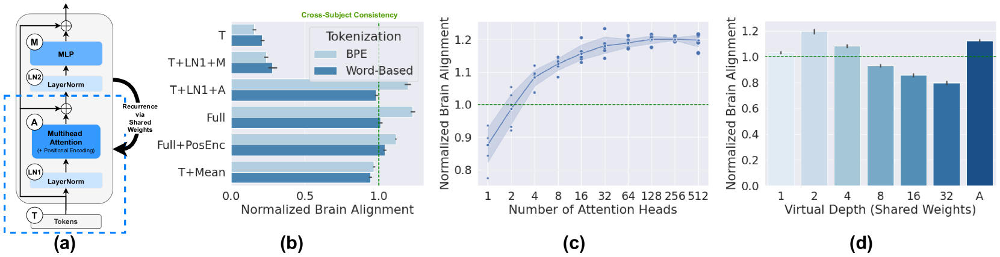

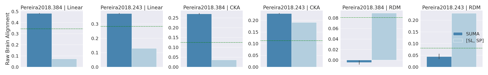

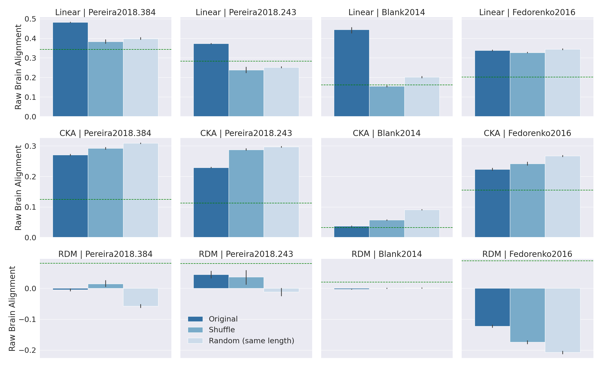

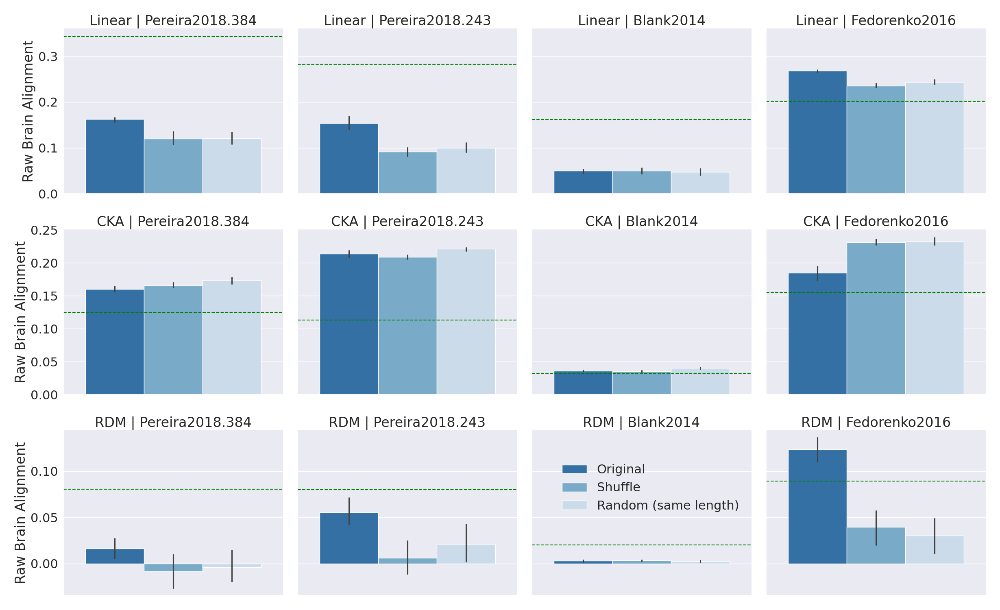

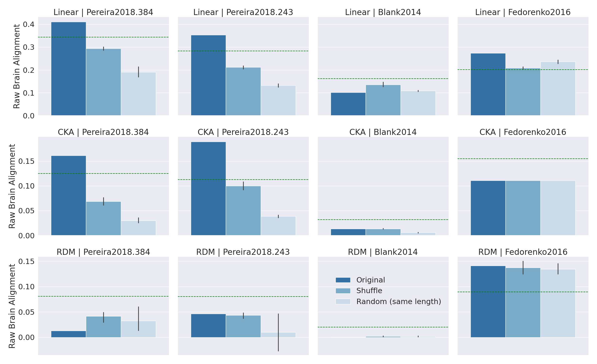

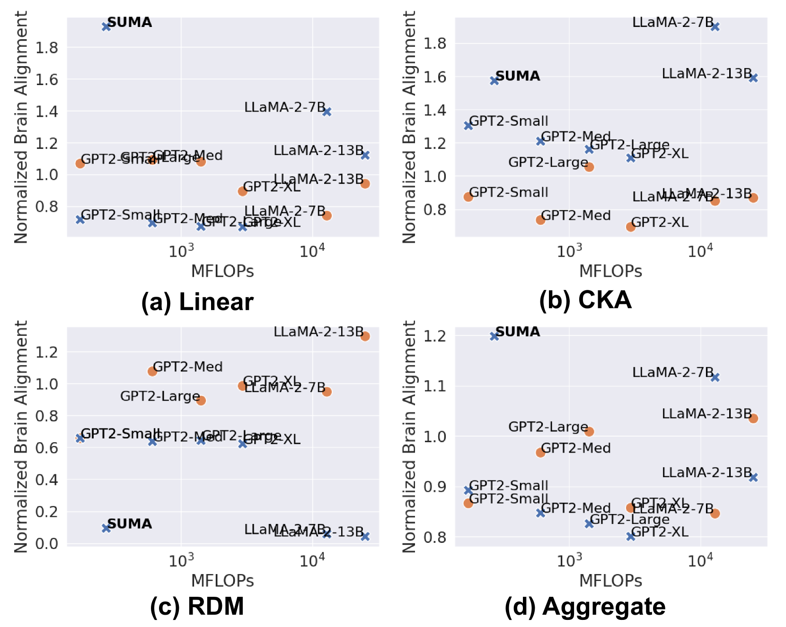

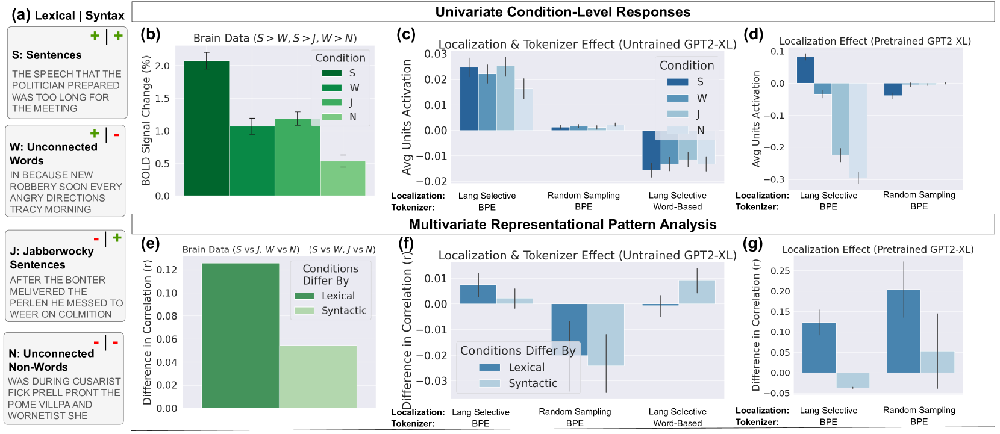

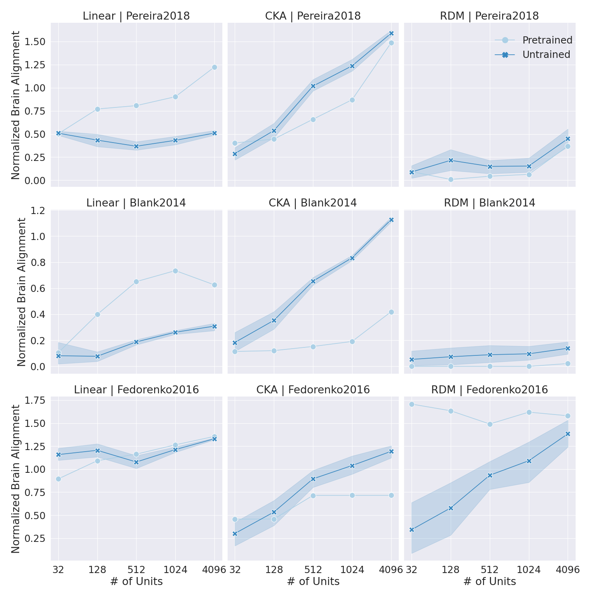

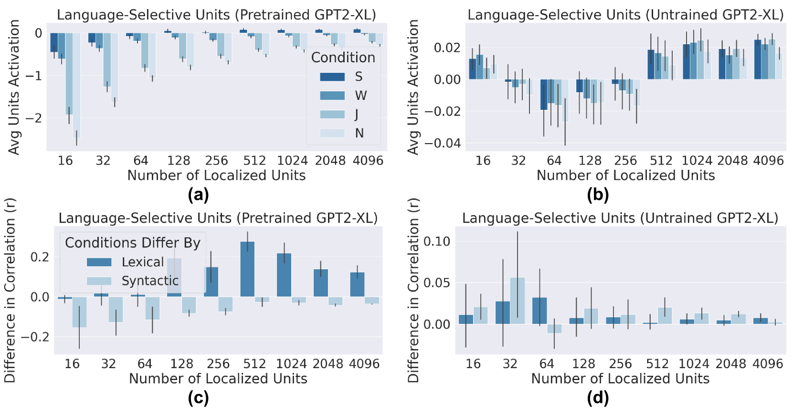

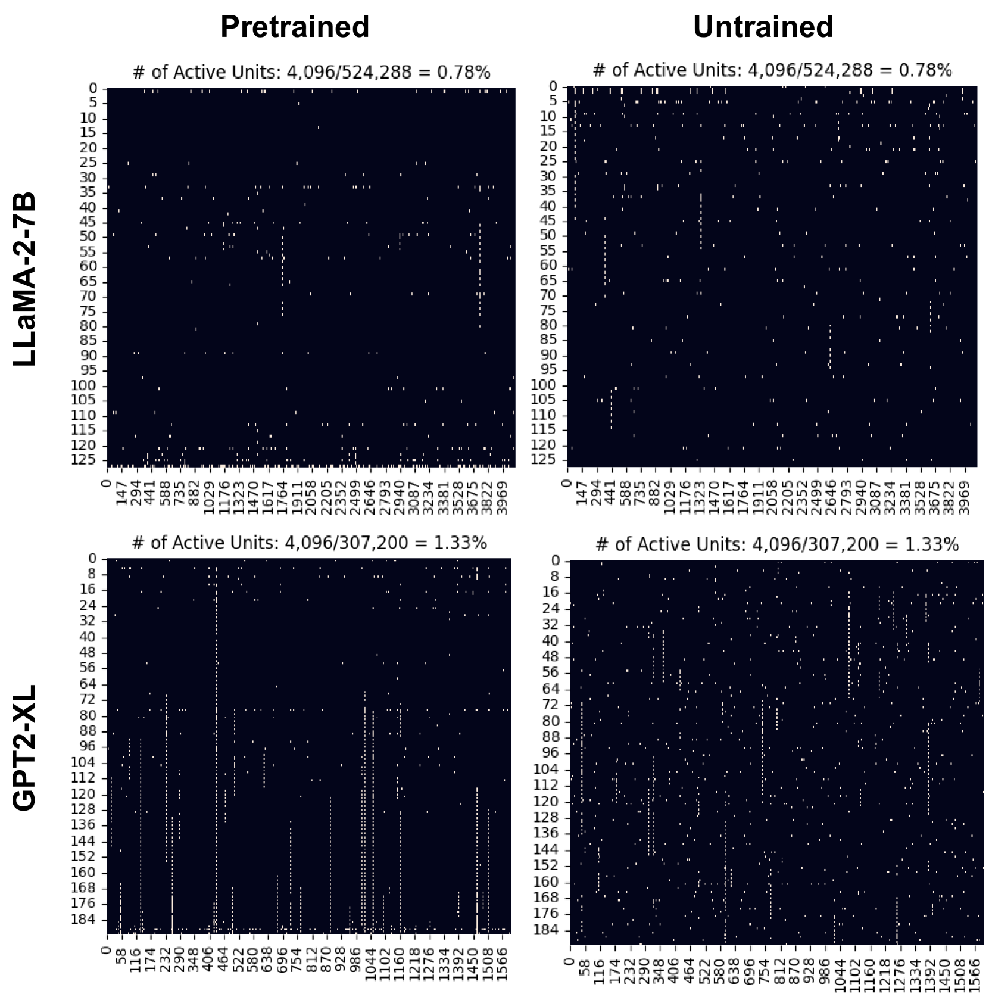

[Arxiv](https://arxiv.org/abs/2406.15109)