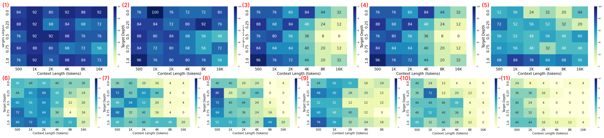
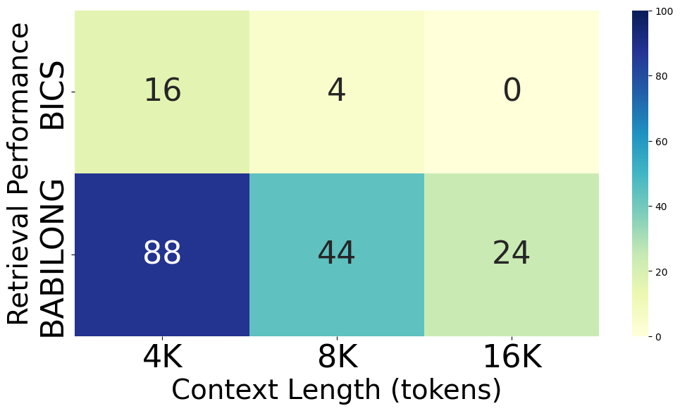

# 代码堆栈之谜：大型语言模型能否洞察Python代码堆栈中的瑕疵

发布时间：2024年06月21日

`LLM应用

这篇论文主要关注大型语言模型（LLMs）在代码环境下的表现，特别是在识别语法错误的能力。它通过设计一个名为“代码错误堆栈”（BICS）的基准测试来评估LLMs在大型源代码中发现简单语法错误的能力。这属于LLM在特定应用场景（即软件开发和程序合成）中的应用，因此应归类为LLM应用。` `软件开发` `程序合成`

> Bug In the Code Stack: Can LLMs Find Bugs in Large Python Code Stacks

# 摘要

> 近期，针对“大海捞针”（NIAH）基准的研究揭示了大型语言模型（LLMs）在从庞大文本中提取上下文信息方面的潜力。但随着LLMs深入软件开发的脉络，其在代码环境下的表现评估变得尤为关键。随着LLMs在程序合成领域的进步，确保它们能理解并产出语法正确的代码成为我们的关注点。为此，我们通过评估LLMs识别语法错误的能力来检验其语法理解力。我们的基准测试“代码错误堆栈”（BICS）专门设计来测试LLMs在大型源代码中发现简单语法错误的能力。研究结果凸显了三个要点：（1）代码环境下的检索任务比文本环境更具挑战性；（2）不同模型间的性能差异显著；（3）尽管模型间存在差异，但上下文长度的增加与性能下降之间存在明显关联。

> Recent research in Needle-in-a-Haystack (NIAH) benchmarks has explored the capabilities of Large Language Models (LLMs) in retrieving contextual information from large text documents. However, as LLMs become increasingly integrated into software development processes, it is crucial to evaluate their performance in code-based environments. As LLMs are further developed for program synthesis, we need to ensure that LLMs can understand syntax and write syntactically correct code. As a step in ensuring LLMs understand syntax, LLMs can be evaluated in their ability to find and detect syntax bugs. Our benchmark, Bug In The Code Stack (BICS), is designed to assess the ability of LLMs to identify simple syntax bugs within large source code. Our findings reveal three key insights: (1) code-based environments pose significantly more challenge compared to text-based environments for retrieval tasks, (2) there is a substantial performance disparity among different models, and (3) there is a notable correlation between longer context lengths and performance degradation, though the extent of this degradation varies between models.

[Arxiv](https://arxiv.org/abs/2406.15325)