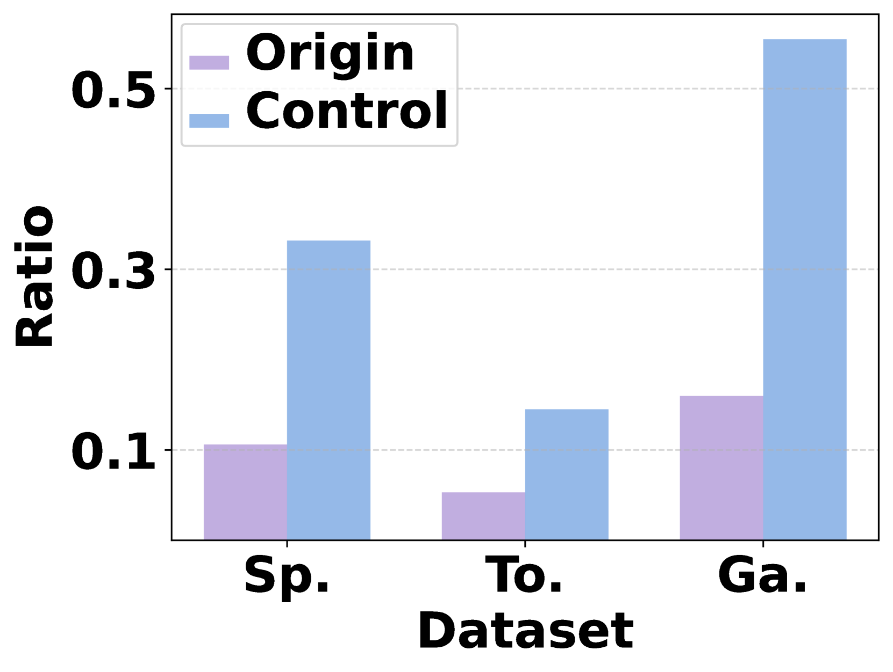

# 解码关键：针对基于LLM的推荐系统，探讨并解决放大偏差与同质化挑战

发布时间：2024年06月21日

`LLM应用

这篇论文主要探讨了将大型语言模型（LLMs）应用于推荐系统时遇到的问题，并提出了一种新的解码方法（D3）来解决这些问题。论文关注的是LLMs在推荐系统中的实际应用，特别是解码策略的改进，以提高推荐的准确性和多样性。因此，这篇论文属于LLM应用分类。` `推荐系统` `电子商务`

> Decoding Matters: Addressing Amplification Bias and Homogeneity Issue for LLM-based Recommendation

# 摘要

> 将LLMs应用于推荐系统时，解码过程需精心设计，以应对生成物品与自然语言间的本质差异。现有方法多沿用LLMs的原始解码策略，但面临两大难题：一是“放大偏差”，即标准长度归一化会提升包含高生成概率令牌（幽灵令牌）的物品分数；二是“同质化问题”，导致用户收到大量相似或重复的推荐。为此，我们提出了一种名为“去偏-多样化解码（D3）”的新方法。D3通过禁用幽灵令牌的长度归一化来缓解放大偏差，并引入无文本辅助模型，鼓励生成LLMs不常选用的令牌，以打破推荐同质化。大量实验结果显示，D3在提升推荐准确性与多样性方面表现出色。

> Adapting Large Language Models (LLMs) for recommendation requires careful consideration of the decoding process, given the inherent differences between generating items and natural language. Existing approaches often directly apply LLMs' original decoding methods. However, we find these methods encounter significant challenges: 1) amplification bias -- where standard length normalization inflates scores for items containing tokens with generation probabilities close to 1 (termed ghost tokens), and 2) homogeneity issue -- generating multiple similar or repetitive items for a user. To tackle these challenges, we introduce a new decoding approach named Debiasing-Diversifying Decoding (D3). D3 disables length normalization for ghost tokens to alleviate amplification bias, and it incorporates a text-free assistant model to encourage tokens less frequently generated by LLMs for counteracting recommendation homogeneity. Extensive experiments on real-world datasets demonstrate the method's effectiveness in enhancing accuracy and diversity.

[Arxiv](https://arxiv.org/abs/2406.14900)