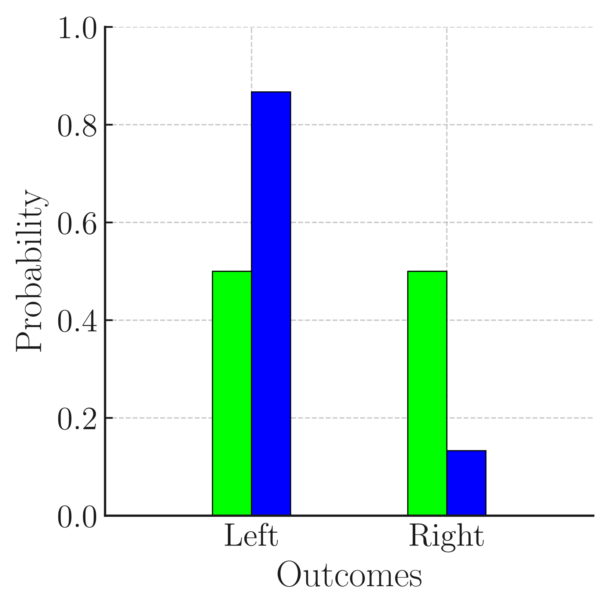

# 大型语言模型是否存在认知失调？本研究探讨了模型揭示的信念与其陈述答案之间的差异。

发布时间：2024年06月21日

`LLM理论

这篇论文探讨了大型语言模型（LLMs）在非定制的提示和多项选择题（MCQ）之外的能力评估方法，特别是通过将问题转化为文本完成任务来揭示LLMs的内在概率分布和信念。这种研究深入探讨了LLMs的理论层面，即它们如何处理和理解输入信息，以及它们的输出如何反映其内部状态和偏差。因此，这篇论文属于LLM理论分类。` `教育评估` `人工智能`

> Do Large Language Models Exhibit Cognitive Dissonance? Studying the Difference Between Revealed Beliefs and Stated Answers

# 摘要

> 提示和多项选择题（MCQ）因其操作简便和评估直接而成为评估大型语言模型（LLMs）能力的主流方法。这些评估揭示了LLMs在因果推理和不确定性理解方面的潜力。本论文中，我们探讨了这些能力是否能在非定制的提示和MCQ之外得到衡量，通过将问题转化为直接的文本完成任务——这是LLMs的核心功能。我们设计了包含多种可能结果的场景，并比较了LLM在提示下的预测（即“陈述答案”）与它们在预测下一个令牌时对这些结果的概率分布（即“揭示信念”）。研究发现，LLMs的“揭示信念”与其“陈述答案”存在显著差异，暗示了在多种场景和结果中可能存在的偏差和误解。鉴于文本完成是LLMs的核心，这些发现提示我们，现有的评估方法可能只揭示了冰山一角，需要更深入的研究来全面理解LLMs的能力范围和本质。

> Prompting and Multiple Choices Questions (MCQ) have become the preferred approach to assess the capabilities of Large Language Models (LLMs), due to their ease of manipulation and evaluation. Such experimental appraisals have pointed toward the LLMs' apparent ability to perform causal reasoning or to grasp uncertainty. In this paper, we investigate whether these abilities are measurable outside of tailored prompting and MCQ by reformulating these issues as direct text completion - the foundation of LLMs. To achieve this goal, we define scenarios with multiple possible outcomes and we compare the prediction made by the LLM through prompting (their Stated Answer) to the probability distributions they compute over these outcomes during next token prediction (their Revealed Belief). Our findings suggest that the Revealed Belief of LLMs significantly differs from their Stated Answer and hint at multiple biases and misrepresentations that their beliefs may yield in many scenarios and outcomes. As text completion is at the core of LLMs, these results suggest that common evaluation methods may only provide a partial picture and that more research is needed to assess the extent and nature of their capabilities.

[Arxiv](https://arxiv.org/abs/2406.14986)