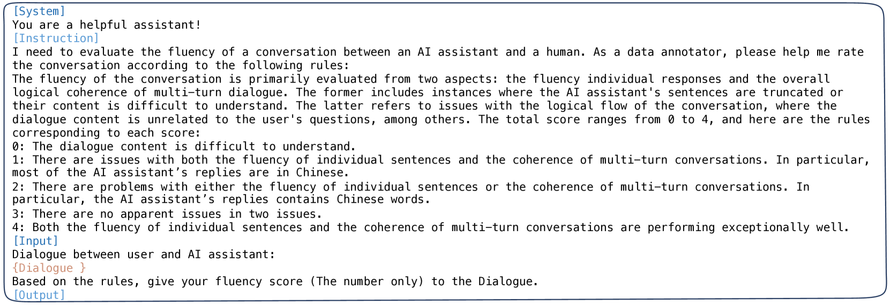

# 情感支持对话评估：探索大型语言模型中的ESC-Eval

发布时间：2024年06月21日

`Agent

理由：这篇论文主要介绍了情感支持对话（ESC）的评估框架ESC-Eval，该框架通过角色扮演代理与ESC模型互动，并进行人工评估。这里的关键点在于使用了角色扮演代理技术来评估基于LLM的ESC模型，这涉及到代理（Agent）的概念，即通过模拟特定角色的行为来测试和评估ESC模型的性能。因此，这篇论文更符合Agent分类。` `心理健康` `对话系统`

> ESC-Eval: Evaluating Emotion Support Conversations in Large Language Models

# 摘要

> 情感支持对话（ESC）旨在缓解压力、提供情感引导，从而增进人的身心福祉，是一个至关重要的应用。随着大型语言模型（LLMs）技术的进步，许多研究者开始利用LLMs构建ESC模型。然而，这些基于LLM的ESC模型的评估标准尚不明确。受角色扮演代理技术飞速发展的启发，我们开发了ESC-Eval评估框架，该框架通过角色扮演代理与ESC模型互动，并随后对互动对话进行人工评估。具体操作上，我们首先整合了七个数据集中的2,801张角色扮演卡片，为角色扮演代理定义角色。接着，我们训练了名为ESC-Role的特定模型，其行为更接近困惑的人而非GPT-4。然后，我们利用ESC-Role和角色卡片，对包括通用AI助手（如ChatGPT）和面向ESC的LLMs（如ExTES-Llama）在内的14个LLMs进行了系统实验。我们对不同ESC模型的多轮交互对话进行了详尽的人工标注。结果表明，面向ESC的LLMs在ESC能力上超越了通用AI助手LLMs，但仍未达到人类水平。为了实现未来ESC模型的自动评分，我们推出了ESC-RANK，该模型在标注数据上训练，评分性能超越了GPT-4的35分。我们的数据和代码已公开在https://github.com/haidequanbu/ESC-Eval。

> Emotion Support Conversation (ESC) is a crucial application, which aims to reduce human stress, offer emotional guidance, and ultimately enhance human mental and physical well-being. With the advancement of Large Language Models (LLMs), many researchers have employed LLMs as the ESC models. However, the evaluation of these LLM-based ESCs remains uncertain. Inspired by the awesome development of role-playing agents, we propose an ESC Evaluation framework (ESC-Eval), which uses a role-playing agent to interact with ESC models, followed by a manual evaluation of the interactive dialogues. In detail, we first re-organize 2,801 role-playing cards from seven existing datasets to define the roles of the role-playing agent. Second, we train a specific role-playing model called ESC-Role which behaves more like a confused person than GPT-4. Third, through ESC-Role and organized role cards, we systematically conduct experiments using 14 LLMs as the ESC models, including general AI-assistant LLMs (ChatGPT) and ESC-oriented LLMs (ExTES-Llama). We conduct comprehensive human annotations on interactive multi-turn dialogues of different ESC models. The results show that ESC-oriented LLMs exhibit superior ESC abilities compared to general AI-assistant LLMs, but there is still a gap behind human performance. Moreover, to automate the scoring process for future ESC models, we developed ESC-RANK, which trained on the annotated data, achieving a scoring performance surpassing 35 points of GPT-4. Our data and code are available at https://github.com/haidequanbu/ESC-Eval.

[Arxiv](https://arxiv.org/abs/2406.14952)