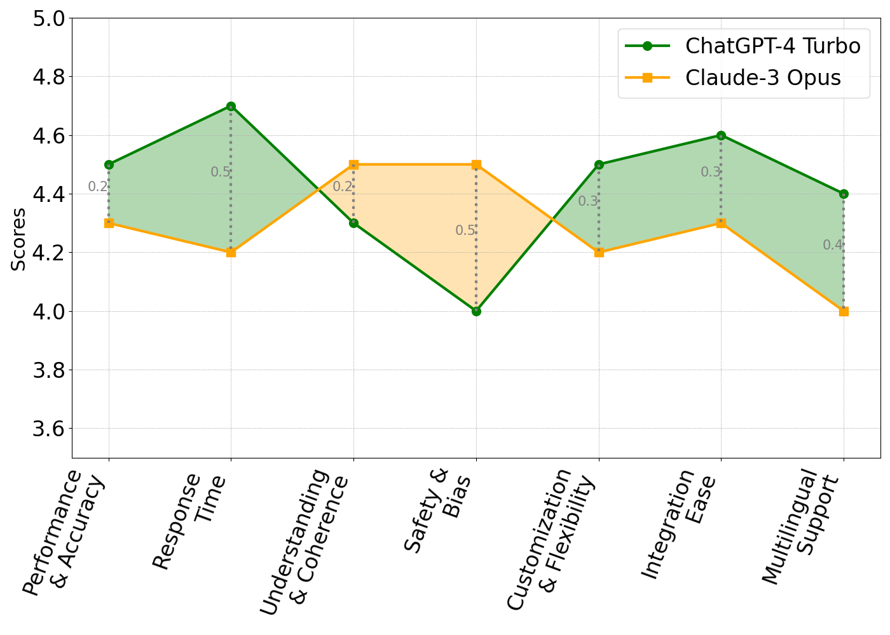

# 借助 ChatGPT 与 Claude，探索机器人助手在 ADHD 治疗中的创新效能，开启治疗新篇章。

发布时间：2024年06月21日

`Agent

理由：这篇论文主要探讨了如何将大型语言模型（如ChatGPT-4 Turbo和Claude-3 Opus）整合到机器人助手中，以辅助ADHD患者的治疗。这种应用涉及创建一个智能代理（Agent），该代理能够与患者进行交互，提供个性化支持。因此，这篇论文更符合Agent分类，因为它关注的是语言模型在智能代理中的应用，特别是在医疗领域的具体实施和效果评估。` `职业治疗`

> Exploring the Efficacy of Robotic Assistants with ChatGPT and Claude in Enhancing ADHD Therapy: Innovating Treatment Paradigms

# 摘要

> 注意力缺陷多动障碍（ADHD）是一种影响日常功能和生活质量的神经发育障碍，表现为注意力不集中、过度活跃和冲动。职业治疗通过培养生活技能和增强个体在各种环境中的参与能力，对管理ADHD至关重要。近期研究指出，结合大型语言模型（如ChatGPT）和社会辅助机器人（SAR）可能提升心理治疗效果，为ADHD患者提供个性化支持。尽管如此，这些技术在ADHD治疗中的联合应用研究尚显不足，预示着创新治疗策略的潜力。为此，我们整合了ChatGPT-4 Turbo和Claude-3 Opus两种语言模型于一机器人助手，以评估它们在辅助交互中的表现，并在模拟治疗环境中比较其效果。结果表明，ChatGPT-4 Turbo在性能和响应速度上占优，适合紧急应用；而Claude-3 Opus则在理解、连贯性和伦理方面表现突出，注重安全互动。两者均具创新性和适应性，但ChatGPT-4 Turbo更易集成且支持更广泛的语言。选择取决于ADHD治疗的具体需求。

> Attention Deficit Hyperactivity Disorder (ADHD) is a neurodevelopmental condition characterized by inattention, hyperactivity, and impulsivity, which can significantly impact an individual's daily functioning and quality of life. Occupational therapy plays a crucial role in managing ADHD by fostering the development of skills needed for daily living and enhancing an individual's ability to participate fully in school, home, and social situations. Recent studies highlight the potential of integrating Large Language Models (LLMs) like ChatGPT and Socially Assistive Robots (SAR) to improve psychological treatments. This integration aims to overcome existing limitations in mental health therapy by providing tailored support and adapting to the unique needs of this sensitive group. However, there remains a significant gap in research exploring the combined use of these advanced technologies in ADHD therapy, suggesting an opportunity for novel therapeutic approaches.
  Thus, we integrated two advanced language models, ChatGPT-4 Turbo and Claude-3 Opus, into a robotic assistant to explore how well each model performs in robot-assisted interactions. Additionally, we have compared their performance in a simulated therapy scenario to gauge their effectiveness against a clinically validated customized model. The results of this study show that ChatGPT-4 Turbo excelled in performance and responsiveness, making it suitable for time-sensitive applications. Claude-3 Opus, on the other hand, showed strengths in understanding, coherence, and ethical considerations, prioritizing safe and engaging interactions. Both models demonstrated innovation and adaptability, but ChatGPT-4 Turbo offered greater ease of integration and broader language support. The selection between them hinges on the specific demands of ADHD therapy.

[Arxiv](https://arxiv.org/abs/2406.15198)