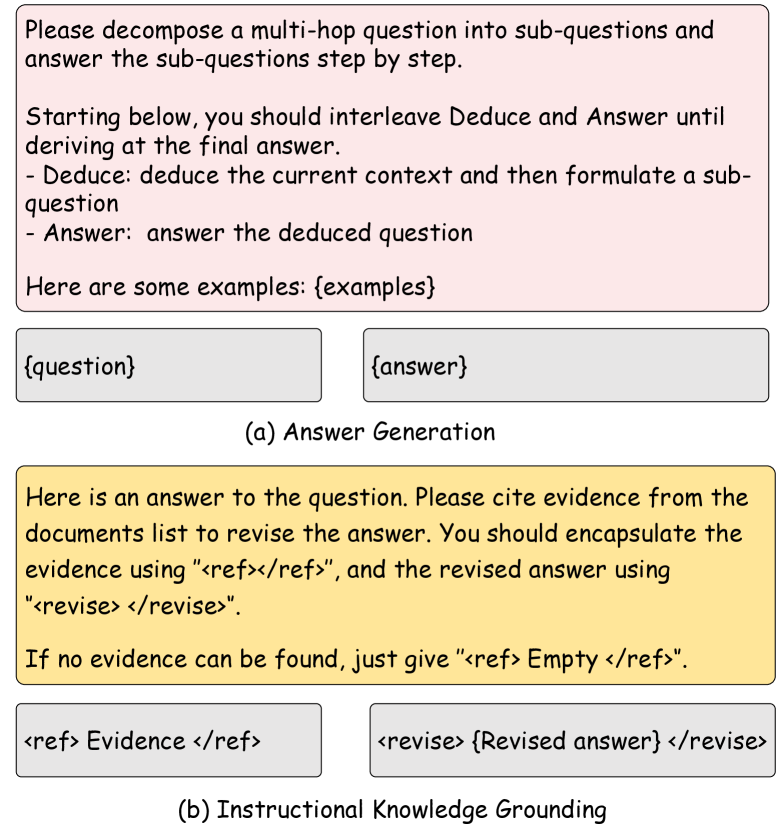

# 在增强检索生成中，采用“生成-再锚定”策略解决多跳问题回答挑战

发布时间：2024年06月21日

`RAG

理由：这篇论文介绍了一种名为“生成后验证（GenGround）”的新框架，旨在解决多跳问题回答（MHQA）任务中的挑战。该框架结合了大型语言模型（LLMs）的参数知识与外部文档检索，通过两个阶段的交替操作来生成和验证答案。这种方法与检索增强生成（RAG）的概念相似，因为它依赖于外部文档来增强模型的生成能力。因此，这篇论文更适合归类于RAG，因为它专注于通过检索和验证过程来改进问题回答任务。` `问答系统`

> Generate-then-Ground in Retrieval-Augmented Generation for Multi-hop Question Answering

# 摘要

> 多跳问题回答（MHQA）任务对大型语言模型（LLMs）构成挑战，因其对密集知识的需求。现有方法如检索增强生成，依赖外部文档检索答案，但受限于检索器和文档噪声。为此，我们创新提出生成后验证（GenGround）框架，结合LLMs的参数知识与外部文档，有效解决多跳问题。GenGround通过两个阶段交替操作，直至答案生成：首先简化问题为单跳并直接生成答案，随后在检索文档中验证问题-答案对，修正错误。此外，我们提出教学验证蒸馏法，将此技术应用于小型模型。在四个数据集上的广泛实验证明了我们方法的优越性。

> Multi-Hop Question Answering (MHQA) tasks present a significant challenge for large language models (LLMs) due to the intensive knowledge required. Current solutions, like Retrieval-Augmented Generation, typically retrieve potential documents from an external corpus to read an answer. However, the performance of this retrieve-then-read paradigm is constrained by the retriever and the inevitable noise in the retrieved documents. To mitigate these challenges, we introduce a novel generate-then-ground (GenGround) framework, synergizing the parametric knowledge of LLMs and external documents to solve a multi-hop question. GenGround empowers LLMs to alternate two phases until the final answer is derived: (1) formulate a simpler, single-hop question and directly generate the answer; (2) ground the question-answer pair in retrieved documents, amending any wrong predictions in the answer. We also propose an instructional grounding distillation method to generalize our method into smaller models. Extensive experiments conducted on four datasets illustrate the superiority of our method.

[Arxiv](https://arxiv.org/abs/2406.14891)