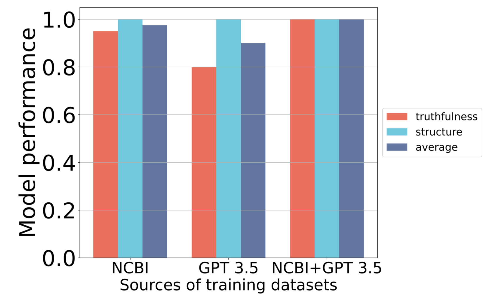
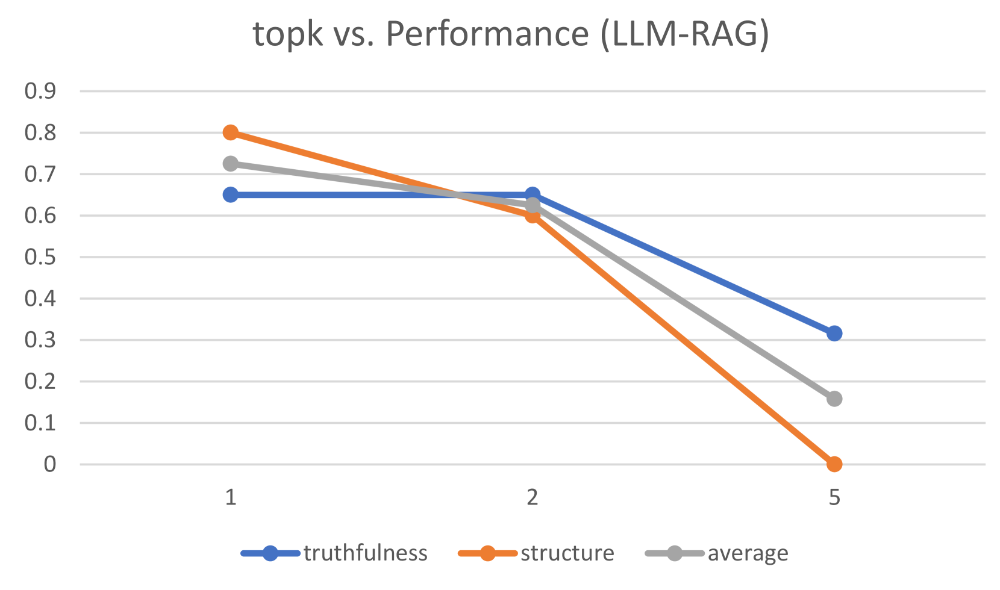

# Geneverse：基因组与蛋白质组研究的开源多模态大型语言模型宝库

发布时间：2024年06月21日

`LLM应用

这篇论文介绍了名为Geneverse的一系列微调LLMs和多模态LLMs（MLLMs），这些模型专门为基因组学和蛋白质组学领域的特定任务设计。论文中提到，这些模型利用特定领域数据集进行训练和评估，并采用了先进的参数高效微调技术。这些模型在基因功能描述生成、蛋白质结构功能推断及空间转录组数据标记基因选择等任务上表现出色。因此，这篇论文属于LLM应用类别，因为它专注于将大型语言模型应用于特定的生物医学领域，并展示了这些模型在实际任务中的应用效果。` `基因组学` `蛋白质组学`

> Geneverse: A collection of Open-source Multimodal Large Language Models for Genomic and Proteomic Research

# 摘要

> 大型语言模型（LLMs）在生物医学和医疗保健领域展现出巨大潜力。尽管已有多种生物医学数据训练的开源LLMs，但在基因组学和蛋白质组学领域的应用研究仍显不足。为此，我们推出了名为Geneverse的一系列微调LLMs和多模态LLMs（MLLMs），专为基因组学和蛋白质组学研究的三个创新任务设计。Geneverse模型利用特定领域数据集进行训练和评估，并采用先进的参数高效微调技术，以适应包括基因功能描述生成、蛋白质结构功能推断及空间转录组数据标记基因选择等任务。我们的评估显示，这些适应后的LLMs和MLLMs在这些任务上表现出色，甚至可能超越闭源大型模型，尤其是在真实性和结构正确性方面。我们所有的训练策略和基础模型均免费开放。

> The applications of large language models (LLMs) are promising for biomedical and healthcare research. Despite the availability of open-source LLMs trained using a wide range of biomedical data, current research on the applications of LLMs to genomics and proteomics is still limited. To fill this gap, we propose a collection of finetuned LLMs and multimodal LLMs (MLLMs), known as Geneverse, for three novel tasks in genomic and proteomic research. The models in Geneverse are trained and evaluated based on domain-specific datasets, and we use advanced parameter-efficient finetuning techniques to achieve the model adaptation for tasks including the generation of descriptions for gene functions, protein function inference from its structure, and marker gene selection from spatial transcriptomic data. We demonstrate that adapted LLMs and MLLMs perform well for these tasks and may outperform closed-source large-scale models based on our evaluations focusing on both truthfulness and structural correctness. All of the training strategies and base models we used are freely accessible.

[Arxiv](https://arxiv.org/abs/2406.15534)