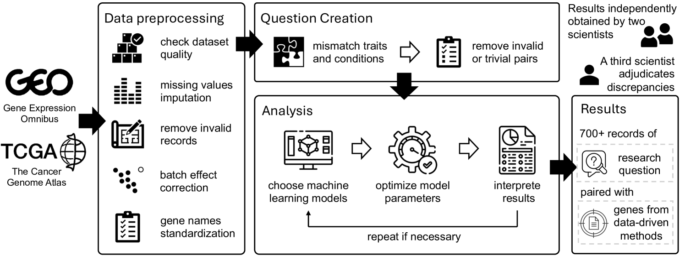
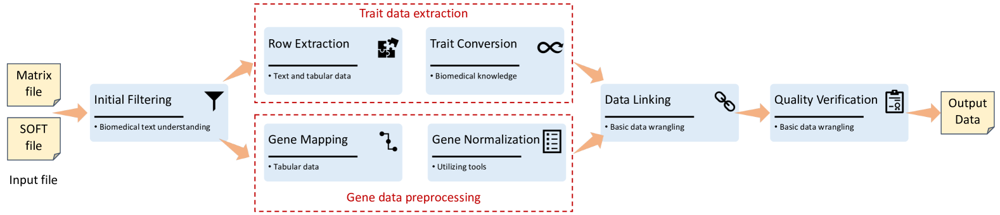
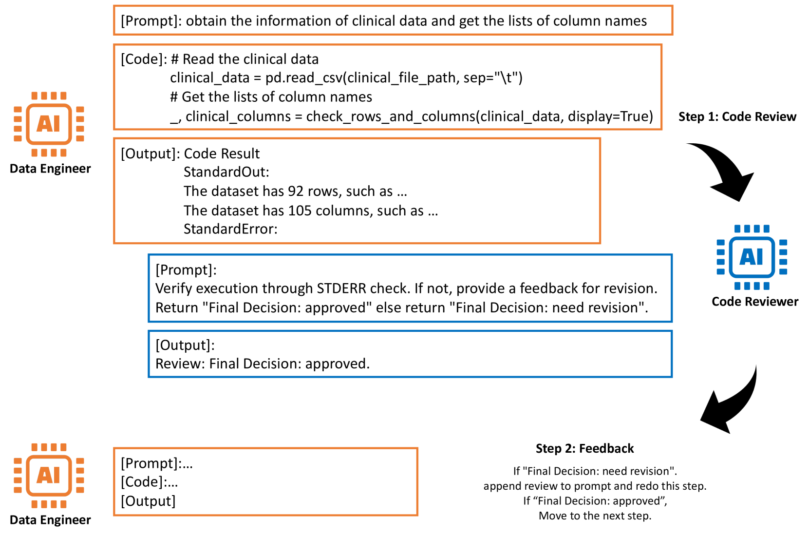
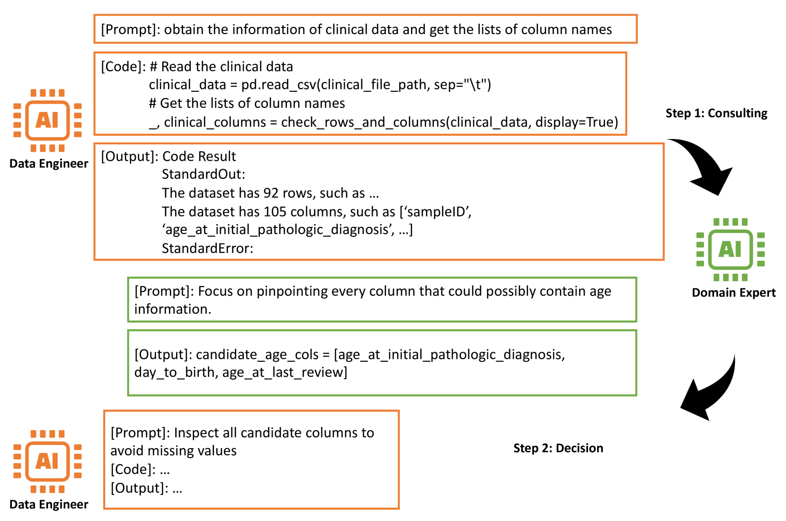

# GenoTEX：大型语言模型探索基因表达数据的评估基准，与生物信息学家的需求相契合

发布时间：2024年06月21日

`Agent

理由：这篇论文介绍了一个基于大型语言模型（LLM）的智能代理系统GenoAgents，专门设计用于自动化基因表达数据分析的任务。这个系统通过情境感知规划、迭代修正和专家咨询来协作分析基因数据集，展示了智能代理在特定领域的应用。因此，这篇论文更符合Agent分类，因为它主要关注的是智能代理的设计和应用，而不是LLM的理论研究或特定的应用场景如RAG（检索增强生成）。` `生物信息学` `基因组学`

> GenoTEX: A Benchmark for Evaluating LLM-Based Exploration of Gene Expression Data in Alignment with Bioinformaticians

# 摘要

> 机器学习的最新进展极大地提升了从基因表达数据中识别疾病相关基因的效率。尽管如此，这些过程往往依赖于大量的专业知识和人工操作，限制了其广泛应用。基于大型语言模型（LLM）的智能代理因其日益增强的问题解决能力，展现出自动化这些任务的潜力。为此，我们推出了GenoTEX，一个专为自动探索基因表达数据设计的基准数据集，涵盖数据集选择、预处理及统计分析等关键任务。GenoTEX提供了一系列注释代码和结果，用于解决多样化的基因识别问题，并遵循计算基因组学的标准流程。这些注释由经验丰富的生物信息学家精心制作，确保了数据的准确性和可靠性。我们还创建了GenoAgents，一支由LLM驱动的智能代理团队，它们通过情境感知规划、迭代修正和专家咨询，协作分析基因数据集。通过实验，我们验证了LLM方法在基因组数据分析中的应用潜力，并通过错误分析揭示了未来的改进方向。我们相信GenoTEX将成为评估和提升AI在基因组数据分析中应用的重要资源，并已将其公开发布于\url{https://github.com/Liu-Hy/GenoTex}。

> Recent advancements in machine learning have significantly improved the identification of disease-associated genes from gene expression datasets. However, these processes often require extensive expertise and manual effort, limiting their scalability. Large Language Model (LLM)-based agents have shown promise in automating these tasks due to their increasing problem-solving abilities. To support the evaluation and development of such methods, we introduce GenoTEX, a benchmark dataset for the automatic exploration of gene expression data, involving the tasks of dataset selection, preprocessing, and statistical analysis. GenoTEX provides annotated code and results for solving a wide range of gene identification problems, in a full analysis pipeline that follows the standard of computational genomics. These annotations are curated by human bioinformaticians who carefully analyze the datasets to ensure accuracy and reliability. To provide baselines for these tasks, we present GenoAgents, a team of LLM-based agents designed with context-aware planning, iterative correction, and domain expert consultation to collaboratively explore gene datasets. Our experiments with GenoAgents demonstrate the potential of LLM-based approaches in genomics data analysis, while error analysis highlights the challenges and areas for future improvement. We propose GenoTEX as a promising resource for benchmarking and enhancing AI-driven methods for genomics data analysis. We make our benchmark publicly available at \url{https://github.com/Liu-Hy/GenoTex}.

[Arxiv](https://arxiv.org/abs/2406.15341)